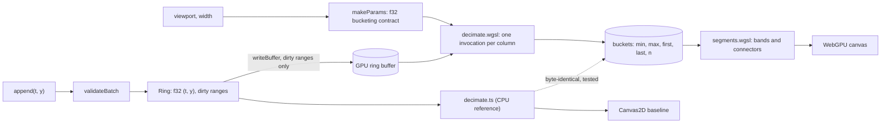

# webgpu-chart

<!-- headline:start -->
**4 series x 1M points: p95 frame time 1.12 ms on WebGPU vs 38.25 ms on uPlot and 33.61 ms on Canvas2D** (uncapped rAF, NVIDIA GeForce RTX 4090, AMD Ryzen 9 7900X 12-Core Processor, Chrome 154, measured 2026-10-04).
<!-- headline:end -->


Recorded with `pnpm demo:record && pnpm demo:gif` (headless host Chrome, synthetic data, 1 kHz ingest).

A streaming time-series chart that decimates millions of points per frame in a WebGPU compute shader. The demo draws the same data with WebGPU, Canvas2D and uPlot side by side. The chart ships as `@sathwik/gpu-timeseries`: ESM, typed, zero runtime dependencies.

## Why it is fast

- One compute invocation per pixel column reduces the visible samples to min, max, first and last (M4). Drawing cost depends on the canvas width, not on the point count.
- Only new samples go to the GPU each frame: the ring buffer tracks dirty ranges.
- The GPU output is byte-identical to a CPU reference. A Playwright test checks it in Chrome on random data.

## Benchmarks

Measured by `pnpm bench`: production build, host Chrome, uncapped rAF, 1600 x 600 canvas at DPR 1, 600 scripted frames (pan, zoom in 1000x, zoom out, follow with 1 kHz ingest). Method and trade-offs: [ADR 0004](docs/adr/0004-benchmark-methodology.md). The table is generated from `bench/results/latest.json` by `pnpm bench:table`. Do not edit it by hand.

<!-- bench:start -->
| Scenario | Renderer | p50 ms | p95 ms | p99 ms | Frames over 16.7 ms | GPU pass p95 ms |
|---|---|---|---|---|---|---|
| 4x1M | WebGPU | 0.37 | 1.12 | 3.37 | 1 / 600 | 0.26 |
| 4x1M | uPlot | 15.08 | 38.25 | 56.33 | 246 / 600 | n/a |
| 4x1M | Canvas2D | 13.98 | 33.61 | 47.50 | 178 / 600 | n/a |
| 4x100k | WebGPU | 0.42 | 1.25 | 3.49 | 0 / 600 | 0.20 |
| 4x100k | uPlot | 3.77 | 8.39 | 11.81 | 0 / 600 | n/a |
| 4x100k | Canvas2D | 3.22 | 7.50 | 9.80 | 0 / 600 | n/a |
| 4x2M | WebGPU | 0.40 | 3.04 | 5.83 | 0 / 600 | 6.09 |
| 4x5M | WebGPU | 0.47 | 4.45 | 7.38 | 1 / 600 | 15.07 |
<!-- bench:end -->

## Quickstart

```bash
pnpm install
pnpm dev            # http://localhost:5430 in Chrome or Edge
pnpm test           # unit and property tests (Node)
pnpm test:gpu       # GPU parity, render and page tests (needs Chrome with WebGPU)
pnpm build && pnpm bench
```

Docker (serves the built demo; your browser still needs WebGPU): `docker compose up -d --build app`, then open http://localhost:5432.

## Use the library

Not on npm yet. Build and pack it, then install the tarball:

```bash
pnpm build && pnpm pack
pnpm add ./sathwik-gpu-timeseries-0.1.0.tgz   # in your project
```

```ts
import { GpuChart } from "@sathwik/gpu-timeseries";

const support = await GpuChart.isSupported();
if (!support.ok) console.warn(support.reason);
const chart = await GpuChart.create(document.getElementById("chart")!, { capacity: 1_000_000 });
const speed = chart.addSeries({ id: "speed", color: "#4dabf7" });
speed.append(times /* Unix ms, non-decreasing */, values);
chart.setViewport("follow");
chart.on("frame", (s) => console.log(s.drawMs, s.gpuMs));
```

## How it works



## Decisions

- [0001 M4 over LTTB](docs/adr/0001-minmax-decimation-over-lttb.md)
- [0002 One invocation per column, exact parity](docs/adr/0002-gpu-kernel-and-exact-parity.md)
- [0003 GPU tests in host Chrome](docs/adr/0003-gpu-tests-in-host-chrome.md)
- [0004 Benchmark methodology](docs/adr/0004-benchmark-methodology.md)
- [0005 f32 time and epochs](docs/adr/0005-time-precision-and-epochs.md)
- [0006 Toolchain and demo stack](docs/adr/0006-toolchain-and-demo-stack.md)
- [0007 Ingest on the main thread](docs/adr/0007-ingest-on-main-thread.md)

## Known limits

- Needs WebGPU (current Chrome or Edge). Without it the demo shows why and runs the baselines only.
- A series holds at most 4.66 hours of data (f32 time, ADR 0005) and its ring capacity.
- No recovery from GPU device loss yet. The pane stops and reports the error.
- CI has no GPU. GPU tests and benchmarks run on a developer machine.
- Benchmark numbers come from one machine. Your hardware will differ.
- Not published to npm yet.

## License

MIT
