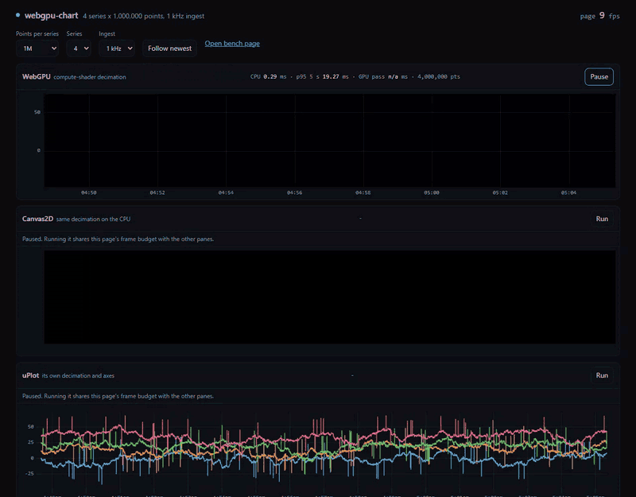
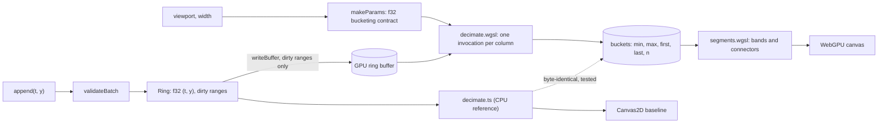

# 📈 webgpu-chart

> Streaming chart on WebGPU. A compute shader reduces millions of points to one record per pixel column.

<!-- headline:start -->
**4 series x 1M points: p95 frame time to GPU-complete 6.39 ms on WebGPU vs 46.73 ms on uPlot and 32.58 ms on Canvas2D** (one frame in flight, each frame timed until its GPU work finished, NVIDIA GeForce RTX 4090, AMD Ryzen 9 7900X 12-Core Processor, Chrome 154, measured 2026-10-04).
<!-- headline:end -->

<!-- readme-header -->
[](https://github.com/sathwikbairaboina2/webgpu-chart/actions/workflows/ci.yml)    

| Measured | Source |
|---|---|
| **p95 6.4 ms vs 46.7 ms uPlot** | `bench/results/latest.json` |



Recorded with `pnpm demo:record && pnpm demo:gif` (headless host Chrome, synthetic data, 1 kHz ingest).

A streaming time-series chart that decimates millions of points per frame in a WebGPU compute shader. The demo draws the same data with WebGPU, Canvas2D and uPlot side by side. The chart ships as `@sathwik/gpu-timeseries`: ESM, typed, zero runtime dependencies.

## Why it is fast

- One compute invocation per pixel column reduces the visible samples to min, max, first and last (M4). Drawing cost depends on the canvas width, not on the point count.
- Only new samples go to the GPU each frame: the ring buffer tracks dirty ranges.
- The GPU output is byte-identical to a CPU reference. A Playwright test checks it in Chrome on random data.

## Benchmarks

Measured by `pnpm bench`: production build, host Chrome, uncapped rAF, one frame in flight, 1600 x 600 canvas at DPR 1, 600 scripted frames (pan, zoom in 1000x, zoom out, follow with 1 kHz ingest). Method and trade-offs: [ADR 0004](docs/adr/0004-benchmark-methodology.md). The table is generated from `bench/results/latest.json` by `pnpm bench:table`. Do not edit it by hand.

What the columns mean: p50, p95 and p99 are per frame, from the start of the frame callback (ingest, state update, render) until the GPU, or the canvas, has finished that frame (`queue.onSubmittedWorkDone` for WebGPU, a 1x1 pixel readback for Canvas2D and uPlot). Submit time alone is not used, because a GPU queue can run well behind the CPU. Throughput is the mean time per frame from the first measured frame to the last completion, so it also includes the idle gap before each rAF callback. The GPU compute pass column comes from timestamp queries and covers the decimation pass only, over all frames including the 60 warmup ones; it is shown as n/a when fewer than 30 readings arrived.

<!-- bench:start -->
| Scenario | Renderer | p50 ms | p95 ms | p99 ms | Frames over 16.7 ms | Throughput ms/frame | GPU compute pass p95 ms |
|---|---|---|---|---|---|---|---|
| 4x1M | WebGPU | 2.16 | 6.39 | 9.01 | 0 / 600 | 6.53 | 0.26 (n=660) |
| 4x1M | uPlot | 24.82 | 46.73 | 63.58 | 410 / 600 | 24.38 | n/a |
| 4x1M | Canvas2D | 17.34 | 32.58 | 47.23 | 337 / 600 | 17.52 | n/a |
| 4x100k | WebGPU | 1.65 | 4.44 | 6.18 | 0 / 600 | 2.08 | 0.13 (n=660) |
| 4x100k | uPlot | 10.20 | 15.88 | 21.11 | 23 / 600 | 10.74 | n/a |
| 4x100k | Canvas2D | 5.42 | 9.13 | 12.13 | 1 / 600 | 5.67 | n/a |
| 4x2M | WebGPU | 1.81 | 5.19 | 7.39 | 0 / 600 | 2.25 | 0.33 (n=660) |
| 4x5M | WebGPU | 1.98 | 9.37 | 13.81 | 2 / 600 | 2.87 | 5.64 (n=660) |
<!-- bench:end -->

## Quickstart

```bash
pnpm install
pnpm dev            # http://localhost:5430 in Chrome or Edge
pnpm test           # unit and property tests (Node)
pnpm test:gpu       # GPU parity, render and page tests (needs Chrome with WebGPU)
pnpm build && pnpm bench
```

Docker (serves the built demo; your browser still needs WebGPU): `docker compose up -d --build app`, then open http://localhost:5432.

## Use the library

Not on npm yet. Build and pack it, then install the tarball:

```bash
pnpm build && pnpm pack
pnpm add ./sathwik-gpu-timeseries-0.1.0.tgz   # in your project
```

```ts
import { GpuChart } from "@sathwik/gpu-timeseries";

const support = await GpuChart.isSupported();
if (!support.ok) console.warn(support.reason);
const chart = await GpuChart.create(document.getElementById("chart")!, { capacity: 1_000_000 });
const speed = chart.addSeries({ id: "speed", color: "#4dabf7" });
speed.append(times /* Unix ms, non-decreasing */, values);
chart.setViewport("follow");
chart.on("frame", (s) => console.log(s.drawMs, s.gpuMs));
```

## How it works



## Decisions

- [0001 M4 over LTTB](docs/adr/0001-minmax-decimation-over-lttb.md)
- [0002 One invocation per column, exact parity](docs/adr/0002-gpu-kernel-and-exact-parity.md)
- [0003 GPU tests in host Chrome](docs/adr/0003-gpu-tests-in-host-chrome.md)
- [0004 Benchmark methodology](docs/adr/0004-benchmark-methodology.md)
- [0005 f32 time and epochs](docs/adr/0005-time-precision-and-epochs.md)
- [0006 Toolchain and demo stack](docs/adr/0006-toolchain-and-demo-stack.md)
- [0007 Ingest on the main thread](docs/adr/0007-ingest-on-main-thread.md)

## Known limits

- Needs WebGPU (current Chrome or Edge). Without it the demo shows why and runs the baselines only.
- A series holds at most 4.66 hours of data (f32 time, ADR 0005) and its ring capacity.
- No recovery from GPU device loss yet. The pane stops and reports the error.
- CI has no GPU. GPU tests and benchmarks run on a developer machine.
- Benchmark numbers come from one machine. Your hardware will differ.
- Not published to npm yet.

## License

MIT
