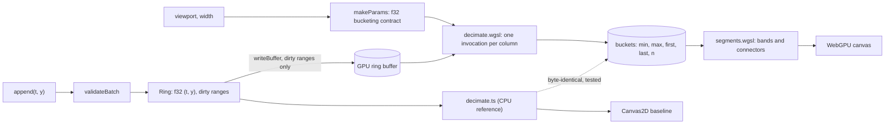

# webgpu-chart developer guide

## 1. What it is

`@sathwik/gpu-timeseries` is a streaming time-series chart. A WebGPU compute shader reduces millions of points to one record per pixel column, so drawing cost follows canvas width, not point count. The demo draws the same data with WebGPU, Canvas2D and uPlot side by side.

Measured headline (from `bench/results/latest.json`):

**4 series x 1M points: p95 frame time 1.12 ms on WebGPU vs 38.25 ms on uPlot and 33.61 ms on Canvas2D** (uncapped rAF, NVIDIA GeForce RTX 4090, AMD Ryzen 9 7900X 12-Core Processor, Chrome 154, measured 2026-10-04).

## 2. Quickstart (5 minutes)

```bash
pnpm install
pnpm exec playwright install chromium   # bundled Chromium for the fallback tests
pnpm dev                                # http://localhost:5430 in Chrome or Edge
pnpm test                               # unit and property tests (Node)
pnpm test:gpu                           # needs Chrome with WebGPU on this machine
pnpm build
pnpm bench                              # writes bench/results/latest.json
```

## 3. Architecture



One frame:

1. The ring reports its dirty ranges and only those bytes are uploaded.
2. The view uniforms (time window, scale, ring head) are written.
3. The compute pass runs one invocation per pixel column and writes min, max, first, last and count.
4. The render pass draws bands and connectors from the buckets.
5. The axis overlay (Canvas2D) draws ticks and grid on top.

## 4. Project layout

| Path | What it holds |
|---|---|
| `src/core` | Pure TypeScript: ring buffer, CPU decimation, segment rule, ticks, ingest, viewport, stats, seeded data |
| `src/gpu` | WebGPU: support check, device, uniforms, uploads, shaders, decimator, timer, backend |
| `src/chart` | Backend interface, model, theme, axes, input, `Chart` pane |
| `src/baselines` | Canvas2D and uPlot backends, sliding window for uPlot |
| `src/adapters` | Synthetic streaming source |
| `src/bench` | Scripted steps, fairness hash, runner, report and README rendering, bench page |
| `src/demo` | Three-pane demo page |
| `src/testing` | Hooks used by the GPU Playwright tests |
| `src/GpuChart.ts`, `src/index.ts` | Public library API |
| `tests` | Vitest files (Node) |
| `e2e/fallback`, `e2e/gpu` | Playwright specs: bundled Chromium without WebGPU, host Chrome with WebGPU |
| `bench` | Bench CLI and `results/` JSON |
| `scripts` | Bench table, pack smoke test, demo recording and GIF |
| `deploy`, `Dockerfile`, `docker-compose.yml` | nginx image of the built demo |
| `docs` | Spec, plan, ADRs, handoff, this guide, demo GIF |

## 5. Run, test and benchmark

| Command | What it does | Port |
|---|---|---|
| `pnpm dev` | Vite dev server | 5430 |
| `pnpm preview` | Serve the build | 5431 |
| `docker compose up -d --build app` | Built demo in nginx, container `webgpu-chart-app` | 5432 |
| `pnpm e2e` | Fallback Playwright project (bundled Chromium, `navigator.gpu` stubbed). Runs in CI | 5433 |
| `pnpm test:gpu` | GPU project: parity, render step, demo, bench page. Needs installed Chrome with a WebGPU adapter | 5433 |
| `pnpm bench` | Full benchmark (`-- --quick` for a smoke run) | 5434 |
| `pnpm bench:table` | Rewrite the README headline and table from `latest.json` (`--check` to verify) | none |
| `pnpm pack:smoke` | Pack, install in a temp project, typecheck without `@webgpu/types` | none |
| `pnpm demo:record`, `pnpm demo:gif` | Record the demo and build `docs/demo.gif` | 5435 |

## 6. Key decisions and what they gave up

- [0001 M4 over LTTB](adr/0001-minmax-decimation-over-lttb.md): keeps every spike, gives up LTTB's smoother look.
- [0002 One invocation per column, exact parity](adr/0002-gpu-kernel-and-exact-parity.md): simple and testable byte for byte, gives up work balance on very uneven data.
- [0003 GPU tests in host Chrome](adr/0003-gpu-tests-in-host-chrome.md): the only browser here with an adapter, gives up GPU tests in CI.
- [0004 Benchmark methodology](adr/0004-benchmark-methodology.md): uncapped rAF on a production build, gives up a vsync-realistic number.
- [0005 f32 time and epochs](adr/0005-time-precision-and-epochs.md): halves GPU memory, caps a series at about 4.66 hours.
- [0006 Toolchain and demo stack](adr/0006-toolchain-and-demo-stack.md): uPlot is a dev dependency only, so the library has no runtime dependencies.
- [0007 Ingest on the main thread](adr/0007-ingest-on-main-thread.md): no worker yet, gives up isolation from page jank.

## 7. Known limits and what is left

- Needs WebGPU (current Chrome or Edge). Without it the demo says why and runs the baselines.
- No recovery from GPU device loss yet. The pane stops and reports the error.
- CI has no GPU and no remote exists, so the workflow has only been linted with actionlint.
- GPU pass time from timestamp queries is GPU wall time and includes contention when other panes draw.
- Numbers come from one machine (two GPUs present, the WebGPU adapter is the NVIDIA one).
- v0.2: device-lost recovery, WebSocket and MQTT adapters, ingest worker, OffscreenCanvas, npm publish, hosted URL, area and band modes, multi-axis, mip-pyramid decimation for 10M+ points.
- Cosmetic, seen in the GIF: a paused uPlot pane shows its pause message faintly over the chart.
