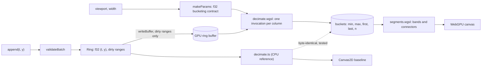

# webgpu-chart developer guide

## 1. What it is

`@sathwik/gpu-timeseries` is a streaming time-series chart for the browser.
A WebGPU compute shader reduces millions of points to one record per pixel column.
So the drawing cost follows the canvas width, not the point count.
The demo draws the same data with WebGPU, Canvas2D and uPlot side by side.

Measured headline (generated from `bench/results/latest.json`, never typed by hand):

<!-- headline:start -->
**4 series x 1M points: p95 frame time to GPU-complete 6.39 ms on WebGPU vs 46.73 ms on uPlot and 32.58 ms on Canvas2D** (one frame in flight, each frame timed until its GPU work finished, NVIDIA GeForce RTX 4090, AMD Ryzen 9 7900X 12-Core Processor, Chrome 154, measured 2026-10-04).
<!-- headline:end -->

The frame time runs from the start of the frame callback until the GPU (or the canvas) has finished that frame.
It is not the CPU submit time. See section 6 and ADR 0004.

## 2. Quickstart (5 minutes)

You need Node 24, pnpm 9 and Chrome or Edge with WebGPU.

```bash
pnpm install
pnpm exec playwright install chromium   # bundled Chromium for the fallback tests
pnpm dev                                # open http://localhost:5430 in Chrome or Edge
pnpm test                               # unit and property tests in Node
pnpm test:gpu                           # GPU tests in your installed Chrome
pnpm build
pnpm bench                              # writes bench/results/latest.json
pnpm bench:table                        # copies the numbers into README.md and this file
```

## 3. Architecture



One frame works like this:

1. The ring reports its dirty ranges. Only those bytes go to the GPU.
2. The view uniforms (time window, scale, ring head) are written.
3. The compute pass runs one invocation per pixel column. It writes min, max, first, last and count.
4. The render pass draws bands and connectors from those buckets.
5. A Canvas2D overlay draws the axes, ticks and grid on top.

Ownership rules:

- `GpuChart.create` acquires a GPU device and owns it. `destroy()` destroys the chart and then the device.
  If creating the chart fails, the device is destroyed at once (`src/gpu/owned.ts`).
- `WebGpuBackend` does not own its device. Whoever acquired it destroys it (the demo pane, the bench page, `GpuChart`).
- `GpuTimer` keeps a ring of 8 timestamp-query slots, so every frame can be timed while earlier readbacks are pending.

## 4. Project layout

| Path | What it holds |
|---|---|
| `src/core` | Pure TypeScript: ring buffer, CPU decimation, segment rule, ticks, ingest, viewport, stats, seeded data |
| `src/gpu` | WebGPU: support check, device, device ownership, uniforms, uploads, shaders, decimator, timer, backend |
| `src/chart` | Backend interface, model, theme, axes, input, the `Chart` pane |
| `src/baselines` | Canvas2D and uPlot backends, and the sliding window that feeds uPlot |
| `src/adapters` | Synthetic streaming source |
| `src/bench` | Scripted steps, fairness hash, runner, report and README rendering, bench page |
| `src/demo` | Three-pane demo page |
| `src/testing` | Hooks used by the GPU Playwright tests |
| `src/GpuChart.ts`, `src/index.ts` | Public library API |
| `tests` | Vitest files (run in Node) |
| `e2e/fallback`, `e2e/gpu` | Playwright specs: bundled Chromium without WebGPU, and host Chrome with WebGPU |
| `bench` | Bench CLI (`run.ts`) and `results/` JSON |
| `scripts` | Bench table, pack smoke test, demo recording and GIF |
| `deploy`, `Dockerfile`, `docker-compose.yml` | nginx image of the built demo |
| `docs` | Spec, plan, ADRs, handoff, this guide, demo GIF |

## 5. Run, test and benchmark

| Command | What it does | Port |
|---|---|---|
| `pnpm dev` | Vite dev server | 5430 |
| `pnpm preview` | Serve the production build | 5431 |
| `docker compose up -d --build app` | Built demo in nginx, container `webgpu-chart-app`. Stop it with `docker compose down` | 5432 |
| `pnpm typecheck` | TypeScript check | none |
| `pnpm test` | Vitest unit and property tests | none |
| `pnpm e2e` | Fallback Playwright project (bundled Chromium, no WebGPU). Runs in CI | 5433 |
| `pnpm test:gpu` | GPU project: parity, render step, demo, bench page. Needs installed Chrome with a WebGPU adapter | 5433 |
| `pnpm build` | Typecheck, demo build and library build | none |
| `pnpm pack:smoke` | Pack, install in a temp project, typecheck without `@webgpu/types` | none |
| `pnpm bench` | Full benchmark in host Chrome (`-- --quick` for a smoke run) | 5434 |
| `pnpm bench:table` | Rewrite the README and DEVDOCS headline and the README table from `latest.json`. `--check` only verifies | none |
| `pnpm demo:record`, `pnpm demo:gif` | Record the demo and build `docs/demo.gif` | 5435 |

CI (`.github/workflows/ci.yml`) runs test, `bench:table --check`, build, pack smoke, the fallback e2e and a Docker build.
It cannot run the GPU tests, because GitHub runners have no GPU.

## 6. Key decisions and what they gave up

- [0001 M4 over LTTB](adr/0001-minmax-decimation-over-lttb.md): keeps every spike. It gives up LTTB's smoother look.
- [0002 One invocation per column, exact parity](adr/0002-gpu-kernel-and-exact-parity.md): simple and testable byte for byte. It gives up work balance on very uneven data.
- [0003 GPU tests in host Chrome](adr/0003-gpu-tests-in-host-chrome.md): host Chrome is the only browser here with an adapter. It gives up GPU tests in CI.
- [0004 Benchmark methodology](adr/0004-benchmark-methodology.md): uncapped rAF on a production build. Each frame is timed until the GPU finishes it, with one frame in flight. It gives up a vsync-realistic number and CPU/GPU pipelining.
  The first version timed only rAF deltas. On this host the GPU ran about 100 ms behind the CPU, so that number only measured submit speed. Review caught it, and the bench now waits for `queue.onSubmittedWorkDone()`.
- [0005 f32 time and epochs](adr/0005-time-precision-and-epochs.md): halves GPU memory. It caps a series at about 4.66 hours.
- [0006 Toolchain and demo stack](adr/0006-toolchain-and-demo-stack.md): uPlot is a dev dependency only. The library has no runtime dependencies.
- [0007 Ingest on the main thread](adr/0007-ingest-on-main-thread.md): no worker yet. It gives up isolation from page jank.

## 7. Known limits and what is left

- Needs WebGPU (current Chrome or Edge). Without it the demo says why and runs the baselines only.
- No recovery from GPU device loss yet. The pane stops and reports the error.
- CI has never run, because there is no remote. The workflow was only linted with actionlint.
- GPU pass times are GPU wall time. They include contention when other panes draw. Timestamps tick in 65.5 us steps, so the demo shows `<0.07` below that.
- Numbers come from one machine (two GPUs present; the WebGPU adapter is the NVIDIA one).
- v0.2: device-lost recovery, WebSocket and MQTT adapters, an ingest worker, OffscreenCanvas, npm publish, a hosted URL, area and band modes, multi-axis, and mip-pyramid decimation for 10M+ points.
