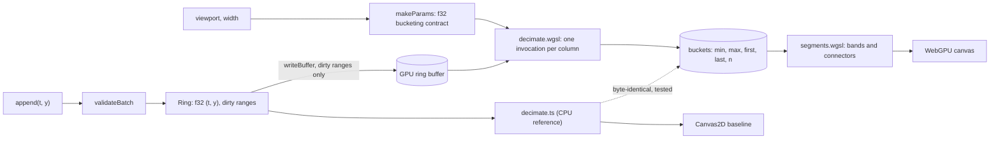

# webgpu-chart v0.1 Implementation Plan

> **For agentic workers:** REQUIRED SUB-SKILL: Use superpowers:subagent-driven-development (recommended) or superpowers:executing-plans to implement this plan task-by-task. Steps use checkbox (`- [ ]`) syntax for tracking.

**Goal:** Ship `@sathwik/gpu-timeseries`, a streaming time-series chart that decimates millions of points per frame in a WebGPU compute shader, plus a three-pane demo (WebGPU, Canvas2D, uPlot), an honest bench harness whose JSON feeds the README headline, a GIF, Docker, CI and docs.

**Architecture:** A pure TypeScript core (ring buffer, M4 decimation reference, segment rule, ticks, ingest, viewport) is shared by three render backends behind one `Backend` interface. The WebGPU backend uploads only dirty ring ranges, runs `decimate.wgsl` (one invocation per pixel column) and draws the buckets with `segments.wgsl`. Its output is byte-identical to the CPU reference, which Canvas2D also uses. A `Chart` wraps any backend with an axis overlay, input and a rAF loop; `GpuChart` is the public WebGPU wrapper.

**Tech Stack:** Node 24, pnpm 9.12.0, TypeScript 7.0.2, Vite 8.3.2, Vitest 5.0.3, fast-check 4.10.2, @playwright/test 1.63.0 (host Chrome for GPU, bundled Chromium for fallback), @webgpu/types 0.1.74, tsx 4.23.15, @types/node 26.6.4, uPlot 1.6.32 (demo and bench only), Docker (node:24-alpine, nginx:1.29-alpine), ffmpeg (host, for the GIF).

**Spec:** `docs/superpowers/specs/2026-10-04-webgpu-chart.md`. ADRs: `docs/adr/0001` to `0007`. Design doc: `C:\Users\sathwik\projects\taskarinchu\docs\devdocs\webgpu-chart.md`. Ledger: `.superpowers/sdd/2026-10-04-webgpu-chart/progress.md`.

## Already done (by the planner, do not redo)

- `git init -b main` in `C:\Users\sathwik\projects\taskarinchu\webgpu-chart`. Git identity is configured. No remote. Never add one.
- Spec, ADRs 0001 to 0007, this plan, the ledger and a planning entry in `docs/handoff.md` are committed.
- Every source file, test and config in this plan was prototyped in a scratch copy on 2026-10-04 and run on this host (Windows 11, Chrome 154, NVIDIA RTX 4090, Node 24.18.0): `tsc` clean, 19 Vitest files with 82 tests passing, 6 Playwright tests passing (2 fallback, 4 GPU), library build plus pack smoke passing, a quick bench run writing JSON, and a GIF of 4,242,254 bytes. Scratch timings are not results and must never be quoted. Only `pnpm bench` output committed in Task 23 may be quoted.
- Verified facts the code depends on:
  - Host Chrome via Playwright `channel: "chrome"` gets an NVIDIA adapter with `timestamp-query`, even headless. Playwright's bundled Chromium gets `requestAdapter() === null`. `navigator.gpu` exists only on `http://localhost` or https.
  - Chrome flags `--disable-frame-rate-limit --disable-gpu-vsync` uncap rAF (the panel is 120 Hz, so capped deltas sit at 8.3 ms).
  - `drawImage(webgpuCanvas)` in the same task as the submit reads back the rendered frame. Playwright video captures WebGPU canvases.
  - uPlot's `batch()` commits synchronously, so its draw time is inside `Backend.render`.
  - TypeScript 7 needs an explicit `rootDir` for declaration emit, and `@webgpu/types` for `GPU*` names.

## Global Constraints

- Work only inside `C:\Users\sathwik\projects\taskarinchu\webgpu-chart`. Never edit sibling repos. Never push, never add a remote, never open PRs.
- Node 24 (`node -v` prints v24.x) and pnpm 9.12.0 (`"packageManager": "pnpm@9.12.0"`). Install exactly the versions listed in Task 1 with `-E`. Do not upgrade anything.
- Host ports only in 5430-5439: dev 5430, preview 5431, Docker demo 5432, Playwright dev server 5433, bench preview 5434, demo recording preview 5435. No other host port may appear in any file.
- Docker: compose project `webgpu-chart`, container `webgpu-chart-app`, image `webgpu-chart:local`. Any one-off container is named `webgpu-chart-<something>`. Stop every container you start.
- The library (`src/index.ts` and what it imports) has zero runtime dependencies and its `.d.ts` never mentions `GPU*` types. uPlot is used only by `src/baselines/uplot.ts`, the demo and the bench.
- Never invent numbers. README numbers come only from `bench/results/latest.json` through `pnpm bench:table`. Test fixtures may contain made-up values only when labeled as fixtures.
- No secrets, no `.env` files.
- No em dash or en dash characters in UI copy, README or docs you write. Use a period, comma or hyphen.
- Use `import type` for type-only imports (`verbatimModuleSyntax` is on).
- Each task ends with exactly one commit whose subject is the one given, then a blank line, then `Co-Authored-By: Claude Sonnet 5.5 <noreply@anthropic.com>`. Commit only after the task's checks pass. Stage the task's ledger line in the same commit. Never commit `node_modules`, `dist`, `test-results`, `playwright-report`, `demo-video`, `bench/results/quick.json` or `*.tgz`.
- Ledger lines (append to `.superpowers/sdd/2026-10-04-webgpu-chart/progress.md`): `Task N: complete - <evidence, e.g. "pnpm test 5 files 24 passed">`, or `Task N: BLOCKED - <reason>`, or `Ruling: <decision> - <where recorded>`.
- Code blocks in this plan are complete files. Create them exactly. If a check fails, use superpowers:systematic-debugging, fix the cause, and note the deviation as a `Ruling:` line.

## Review Focus

1. **Zero-span or inverted viewport** (one sample, or zooming onto a single instant): the scale must stay finite, every sample lands in column 0, axes do not divide by zero. Pinned in Task 4 ("zero-span window"), Task 8 ("minimum span", "non-finite input") and Task 12 ("zero-length window").
2. **An append bigger than the ring, or one that wraps**: the GPU upload must be one full-ring upload or two in-range ranges, never an out-of-range write. Pinned in Task 3 ("splits a wrapping append", "overwrites everything") and Task 9 ("larger than capacity", "across the wrap").
3. **A window with no samples** (panned past the data, or a gap): all columns empty, both renderers draw only the background, nothing throws. Pinned in Task 4 ("empty window"), Task 5 ("nothing for empty buckets") and Task 13 (parity `emptyWindows > 5`).
4. **A browser without WebGPU, or with a null adapter**: the page says why, and the Canvas2D and uPlot panes still run. Pinned in Task 9 (`isSupported` reasons) and Task 17 (`fallback.spec.ts`).
5. **A hidden tab during a benchmark** (rAF is throttled): the run must abort rather than record bad numbers. Pinned in Task 18 ("aborts when the tab is hidden").

## File map

```
webgpu-chart/
  package.json, pnpm-lock.yaml, tsconfig.json, tsconfig.lib.json, vite.config.ts, vite.lib.config.ts,
  vitest.config.ts, playwright.config.ts, .gitignore, .gitattributes, .nvmrc, .dockerignore, LICENSE
  index.html, bench.html, gpu-test.html          Vite pages (demo, bench, GPU test hooks)
  Dockerfile, docker-compose.yml, deploy/nginx.conf, .github/workflows/ci.yml
  src/
    index.ts                 public library entry
    GpuChart.ts              public WebGPU chart
    core/prng.ts             mulberry32
    core/dataset.ts          Walk, makeDataset, yExtent
    core/ring.ts             Ring: f32 (t, y) ring, dirty ranges, visibleRange, epochs
    core/decimate.ts         bucketing contract, CPU reference M4
    core/segments.ts         segment rule shared with segments.wgsl
    core/ticks.ts            nice value and time ticks, labels
    core/ingest.ts           validateBatch policies
    core/viewport.ts         clamp, zoom, pan, follow
    core/stats.ts            percentile, summarize, RollingWindow
    gpu/support.ts           isSupported (no GPU types)
    gpu/device.ts            acquireDevice
    gpu/uniforms.ts          packView, packDraw, parseColor
    gpu/upload.ts            uploadDirty
    gpu/decimate.wgsl        compute shader
    gpu/decimator.ts         GpuDecimator (compute pipeline, buffers, readback for tests)
    gpu/segments.wgsl        render shader
    gpu/timer.ts             GpuTimer (timestamp queries)
    gpu/WebGpuBackend.ts     WebGPU Backend
    chart/backend.ts         Backend interface, FrameInput, RenderStats, FrameStats
    chart/model.ts           ChartModel (series, viewport, y range)
    chart/theme.ts, chart/axes.ts, chart/input.ts, chart/Chart.ts
    baselines/canvas2d.ts    Canvas2DBackend
    baselines/linearWindow.ts, baselines/uplot.ts
    adapters/synthetic.ts    SyntheticSource
    bench/script.ts, bench/fairness.ts, bench/runner.ts, bench/report.ts, bench/page.ts
    demo/main.ts, demo/demo.css
    testing/gpuTestPage.ts   hooks for e2e/gpu
  tests/                     Vitest (node): 19 files, 82 tests at the end
  e2e/fallback/fallback.spec.ts           bundled Chromium, navigator.gpu stubbed (CI)
  e2e/gpu/parity.spec.ts, e2e/gpu/pages.spec.ts   host Chrome with WebGPU
  bench/run.ts               bench CLI, writes bench/results/*.json
  scripts/bench-table.ts, scripts/pack-smoke.mjs, scripts/record-demo.ts, scripts/make-demo-gif.mjs
  docs/                      spec, plan, ADRs, DEVDOCS.md, handoff.md, demo.gif
  README.md
```

## Gates (Task 22 runs them; the reviewer re-runs them)

| Gate | Command | Pass condition |
|---|---|---|
| G1 | `pnpm typecheck` | exit 0, no output |
| G2 | `pnpm test` | `Test Files  19 passed (19)` and `Tests  82 passed (82)` |
| G3 | `pnpm build` | exit 0; `dist/demo/index.html`, `dist/lib/index.js`, `dist/lib/index.d.ts` exist |
| G4 | `pnpm e2e` | `2 passed` (fallback project, bundled Chromium) |
| G5 | `pnpm test:gpu` | `4 passed` (gpu project, host Chrome) |
| G6 | `pnpm pack:smoke` | prints `consumer typecheck ok without @webgpu/types`, exit 0 |
| G7 | `pnpm bench:table --check` | exit 0; `bench/results/latest.json` has scenario `4x1M` with webgpu, canvas2d and uplot results, no errors, one shared `inputHash` |
| G8 | `docker compose up -d --build app`, then `curl -s -o /dev/null -w "%{http_code}" http://localhost:5432/`, then `docker compose down` | prints `200`; `docker ps` shows `webgpu-chart-app` while up and nothing after down |
| G9 | `docker run --rm --name webgpu-chart-actionlint -v "${PWD}:/repo" -w /repo rhysd/actionlint:latest -color` | no output, exit 0 |
| G10 | `ls -l docs/demo.gif` | under 5,242,880 bytes, embedded near the top of README.md |
| G11 | `git status --short`; `git remote -v`; port grep (Task 22) | clean tree, no remote, no host port outside 5430-5439 |

---

### Task 1: Scaffold

**Files:**
- Create: `package.json`, `tsconfig.json`, `vite.config.ts`, `vitest.config.ts`, `.gitignore`, `.gitattributes`, `.nvmrc`, `LICENSE`, `src/index.ts`, `tests/smoke.test.ts`

**Interfaces:**
- Produces: scripts `pnpm test`, `pnpm typecheck`, `pnpm dev` (port 5430) and the rest used by later tasks. `pnpm build` fails until Task 20 (it needs `bench.html` from Task 19 and `vite.lib.config.ts` from Task 20). That is expected. Use `pnpm typecheck` and `pnpm test` until then.

- [ ] **Step 1: Create `package.json`**

```json
{
  "name": "@sathwik/gpu-timeseries",
  "version": "0.1.0",
  "description": "Streaming time-series chart that decimates millions of points per frame on WebGPU.",
  "license": "MIT",
  "type": "module",
  "packageManager": "pnpm@9.12.0",
  "engines": {
    "node": ">=24"
  },
  "files": [
    "dist/lib"
  ],
  "module": "./dist/lib/index.js",
  "types": "./dist/lib/index.d.ts",
  "exports": {
    ".": {
      "types": "./dist/lib/index.d.ts",
      "import": "./dist/lib/index.js"
    }
  },
  "sideEffects": false,
  "scripts": {
    "dev": "vite",
    "preview": "vite preview",
    "typecheck": "tsc -p tsconfig.json",
    "test": "vitest run",
    "build": "pnpm typecheck && pnpm build:demo && pnpm build:lib",
    "build:demo": "vite build",
    "build:lib": "vite build -c vite.lib.config.ts && tsc -p tsconfig.lib.json",
    "e2e": "playwright test --project=fallback",
    "test:gpu": "playwright test --project=gpu",
    "bench": "tsx bench/run.ts",
    "bench:table": "tsx scripts/bench-table.ts",
    "pack:smoke": "node scripts/pack-smoke.mjs",
    "demo:record": "tsx scripts/record-demo.ts",
    "demo:gif": "node scripts/make-demo-gif.mjs"
  }
}
```

- [ ] **Step 2: Install pinned dependencies and the bundled Chromium**

```bash
pnpm add -D -E typescript@7.0.2 vite@8.3.2 vitest@5.0.3 fast-check@4.10.2 @playwright/test@1.63.0 @webgpu/types@0.1.74 tsx@4.23.15 @types/node@26.6.4 uplot@1.6.32
pnpm exec playwright install chromium
```

Expected: `pnpm-lock.yaml` is created and `package.json` gains a `devDependencies` block with exact versions (no `^`). uPlot is a dev dependency on purpose: the published library has no runtime dependencies (ADR 0006). The Playwright install either downloads Chromium or reports it is already present.

- [ ] **Step 3: Create the configs**

`tsconfig.json`:

```json
{
  "compilerOptions": {
    "target": "ES2022",
    "module": "ESNext",
    "moduleResolution": "bundler",
    "lib": ["ES2023", "DOM", "DOM.Iterable"],
    "types": ["@webgpu/types", "node", "vite/client"],
    "strict": true,
    "skipLibCheck": true,
    "isolatedModules": true,
    "verbatimModuleSyntax": true,
    "noEmit": true
  },
  "include": ["src", "tests", "e2e", "bench", "scripts", "*.config.ts"]
}
```

`vite.config.ts`:

```ts
import { resolve } from "node:path";
import { defineConfig } from "vite";

// Cross-origin isolation gives performance.now() 5 us resolution instead of 100 us (bench precision).
const isolation = {
  "Cross-Origin-Opener-Policy": "same-origin",
  "Cross-Origin-Embedder-Policy": "require-corp",
};

// Demo, bench and GPU test pages. The library build is vite.lib.config.ts.
export default defineConfig({
  base: "./",
  server: { port: 5430, strictPort: true, headers: isolation },
  preview: { port: 5431, strictPort: true, headers: isolation },
  build: {
    outDir: "dist/demo",
    emptyOutDir: true,
    target: "es2022",
    rollupOptions: {
      input: {
        index: resolve(import.meta.dirname, "index.html"),
        bench: resolve(import.meta.dirname, "bench.html"),
        "gpu-test": resolve(import.meta.dirname, "gpu-test.html"),
      },
    },
  },
});
```

`vitest.config.ts`:

```ts
import { defineConfig } from "vitest/config";

export default defineConfig({
  test: { include: ["tests/**/*.test.ts"], environment: "node" },
});
```

`.gitignore`:

```text
node_modules/
dist/
test-results/
playwright-report/
demo-video/
bench/results/quick.json
*.tgz
*.log
.env
.env.*
!.env.example
```

`.gitattributes`:

```text
* text=auto eol=lf
*.gif binary
*.png binary
```

`.nvmrc`:

```text
24
```

`LICENSE`: the standard MIT license text with the line `Copyright (c) 2026 Sathwik`.

- [ ] **Step 4: Write the failing smoke test**

`tests/smoke.test.ts`:

```ts
import { readFileSync } from "node:fs";
import { describe, expect, it } from "vitest";
import { VERSION } from "../src/index";

describe("scaffold", () => {
  it("exports the package version", () => {
    const pkg = JSON.parse(readFileSync(new URL("../package.json", import.meta.url), "utf8")) as { version: string };
    expect(VERSION).toBe(pkg.version);
  });
});
```

Run: `pnpm test`
Expected: FAIL. `tests/smoke.test.ts` cannot resolve `../src/index`.

- [ ] **Step 5: Create `src/index.ts`**

```ts
// Public entry of @sathwik/gpu-timeseries. Task 15 fills in the exports.
export const VERSION = "0.1.0";
```

Run: `pnpm test`
Expected: `Test Files  1 passed (1)`, `Tests  1 passed (1)`.

Run: `pnpm typecheck`
Expected: exit 0, no output.

- [ ] **Step 6: Commit**

Check `git status --short` first: no `node_modules`, `dist` or other ignored paths may be listed.

```bash
git add package.json pnpm-lock.yaml tsconfig.json vite.config.ts vitest.config.ts .gitignore .gitattributes .nvmrc LICENSE src/index.ts tests/smoke.test.ts .superpowers/sdd/2026-10-04-webgpu-chart/progress.md
git commit -m "chore: scaffold library, demo and test tooling" -m "Co-Authored-By: Claude Sonnet 5.5 <noreply@anthropic.com>"
```

---

### Task 2: Seeded data

**Files:**
- Create: `src/core/prng.ts`, `src/core/dataset.ts`
- Test: `tests/dataset.test.ts`

**Interfaces:**
- Produces: `mulberry32(seed): () => number`; `class Walk(seed, level = 0) { next(): number }`; `makeDataset(spec: DatasetSpec): SeriesData[]` with `DatasetSpec { seed, series, points, startMs, stepMs }` and `SeriesData { t: Float64Array; y: Float32Array }` (all series share one `t` array); `yExtent(data): [number, number]`; constants `SPIKE_PROBABILITY`, `SPIKE_HEIGHT`, `WALK_STEP`, `REVERSION`.

- [ ] **Step 1: Write the failing test** `tests/dataset.test.ts`:

```ts
import { describe, expect, it } from "vitest";
import { mulberry32 } from "../src/core/prng";
import { Walk, makeDataset, yExtent } from "../src/core/dataset";

describe("mulberry32", () => {
  it("is deterministic per seed and stays in [0, 1)", () => {
    const a = mulberry32(42);
    const b = mulberry32(42);
    for (let i = 0; i < 1000; i++) {
      const x = a();
      expect(x).toBe(b());
      expect(x).toBeGreaterThanOrEqual(0);
      expect(x).toBeLessThan(1);
    }
    expect(mulberry32(1)()).not.toBe(mulberry32(2)());
  });
});

describe("Walk", () => {
  it("returns f32 values and the same sequence for the same seed", () => {
    const a = new Walk(7);
    const b = new Walk(7);
    for (let i = 0; i < 1000; i++) {
      const v = a.next();
      expect(v).toBe(b.next());
      expect(Math.fround(v)).toBe(v);
    }
  });
});

describe("makeDataset", () => {
  it("builds evenly spaced shared timestamps and one walk per series", () => {
    const d = makeDataset({ seed: 1, series: 3, points: 500, startMs: 1_000, stepMs: 2 });
    expect(d).toHaveLength(3);
    expect(d[0].t[0]).toBe(1_000);
    expect(d[0].t[499]).toBe(1_998);
    expect(d[1].t).toBe(d[0].t);
    expect(d[0].y).not.toEqual(d[1].y);
    const again = makeDataset({ seed: 1, series: 3, points: 500, startMs: 1_000, stepMs: 2 });
    expect(again[2].y).toEqual(d[2].y);
  });

  it("yExtent pads the range and has a default for no data", () => {
    const [lo, hi] = yExtent([{ t: new Float64Array([0, 1]), y: new Float32Array([0, 10]) }]);
    expect(lo).toBeCloseTo(-0.5);
    expect(hi).toBeCloseTo(10.5);
    expect(yExtent([])).toEqual([0, 1]);
  });
});
```

- [ ] **Step 2: Run it**

Run: `pnpm test`
Expected: FAIL. `tests/dataset.test.ts` cannot resolve `../src/core/prng`.

- [ ] **Step 3: Implement** `src/core/prng.ts`:

```ts
/** Deterministic 32-bit PRNG (mulberry32). Each call returns a float in [0, 1). */
export function mulberry32(seed: number): () => number {
  let s = seed >>> 0;
  return () => {
    s = (s + 0x6d2b79f5) >>> 0;
    let t = s;
    t = Math.imul(t ^ (t >>> 15), t | 1);
    t ^= t + Math.imul(t ^ (t >>> 7), t | 61);
    return ((t ^ (t >>> 14)) >>> 0) / 4294967296;
  };
}
```

`src/core/dataset.ts`:

```ts
import { mulberry32 } from "./prng";

/** Probability that a sample is a one-sample spike. */
export const SPIKE_PROBABILITY = 1 / 20_000;
/** Height of a spike above or below the walk. */
export const SPIKE_HEIGHT = 25;
/** Largest step of the walk per sample. */
export const WALK_STEP = 0.08;
/** Pull back toward the level per sample (time constant 50,000 samples). */
export const REVERSION = 0.00002;

/**
 * Random walk that drifts around `level`, with rare one-sample spikes. Deterministic for a seed.
 * Values are f32 (Math.fround), so they survive a Float32Array round trip unchanged.
 */
export class Walk {
  private readonly rnd: () => number;
  private y: number;

  constructor(
    seed: number,
    private readonly level = 0,
  ) {
    this.rnd = mulberry32(seed);
    this.y = level;
  }

  next(): number {
    this.y += (this.rnd() * 2 - 1) * WALK_STEP - (this.y - this.level) * REVERSION;
    if (this.rnd() < SPIKE_PROBABILITY) {
      return Math.fround(this.y + (this.rnd() < 0.5 ? -SPIKE_HEIGHT : SPIKE_HEIGHT));
    }
    return Math.fround(this.y);
  }
}

export interface DatasetSpec {
  seed: number;
  series: number;
  points: number;
  /** Absolute time of sample 0, Unix ms. */
  startMs: number;
  stepMs: number;
}

export interface SeriesData {
  /** Absolute Unix ms. Shared by all series of one dataset. */
  t: Float64Array;
  y: Float32Array;
}

export function makeDataset(spec: DatasetSpec): SeriesData[] {
  const t = new Float64Array(spec.points);
  for (let i = 0; i < spec.points; i++) t[i] = spec.startMs + i * spec.stepMs;
  const out: SeriesData[] = [];
  for (let s = 0; s < spec.series; s++) {
    const walk = new Walk(spec.seed + s * 7919, s * 12);
    const y = new Float32Array(spec.points);
    for (let i = 0; i < spec.points; i++) y[i] = walk.next();
    out.push({ t, y });
  }
  return out;
}

/** Min and max over all series, padded by 5%. [0, 1] when there is no data. */
export function yExtent(data: SeriesData[]): [number, number] {
  let lo = Infinity;
  let hi = -Infinity;
  for (const s of data) {
    for (let i = 0; i < s.y.length; i++) {
      const v = s.y[i];
      if (v < lo) lo = v;
      if (v > hi) hi = v;
    }
  }
  if (lo > hi) return [0, 1];
  const pad = (hi - lo) * 0.05 || 1;
  return [lo - pad, hi + pad];
}
```

- [ ] **Step 4: Run tests**

Run: `pnpm test`
Expected: `Test Files  2 passed (2)`, `Tests  5 passed (5)`. Then `pnpm typecheck`: exit 0.

- [ ] **Step 5: Commit** `feat(core): seeded prng, random walk and datasets` (add the three files plus the ledger).

---

### Task 3: Ring buffer

**Files:**
- Create: `src/core/ring.ts`
- Test: `tests/ring.property.test.ts`, `tests/ring.visibleRange.test.ts`, `tests/ring.epoch.test.ts`

**Interfaces:**
- Produces: `MAX_SPAN_MS = 16_777_216`; `canonicalY(y): number`; `interface DirtyRange { start; end }` (physical slots); `interface IndexRange { start; end }` (logical, 0 = oldest); `class Ring(capacity)` with fields `capacity, data: Float32Array (interleaved t,y), head, count, epoch, rebases, yMin, yMax, version`, getter `oldest`, and methods `physical(k)`, `tRel(k)`, `y(k)`, `tAbs(k)`, `firstT()` (+Infinity when empty), `lastT()` (-Infinity when empty), `append(t, y)`, `takeDirty(): DirtyRange[]`, `visibleRange(t0Abs, t1Abs): IndexRange`.
- Contract: callers pass finite, non-decreasing `t` (Task 7's `validateBatch` guarantees it). `takeDirty()` has one consumer (the GPU uploader).

- [ ] **Step 1: Write the failing tests**

`tests/ring.property.test.ts` (invariant 3):

```ts
import { describe, expect, it } from "vitest";
import fc from "fast-check";
import { Ring, canonicalY } from "../src/core/ring";

/** Naive model: a plain array that keeps the last `capacity` samples. */
function model(capacity: number, batches: number[]): number[] {
  const all: number[] = [];
  let t = 0;
  for (const k of batches) for (let i = 0; i < k; i++) all.push(t++);
  return all.slice(Math.max(0, all.length - capacity));
}

describe("Ring (invariant 3)", () => {
  it("never exceeds capacity and keeps exactly the newest samples", () => {
    fc.assert(
      fc.property(
        fc.integer({ min: 1, max: 64 }),
        fc.array(fc.integer({ min: 0, max: 150 }), { maxLength: 30 }),
        (capacity, batches) => {
          const r = new Ring(capacity);
          let t = 0;
          for (const k of batches) {
            const ts = Array.from({ length: k }, () => t++);
            r.append(ts, ts.map((v) => v * 2));
            expect(r.count).toBeLessThanOrEqual(capacity);
          }
          const want = model(capacity, batches);
          expect(r.count).toBe(want.length);
          for (let k = 0; k < r.count; k++) {
            expect(r.tAbs(k)).toBe(want[k]);
            expect(r.y(k)).toBe(want[k] * 2);
          }
        },
      ),
    );
  });

  it("rejects a bad capacity and mismatched lengths", () => {
    expect(() => new Ring(0)).toThrow(RangeError);
    expect(() => new Ring(1.5)).toThrow(RangeError);
    expect(() => new Ring(4).append([1, 2], [1])).toThrow(RangeError);
  });

  it("stores canonical f32 y values", () => {
    const r = new Ring(4);
    r.append([0, 1, 2, 3], [-0, 1e-40, 0.1, -3]);
    expect(Object.is(r.y(0), 0)).toBe(true);
    expect(r.y(1)).toBe(0);
    expect(r.y(2)).toBe(Math.fround(0.1));
    expect(canonicalY(-1e-39)).toBe(0);
    expect(r.yMin).toBe(-3);
    expect(r.yMax).toBe(Math.fround(0.1));
  });
});

describe("Ring dirty ranges", () => {
  it("reports one range for a plain append and merges consecutive appends", () => {
    const r = new Ring(10);
    r.append([0, 1, 2], [0, 0, 0]);
    r.append([3, 4], [0, 0]);
    expect(r.takeDirty()).toEqual([{ start: 0, end: 5 }]);
    expect(r.takeDirty()).toEqual([]);
  });

  it("splits a wrapping append into two ranges", () => {
    const r = new Ring(10);
    r.append([0, 1, 2, 3, 4, 5, 6, 7], new Array(8).fill(0));
    r.takeDirty();
    r.append([8, 9, 10, 11], [0, 0, 0, 0]);
    expect(r.takeDirty()).toEqual([
      { start: 8, end: 10 },
      { start: 0, end: 2 },
    ]);
  });

  it("reports the whole ring when an append overwrites everything", () => {
    const r = new Ring(4);
    r.append([0, 1, 2, 3, 4, 5, 6], new Array(7).fill(1));
    expect(r.takeDirty()).toEqual([{ start: 0, end: 4 }]);
    expect(r.count).toBe(4);
    expect(r.tAbs(0)).toBe(3);
  });

  it("keeps at most two pending ranges when nobody takes them", () => {
    const r = new Ring(8);
    for (let i = 0; i < 100; i++) r.append([i], [i]);
    const d = r.takeDirty();
    expect(d.length).toBeLessThanOrEqual(2);
  });
});
```

`tests/ring.visibleRange.test.ts` (invariant 4):

```ts
import { describe, expect, it } from "vitest";
import fc from "fast-check";
import { Ring } from "../src/core/ring";

describe("Ring.visibleRange (invariant 4)", () => {
  it("returns exactly the samples with t0 <= t <= t1, across the wrap point", () => {
    fc.assert(
      fc.property(
        fc.integer({ min: 1, max: 50 }),
        fc.array(fc.integer({ min: 0, max: 3 }), { minLength: 1, maxLength: 200 }),
        fc.integer({ min: -5, max: 400 }),
        fc.integer({ min: 0, max: 400 }),
        (capacity, gaps, a, len) => {
          const r = new Ring(capacity);
          let t = 1_700_000_000_000;
          const ts = gaps.map((g) => (t += g));
          r.append(ts, ts.map(() => 1));
          const t0 = 1_700_000_000_000 + a;
          const t1 = t0 + len;
          const { start, end } = r.visibleRange(t0, t1);
          const want: number[] = [];
          for (let k = 0; k < r.count; k++) {
            const rel = r.tRel(k);
            if (rel >= t0 - r.epoch && rel <= t1 - r.epoch) want.push(k);
          }
          const got = Array.from({ length: end - start }, (_, i) => start + i);
          expect(got).toEqual(want);
        },
      ),
    );
  });

  it("returns an empty range for an empty ring or an inverted window", () => {
    const r = new Ring(8);
    expect(r.visibleRange(0, 10)).toEqual({ start: 0, end: 0 });
    r.append([1, 2, 3], [0, 0, 0]);
    const inv = r.visibleRange(3, 1);
    expect(inv.end - inv.start).toBe(0);
  });
});
```

`tests/ring.epoch.test.ts` (invariant 6):

```ts
import { describe, expect, it } from "vitest";
import { MAX_SPAN_MS, Ring } from "../src/core/ring";

describe("Ring epochs (invariant 6)", () => {
  it("keeps relative time within 2^24 ms over a 6-hour 10 Hz stream and rebases", () => {
    const r = new Ring(1_000_000);
    const start = 1_759_536_000_000;
    const hz = 10;
    const total = 6 * 3600 * hz;
    let maxRel = 0;
    for (let i = 0; i < total; i += 1000) {
      const ts: number[] = [];
      for (let j = i; j < Math.min(total, i + 1000); j++) ts.push(start + j * (1000 / hz));
      r.append(ts, ts.map(() => 1));
      maxRel = Math.max(maxRel, r.tRel(r.count - 1));
      expect(r.tRel(0)).toBeGreaterThanOrEqual(0);
    }
    expect(r.rebases).toBeGreaterThan(0);
    expect(maxRel).toBeLessThanOrEqual(MAX_SPAN_MS);
    expect(r.lastT()).toBe(start + (total - 1) * 100);
    expect(r.lastT() - r.firstT()).toBeLessThan(MAX_SPAN_MS);
  });

  it("marks the whole ring dirty after a rebase and keeps times exact", () => {
    const r = new Ring(100);
    const t0 = 1_000_000;
    r.append([t0, t0 + 10_000], [1, 2]);
    r.takeDirty();
    r.append([t0 + MAX_SPAN_MS - 2], [3]);
    expect(r.rebases).toBe(0);
    r.append([t0 + 10_000 + MAX_SPAN_MS - 5], [4]);
    expect(r.rebases).toBe(1);
    expect(r.takeDirty()).toEqual([{ start: 0, end: 100 }]);
    expect(r.tAbs(0)).toBe(t0 + 10_000);
    expect(r.lastT()).toBe(t0 + 10_000 + MAX_SPAN_MS - 5);
  });

  it("evicts samples older than the span window", () => {
    const r = new Ring(100);
    r.append([0, 1, 2], [1, 1, 1]);
    r.append([MAX_SPAN_MS + 1], [1]);
    expect(r.firstT()).toBe(2);
    expect(r.count).toBe(2);
  });
});
```

- [ ] **Step 2: Run them**

Run: `pnpm test`
Expected: FAIL. The three ring test files cannot resolve `../src/core/ring`.

- [ ] **Step 3: Implement** `src/core/ring.ts`:

```ts
/** Largest span of relative time a ring holds: 2^24 ms (about 4.66 h). f32 is exact for integers below it. */
export const MAX_SPAN_MS = 16_777_216;
/** Samples are kept while newest - t <= KEEP_MS, so that newest - floor(oldest) < MAX_SPAN_MS. */
const KEEP_MS = MAX_SPAN_MS - 1;
/** Smallest positive normal f32 (2^-126). */
const MIN_NORMAL_F32 = 1.1754943508222875e-38;

/** Physical sample indices [start, end). */
export interface DirtyRange {
  start: number;
  end: number;
}

/** Logical sample indices [start, end); 0 is the oldest sample. */
export interface IndexRange {
  start: number;
  end: number;
}

/** f32 value with -0 turned into +0 and subnormals flushed to 0 (GPUs may flush them). */
export function canonicalY(y: number): number {
  const f = Math.fround(y);
  return f === 0 || Math.abs(f) < MIN_NORMAL_F32 ? 0 : f;
}

/**
 * Fixed-capacity ring of (t, y) samples, interleaved as f32 pairs, the same layout the GPU storage buffer uses.
 * t is stored relative to an integer `epoch` (absolute ms). Appends must be finite and non-decreasing in t
 * (see validateBatch). takeDirty() has exactly one consumer: the GPU uploader.
 */
export class Ring {
  readonly capacity: number;
  /** [t0, y0, t1, y1, ...] indexed by physical slot. */
  readonly data: Float32Array;
  /** Physical slot of the next write. */
  head = 0;
  count = 0;
  /** Absolute ms that relative times are measured from. Always an integer. */
  epoch = 0;
  /** How many times the epoch moved. */
  rebases = 0;
  /** Min and max of every y ever appended. Never shrinks. */
  yMin = Infinity;
  yMax = -Infinity;
  /** Bumped on every append that stores at least one sample. */
  version = 0;
  private dirty: DirtyRange[] = [];
  private full = false;

  constructor(capacity: number) {
    if (!Number.isInteger(capacity) || capacity < 1) {
      throw new RangeError(`capacity must be a positive integer, got ${capacity}`);
    }
    this.capacity = capacity;
    this.data = new Float32Array(capacity * 2);
  }

  /** Physical slot of logical index 0 (the oldest sample). */
  get oldest(): number {
    return (this.head - this.count + this.capacity) % this.capacity;
  }

  physical(k: number): number {
    return (this.oldest + k) % this.capacity;
  }

  tRel(k: number): number {
    return this.data[2 * this.physical(k)];
  }

  y(k: number): number {
    return this.data[2 * this.physical(k) + 1];
  }

  tAbs(k: number): number {
    return this.epoch + this.tRel(k);
  }

  /** Absolute time of the oldest sample, or +Infinity when empty. */
  firstT(): number {
    return this.count === 0 ? Infinity : this.tAbs(0);
  }

  /** Absolute time of the newest sample, or -Infinity when empty. */
  lastT(): number {
    return this.count === 0 ? -Infinity : this.tAbs(this.count - 1);
  }

  append(t: ArrayLike<number>, y: ArrayLike<number>): void {
    const n = t.length;
    if (y.length !== n) throw new RangeError(`t has ${n} samples but y has ${y.length}`);
    if (n === 0) return;
    const newest = t[n - 1];

    // Batch samples that would be evicted at once are skipped; so are all but the last `capacity`.
    let i0 = Math.max(0, n - this.capacity);
    while (i0 < n - 1 && newest - t[i0] > KEEP_MS) i0++;

    // Evict ring samples outside the time window (ADR 0005).
    while (this.count > 0 && newest - this.tAbs(0) > KEEP_MS) this.count--;

    if (this.count === 0) {
      this.epoch = Math.floor(t[i0]);
    } else if (newest - this.epoch >= MAX_SPAN_MS) {
      this.rebase(this.epoch + Math.floor(this.tRel(0)));
    }

    const k = n - i0;
    const start = this.head;
    for (let i = i0; i < n; i++) {
      const p = this.head;
      this.data[2 * p] = Math.fround(t[i] - this.epoch);
      const v = canonicalY(y[i]);
      this.data[2 * p + 1] = v;
      if (v < this.yMin) this.yMin = v;
      if (v > this.yMax) this.yMax = v;
      this.head = p + 1 === this.capacity ? 0 : p + 1;
      if (this.count < this.capacity) this.count++;
    }
    if (start + k <= this.capacity) {
      this.markDirty(start, start + k);
    } else {
      this.markDirty(start, this.capacity);
      this.markDirty(0, start + k - this.capacity);
    }
    this.version++;
  }

  /** Dirty physical ranges since the last call, then clears them. A full upload is [{0, capacity}]. */
  takeDirty(): DirtyRange[] {
    if (this.full) {
      this.full = false;
      this.dirty = [];
      return [{ start: 0, end: this.capacity }];
    }
    const out = this.dirty;
    this.dirty = [];
    return out;
  }

  /** Logical range of samples with t0 <= t <= t1 (absolute ms), by binary search. */
  visibleRange(t0: number, t1: number): IndexRange {
    if (!(t1 >= t0)) return { start: 0, end: 0 };
    const start = this.lowerBound(t0 - this.epoch, false);
    const end = this.lowerBound(t1 - this.epoch, true);
    return { start, end: Math.max(start, end) };
  }

  /** First logical k with tRel(k) >= x, or with tRel(k) > x when `after` is true. */
  private lowerBound(x: number, after: boolean): number {
    let lo = 0;
    let hi = this.count;
    while (lo < hi) {
      const mid = (lo + hi) >>> 1;
      const v = this.tRel(mid);
      if (after ? v <= x : v < x) lo = mid + 1;
      else hi = mid;
    }
    return lo;
  }

  private rebase(newEpoch: number): void {
    const shift = newEpoch - this.epoch;
    for (let k = 0; k < this.count; k++) {
      const p = 2 * this.physical(k);
      this.data[p] = Math.fround(this.data[p] - shift);
    }
    this.epoch = newEpoch;
    this.rebases++;
    this.full = true;
    this.dirty = [];
  }

  private markDirty(start: number, end: number): void {
    if (this.full || end <= start) return;
    const last = this.dirty[this.dirty.length - 1];
    if (last && last.end === start) last.end = end;
    else this.dirty.push({ start, end });
    let total = 0;
    for (const d of this.dirty) total += d.end - d.start;
    if (total >= this.capacity || this.dirty.length > 2) {
      this.full = true;
      this.dirty = [];
    }
  }
}
```

- [ ] **Step 4: Run tests**

Run: `pnpm test`
Expected: `Test Files  5 passed (5)`, `Tests  17 passed (17)`. Then `pnpm typecheck`: exit 0.

- [ ] **Step 5: Commit** `feat(core): ring buffer with dirty ranges, range search and epochs`.

---

### Task 4: CPU reference decimation

**Files:**
- Create: `src/core/decimate.ts`
- Test: `tests/decimate.test.ts`

**Interfaces:**
- Consumes: `Ring` (Task 3).
- Produces: `BUCKET_FLOATS = 8`, `BUCKET_BYTES = 32`, `MIN_SPAN_MS = 1e-3`; `interface DecimateParams { t0; scale; width; start; end }`; `interface Buckets { width; buffer: ArrayBuffer; f32: Float32Array; u32: Uint32Array }`; `createBuckets(width)`; `makeParams(ring, view: { t0; t1 }, width): DecimateParams`; `columnOf(t, t0, scale, width): number`; `decimate(ring, params, out?): Buckets`. Bucket record layout per column: `[minY, maxY, firstY, lastY]` as f32, then `n` as u32 at word 4, words 5-7 zero. Empty columns are all-zero bytes. This exact layout is what `decimate.wgsl` writes (Task 13).

- [ ] **Step 1: Write the failing test** `tests/decimate.test.ts` (includes invariant 2):

```ts
import { describe, expect, it } from "vitest";
import fc from "fast-check";
import { Ring } from "../src/core/ring";
import { BUCKET_FLOATS, columnOf, createBuckets, decimate, makeParams } from "../src/core/decimate";

function ringOf(ts: number[], ys: number[], capacity = ts.length): Ring {
  const r = new Ring(capacity);
  r.append(ts, ys);
  return r;
}

const bucket = (b: ReturnType<typeof decimate>, c: number) => ({
  minY: b.f32[c * BUCKET_FLOATS],
  maxY: b.f32[c * BUCKET_FLOATS + 1],
  firstY: b.f32[c * BUCKET_FLOATS + 2],
  lastY: b.f32[c * BUCKET_FLOATS + 3],
  n: b.u32[c * BUCKET_FLOATS + 4],
});

describe("columnOf", () => {
  it("clamps to [0, width - 1] and uses f32 arithmetic", () => {
    expect(columnOf(-5, 0, 1, 10)).toBe(0);
    expect(columnOf(50, 0, 1, 10)).toBe(9);
    expect(columnOf(3.5, 0, 1, 10)).toBe(3);
    const t0 = Math.fround(0.1);
    const scale = Math.fround(1 / 3);
    expect(columnOf(Math.fround(3.1), t0, scale, 100)).toBe(Math.floor(Math.fround(Math.fround(Math.fround(3.1) - t0) * scale)));
  });
});

describe("decimate", () => {
  it("computes min, max, first, last and n per column", () => {
    // 10 samples over [0, 9] into 2 columns of 5 ms each.
    const r = ringOf([0, 1, 2, 3, 4, 5, 6, 7, 8, 9], [5, 1, 9, 2, 3, 4, 8, 0, 6, 7]);
    const b = decimate(r, makeParams(r, { t0: 0, t1: 10 }, 2));
    expect(bucket(b, 0)).toEqual({ minY: 1, maxY: 9, firstY: 5, lastY: 3, n: 5 });
    expect(bucket(b, 1)).toEqual({ minY: 0, maxY: 8, firstY: 4, lastY: 7, n: 5 });
  });

  it("leaves empty columns as zero bytes and handles an empty window", () => {
    const r = ringOf([0, 100], [3, 4]);
    const b = decimate(r, makeParams(r, { t0: 0, t1: 100 }, 10));
    expect(bucket(b, 5)).toEqual({ minY: 0, maxY: 0, firstY: 0, lastY: 0, n: 0 });
    expect(bucket(b, 9).n).toBe(1);
    const empty = decimate(r, makeParams(r, { t0: 40, t1: 60 }, 10));
    expect(Array.from(empty.u32).every((v) => v === 0)).toBe(true);
  });

  it("puts every sample of a zero-span window in column 0", () => {
    const r = ringOf([5, 5, 5], [1, 2, 3]);
    const b = decimate(r, makeParams(r, { t0: 5, t1: 5 }, 4));
    expect(bucket(b, 0)).toEqual({ minY: 1, maxY: 3, firstY: 1, lastY: 3, n: 3 });
  });

  it("reads across the ring wrap point", () => {
    const r = new Ring(4);
    r.append([0, 1, 2, 3, 4, 5], [0, 0, 7, 8, 9, 1]);
    const b = decimate(r, makeParams(r, { t0: 2, t1: 5 }, 1));
    expect(bucket(b, 0)).toEqual({ minY: 1, maxY: 9, firstY: 7, lastY: 1, n: 4 });
  });

  it("rejects a width mismatch and a bad width", () => {
    const r = ringOf([0, 1], [0, 1]);
    expect(() => decimate(r, makeParams(r, { t0: 0, t1: 1 }, 4), createBuckets(3))).toThrow(RangeError);
    expect(() => makeParams(r, { t0: 0, t1: 1 }, 0)).toThrow(RangeError);
  });
});

describe("decimate spike property (invariant 2)", () => {
  it("shows a single extreme sample in its column's max (or min) at any zoom", () => {
    fc.assert(
      fc.property(
        fc.integer({ min: 2, max: 3000 }),
        fc.integer({ min: 1, max: 2000 }),
        fc.double({ min: 0, max: 1, noNaN: true }),
        fc.double({ min: 0, max: 1, noNaN: true }),
        fc.double({ min: 0, max: 1, noNaN: true }),
        fc.boolean(),
        fc.integer(),
        (n, width, spikeAt, a, b, up, seed) => {
          let s = seed >>> 0;
          const ys = Array.from({ length: n }, () => ((s = (s * 1664525 + 1013904223) >>> 0) / 2 ** 32) * 10 - 5);
          const ts = Array.from({ length: n }, (_, i) => 1_759_000_000_000 + i * 3);
          const k = Math.min(n - 1, Math.floor(spikeAt * n));
          ys[k] = up ? 1000 : -1000;
          const r = new Ring(n);
          r.append(ts, ys);
          const lo = Math.min(a, b) * k;
          const hi = k + Math.max(a, b) * (n - 1 - k);
          const view = { t0: ts[Math.floor(lo)], t1: ts[Math.ceil(hi)] };
          const p = makeParams(r, view, width);
          const out = decimate(r, p);
          const c = columnOf(r.tRel(k), p.t0, p.scale, width);
          if (up) expect(out.f32[c * BUCKET_FLOATS + 1]).toBe(1000);
          else expect(out.f32[c * BUCKET_FLOATS]).toBe(-1000);
        },
      ),
      { numRuns: 300 },
    );
  });
});
```

- [ ] **Step 2: Run it**

Run: `pnpm test`
Expected: FAIL. `tests/decimate.test.ts` cannot resolve `../src/core/decimate`.

- [ ] **Step 3: Implement** `src/core/decimate.ts`:

```ts
import type { Ring } from "./ring";

/** Floats per bucket record. A record is 32 bytes: minY, maxY, firstY, lastY (f32), n (u32), 3 x u32 padding. */
export const BUCKET_FLOATS = 8;
export const BUCKET_BYTES = 32;
/** Smallest time span a viewport may have when computing the scale (avoids division by zero). */
export const MIN_SPAN_MS = 1e-3;

/** Inputs of the bucketing contract (ADR 0002). Shared by the CPU reference and the GPU kernel. */
export interface DecimateParams {
  /** Viewport start, f32 ms relative to the ring epoch. */
  t0: number;
  /** f32 columns per ms. */
  scale: number;
  /** Number of columns (device pixels). */
  width: number;
  /** Logical index range of visible samples. */
  start: number;
  end: number;
}

/** Bucket records in the GPU layout. f32 and u32 view the same buffer. */
export interface Buckets {
  width: number;
  buffer: ArrayBuffer;
  f32: Float32Array;
  u32: Uint32Array;
}

export function createBuckets(width: number): Buckets {
  const buffer = new ArrayBuffer(width * BUCKET_BYTES);
  return { width, buffer, f32: new Float32Array(buffer), u32: new Uint32Array(buffer) };
}

export function makeParams(ring: Ring, view: { t0: number; t1: number }, width: number): DecimateParams {
  if (!Number.isInteger(width) || width < 1) throw new RangeError(`width must be a positive integer, got ${width}`);
  const { start, end } = ring.visibleRange(view.t0, view.t1);
  const span = Math.max(view.t1 - view.t0, MIN_SPAN_MS);
  return {
    t0: Math.fround(view.t0 - ring.epoch),
    scale: Math.fround(width / span),
    width,
    start,
    end,
  };
}

/** Column of a sample: clamp(floor(f32(f32(t - t0) * scale)), 0, width - 1). Matches decimate.wgsl bit for bit. */
export function columnOf(t: number, t0: number, scale: number, width: number): number {
  const c = Math.floor(Math.fround(Math.fround(t - t0) * scale));
  return c < 0 ? 0 : c > width - 1 ? width - 1 : c;
}

/** CPU reference M4 decimation: min, max, first, last and count per column. Empty columns are all zero bytes. */
export function decimate(ring: Ring, p: DecimateParams, out: Buckets = createBuckets(p.width)): Buckets {
  if (out.width !== p.width) throw new RangeError(`buckets have width ${out.width}, params have ${p.width}`);
  const { f32, u32 } = out;
  f32.fill(0);
  const data = ring.data;
  const cap = ring.capacity;
  let i = (ring.oldest + p.start) % cap;
  for (let k = p.start; k < p.end; k++) {
    const t = data[2 * i];
    const y = data[2 * i + 1];
    const o = columnOf(t, p.t0, p.scale, p.width) * BUCKET_FLOATS;
    if (u32[o + 4] === 0) {
      f32[o] = y;
      f32[o + 1] = y;
      f32[o + 2] = y;
    } else {
      if (y < f32[o]) f32[o] = y;
      if (y > f32[o + 1]) f32[o + 1] = y;
    }
    f32[o + 3] = y;
    u32[o + 4]++;
    i = i + 1 === cap ? 0 : i + 1;
  }
  return out;
}
```

- [ ] **Step 4: Run tests**

Run: `pnpm test`
Expected: `Test Files  6 passed (6)`, `Tests  24 passed (24)`. Then `pnpm typecheck`: exit 0.

- [ ] **Step 5: Commit** `feat(core): cpu reference m4 decimation`.

---

### Task 5: Segment rule

**Files:**
- Create: `src/core/segments.ts`
- Test: `tests/segments.test.ts`

**Interfaces:**
- Consumes: `Buckets`, `BUCKET_FLOATS` (Task 4).
- Produces: `interface YMap { yMin; yMax; heightPx }`; `yToPx(y, m)`; `segmentCapacity(width)`; `segmentsInto(b, m, maxGapPx, out: Float32Array): number` (segment count); `segmentsFromBuckets(b, m, maxGapPx): Float32Array` (`[x0, y0, x1, y1]` per segment, pixel space, row 0 at the top). `segments.wgsl` (Task 14) implements the same rule.

- [ ] **Step 1: Write the failing test** `tests/segments.test.ts`:

```ts
import { describe, expect, it } from "vitest";
import { Ring } from "../src/core/ring";
import { createBuckets, decimate, makeParams } from "../src/core/decimate";
import { segmentsFromBuckets, segmentsInto, yToPx } from "../src/core/segments";

const map = { yMin: 0, yMax: 10, heightPx: 100 };

describe("yToPx", () => {
  it("maps yMax to the top row and yMin to the bottom", () => {
    expect(yToPx(10, map)).toBe(0);
    expect(yToPx(0, map)).toBe(100);
    expect(yToPx(5, { yMin: 5, yMax: 5, heightPx: 100 })).toBe(0);
  });
});

describe("segmentsFromBuckets", () => {
  it("draws a band per column and connectors between neighbours", () => {
    const r = new Ring(4);
    r.append([0, 1, 2, 3], [2, 4, 6, 8]);
    const b = decimate(r, makeParams(r, { t0: 0, t1: 4 }, 2));
    const s = Array.from(segmentsFromBuckets(b, map, 32));
    // column 0: band only (first=2,last=4); column 1: connector from (0.5, px(4)) to (1.5, px(6)), then band.
    expect(s).toEqual([0.5, 59.5, 0.5, 80.5, 0.5, 60, 1.5, 40, 1.5, 19.5, 1.5, 40.5]);
  });

  it("leaves gaps wider than maxGapPx open", () => {
    const r = new Ring(2);
    r.append([0, 99], [1, 1]);
    const b = decimate(r, makeParams(r, { t0: 0, t1: 100 }, 100));
    expect(segmentsFromBuckets(b, map, 32).length).toBe(8);
    expect(segmentsFromBuckets(b, map, 100).length).toBe(12);
  });

  it("draws nothing for empty buckets and checks the buffer size", () => {
    const b = createBuckets(10);
    expect(segmentsFromBuckets(b, map, 32).length).toBe(0);
    expect(() => segmentsInto(b, map, 32, new Float32Array(3))).toThrow(RangeError);
  });
});
```

- [ ] **Step 2: Run it**

Run: `pnpm test`
Expected: FAIL. `tests/segments.test.ts` cannot resolve `../src/core/segments`.

- [ ] **Step 3: Implement** `src/core/segments.ts`:

```ts
import { BUCKET_FLOATS, type Buckets } from "./decimate";

/** Maps values to pixel rows. Row 0 is the top. */
export interface YMap {
  yMin: number;
  yMax: number;
  heightPx: number;
}

export function yToPx(y: number, m: YMap): number {
  const span = m.yMax - m.yMin;
  return ((m.yMax - y) / (span === 0 ? 1 : span)) * m.heightPx;
}

/** Floats needed for the worst case: a band and a connector per column, 4 floats each. */
export function segmentCapacity(width: number): number {
  return width * 8;
}

/**
 * Writes line segments [x0, y0, x1, y1] in pixel space and returns how many it wrote.
 * Rule (spec section 4.7, mirrored by segments.wgsl):
 * - every non-empty column c gets a band (c + 0.5, px(maxY) - 0.5) -> (c + 0.5, px(minY) + 0.5);
 * - it also gets a connector (p + 0.5, px(lastY_p)) -> (c + 0.5, px(firstY_c)) from the previous non-empty
 *   column p when c - p <= maxGapPx. Wider gaps stay gaps.
 * The connector is written before the band.
 */
export function segmentsInto(b: Buckets, m: YMap, maxGapPx: number, out: Float32Array): number {
  if (out.length < segmentCapacity(b.width)) throw new RangeError("segment buffer too small");
  const { f32, u32 } = b;
  let n = 0;
  let prev = -1;
  for (let c = 0; c < b.width; c++) {
    const o = c * BUCKET_FLOATS;
    if (u32[o + 4] === 0) continue;
    const x = c + 0.5;
    if (prev >= 0 && c - prev <= maxGapPx) {
      const w = 4 * n++;
      out[w] = prev + 0.5;
      out[w + 1] = yToPx(f32[prev * BUCKET_FLOATS + 3], m);
      out[w + 2] = x;
      out[w + 3] = yToPx(f32[o + 2], m);
    }
    const w = 4 * n++;
    out[w] = x;
    out[w + 1] = yToPx(f32[o + 1], m) - 0.5;
    out[w + 2] = x;
    out[w + 3] = yToPx(f32[o], m) + 0.5;
    prev = c;
  }
  return n;
}

export function segmentsFromBuckets(b: Buckets, m: YMap, maxGapPx: number): Float32Array {
  const out = new Float32Array(segmentCapacity(b.width));
  const n = segmentsInto(b, m, maxGapPx, out);
  return out.slice(0, n * 4);
}
```

- [ ] **Step 4: Run tests**

Run: `pnpm test`
Expected: `Test Files  7 passed (7)`, `Tests  28 passed (28)`.

- [ ] **Step 5: Commit** `feat(core): segment rule for decimated columns`.

---

### Task 6: Ticks

**Files:**
- Create: `src/core/ticks.ts`
- Test: `tests/ticks.test.ts`

**Interfaces:**
- Produces: `niceStep(span, maxTicks)`, `niceTicks(min, max, maxTicks = 6): number[]`, `TIME_STEPS`, `timeStep(spanMs, maxTicks)`, `timeTicks(t0, t1, maxTicks = 8, tzOffsetMs = 0): { step; ticks }`, `formatTime(t, step, utc = false)`, `formatValue(v, step)`.

- [ ] **Step 1: Write the failing test** `tests/ticks.test.ts`:

```ts
import { describe, expect, it } from "vitest";
import { formatTime, formatValue, niceStep, niceTicks, timeStep, timeTicks } from "../src/core/ticks";

describe("niceTicks", () => {
  it("uses 1-2-5 steps inside the range", () => {
    expect(niceStep(10, 5)).toBe(2);
    expect(niceTicks(0, 10, 5)).toEqual([0, 2, 4, 6, 8, 10]);
    expect(niceTicks(-3.2, 7.9, 6)).toEqual([-2, 0, 2, 4, 6]);
    expect(niceTicks(0.1, 0.35, 5)).toEqual([0.1, 0.15, 0.2, 0.25, 0.3, 0.35]);
  });

  it("handles degenerate ranges", () => {
    expect(niceTicks(5, 5)).toEqual([5]);
    expect(niceTicks(NaN, 1)).toEqual([]);
  });
});

describe("timeTicks", () => {
  it("picks a step from the allowed list and aligns ticks to it", () => {
    expect(timeStep(10_000, 8)).toBe(2_000);
    const { step, ticks } = timeTicks(1_500, 9_700, 8);
    expect(step).toBe(2_000);
    expect(ticks).toEqual([2_000, 4_000, 6_000, 8_000]);
  });

  it("aligns hour ticks to the given time zone offset", () => {
    const ist = 5.5 * 3600_000;
    const { ticks } = timeTicks(0, 10 * 3600_000, 8, ist);
    expect((ticks[0] + ist) % (2 * 3600_000)).toBe(0);
  });

  it("formats labels by step size in UTC", () => {
    const t = Date.UTC(2026, 9, 4, 13, 5, 9, 42);
    expect(formatTime(t, 86_400_000, true)).toBe("2026-10-04");
    expect(formatTime(t, 60_000, true)).toBe("13:05");
    expect(formatTime(t, 1_000, true)).toBe("13:05:09");
    expect(formatTime(t, 10, true)).toBe("05:09.042");
  });

  it("formats values with decimals that match the step", () => {
    expect(formatValue(2, 1)).toBe("2");
    expect(formatValue(0.25, 0.05)).toBe("0.25");
    expect(formatValue(1500, 500)).toBe("1500");
  });
});
```

- [ ] **Step 2: Run it**

Run: `pnpm test`
Expected: FAIL. `tests/ticks.test.ts` cannot resolve `../src/core/ticks`.

- [ ] **Step 3: Implement** `src/core/ticks.ts`:

```ts
/** 1, 2 or 5 times a power of ten, at least span / maxTicks. */
export function niceStep(span: number, maxTicks: number): number {
  const raw = span / Math.max(1, maxTicks);
  const mag = 10 ** Math.floor(Math.log10(raw));
  const norm = raw / mag;
  const nice = norm <= 1 ? 1 : norm <= 2 ? 2 : norm <= 5 ? 5 : 10;
  return nice * mag;
}

/** Evenly spaced round values in [min, max]. */
export function niceTicks(min: number, max: number, maxTicks = 6): number[] {
  if (!Number.isFinite(min) || !Number.isFinite(max)) return [];
  if (!(max > min)) return [min];
  const step = niceStep(max - min, maxTicks);
  const first = Math.ceil(min / step) * step;
  const out: number[] = [];
  for (let i = 0; i < 1000; i++) {
    const v = first + i * step;
    if (v > max + step * 1e-9) break;
    out.push(Number(v.toPrecision(12)));
  }
  return out;
}

const SECOND = 1000;
const MINUTE = 60 * SECOND;
const HOUR = 60 * MINUTE;
const DAY = 24 * HOUR;
/** Allowed time steps in ms. */
export const TIME_STEPS = [
  1, 2, 5, 10, 20, 50, 100, 200, 500,
  SECOND, 2 * SECOND, 5 * SECOND, 10 * SECOND, 15 * SECOND, 30 * SECOND,
  MINUTE, 2 * MINUTE, 5 * MINUTE, 10 * MINUTE, 15 * MINUTE, 30 * MINUTE,
  HOUR, 2 * HOUR, 3 * HOUR, 6 * HOUR, 12 * HOUR, DAY,
];

export function timeStep(spanMs: number, maxTicks: number): number {
  const raw = spanMs / Math.max(1, maxTicks);
  for (const s of TIME_STEPS) if (s >= raw) return s;
  return niceStep(spanMs / DAY, maxTicks) * DAY;
}

/**
 * Time ticks in [t0, t1] (absolute ms). `tzOffsetMs` is added before aligning, so hour ticks fall on local
 * hours (pass -new Date().getTimezoneOffset() * 60000 for local time, 0 for UTC).
 */
export function timeTicks(t0: number, t1: number, maxTicks = 8, tzOffsetMs = 0): { step: number; ticks: number[] } {
  if (!Number.isFinite(t0) || !Number.isFinite(t1)) return { step: 1, ticks: [] };
  if (!(t1 > t0)) return { step: 1, ticks: [t0] };
  const step = timeStep(t1 - t0, maxTicks);
  const first = Math.ceil((t0 + tzOffsetMs) / step) * step - tzOffsetMs;
  const ticks: number[] = [];
  for (let i = 0; i < 1000; i++) {
    const v = first + i * step;
    if (v > t1) break;
    ticks.push(v);
  }
  return { step, ticks };
}

const pad = (n: number, w = 2): string => String(n).padStart(w, "0");

/** Label for a time tick. Finer steps show finer units. */
export function formatTime(t: number, step: number, utc = false): string {
  const d = new Date(t);
  const Y = utc ? d.getUTCFullYear() : d.getFullYear();
  const M = (utc ? d.getUTCMonth() : d.getMonth()) + 1;
  const D = utc ? d.getUTCDate() : d.getDate();
  const h = utc ? d.getUTCHours() : d.getHours();
  const m = utc ? d.getUTCMinutes() : d.getMinutes();
  const s = utc ? d.getUTCSeconds() : d.getSeconds();
  const ms = utc ? d.getUTCMilliseconds() : d.getMilliseconds();
  if (step >= DAY) return `${Y}-${pad(M)}-${pad(D)}`;
  if (step >= MINUTE) return `${pad(h)}:${pad(m)}`;
  if (step >= SECOND) return `${pad(h)}:${pad(m)}:${pad(s)}`;
  return `${pad(m)}:${pad(s)}.${pad(ms, 3)}`;
}

/** Label for a value tick with just enough decimals for the step. */
export function formatValue(v: number, step: number): string {
  const decimals = Math.min(10, Math.max(0, -Math.floor(Math.log10(step))));
  return v.toFixed(decimals);
}
```

- [ ] **Step 4: Run tests**

Run: `pnpm test`
Expected: `Test Files  8 passed (8)`, `Tests  34 passed (34)`.

- [ ] **Step 5: Commit** `feat(core): nice value and time ticks`.

---

### Task 7: Ingest validation

**Files:**
- Create: `src/core/ingest.ts`
- Test: `tests/ingest.test.ts`

**Interfaces:**
- Consumes: `Ring` (in the test only).
- Produces: `type OrderPolicy = "drop" | "clamp-to-last"`; `interface IngestReport { accepted; droppedNonFinite; droppedOutOfOrder; clamped }`; `interface ValidatedBatch { t: Float64Array; y: Float32Array; report }`; `validateBatch(t, y, lastT, policy = "drop"): ValidatedBatch`.

- [ ] **Step 1: Write the failing test** `tests/ingest.test.ts` (invariant 5):

```ts
import { describe, expect, it } from "vitest";
import { validateBatch } from "../src/core/ingest";
import { Ring } from "../src/core/ring";

describe("validateBatch (invariant 5)", () => {
  it("drops non-finite t, non-finite y and y that overflow f32", () => {
    const v = validateBatch([1, NaN, 3, 4, 5], [1, 2, Infinity, 1e39, 5], -Infinity);
    expect(Array.from(v.t)).toEqual([1, 5]);
    expect(Array.from(v.y)).toEqual([1, 5]);
    expect(v.report).toEqual({ accepted: 2, droppedNonFinite: 3, droppedOutOfOrder: 0, clamped: 0 });
  });

  it("drops out-of-order samples with policy drop", () => {
    const v = validateBatch([5, 4, 6, 6], [1, 2, 3, 4], 5, "drop");
    expect(Array.from(v.t)).toEqual([5, 6, 6]);
    expect(v.report.droppedOutOfOrder).toBe(1);
  });

  it("clamps out-of-order samples to the last t with policy clamp-to-last", () => {
    const v = validateBatch([3, 7, 2], [1, 2, 3], 4, "clamp-to-last");
    expect(Array.from(v.t)).toEqual([4, 7, 7]);
    expect(v.report.clamped).toBe(2);
  });

  it("throws on length mismatch", () => {
    expect(() => validateBatch([1, 2], [1], 0)).toThrow(RangeError);
  });

  it("never lets a bad sample into the ring", () => {
    const r = new Ring(16);
    const a = validateBatch([1, 2, 3], [1, NaN, 3], r.lastT());
    r.append(a.t, a.y);
    const b = validateBatch([2, 4], [9, 4], r.lastT());
    r.append(b.t, b.y);
    expect(Array.from({ length: r.count }, (_, k) => r.tAbs(k))).toEqual([1, 3, 4]);
    expect(Array.from({ length: r.count }, (_, k) => r.y(k))).toEqual([1, 3, 4]);
  });
});
```

- [ ] **Step 2: Run it**

Run: `pnpm test`
Expected: FAIL. `tests/ingest.test.ts` cannot resolve `../src/core/ingest`.

- [ ] **Step 3: Implement** `src/core/ingest.ts`:

```ts
/** What to do with a sample whose t is before the last accepted t. */
export type OrderPolicy = "drop" | "clamp-to-last";

export interface IngestReport {
  accepted: number;
  droppedNonFinite: number;
  droppedOutOfOrder: number;
  clamped: number;
}

export interface ValidatedBatch {
  t: Float64Array;
  y: Float32Array;
  report: IngestReport;
}

/**
 * Filters a batch so it can go into a Ring (invariant 5).
 * Non-finite t, non-finite y and y that overflow f32 are always dropped.
 * Out-of-order t (before `lastT`) is dropped or clamped to the last accepted t, per `policy`.
 */
export function validateBatch(
  t: ArrayLike<number>,
  y: ArrayLike<number>,
  lastT: number,
  policy: OrderPolicy = "drop",
): ValidatedBatch {
  if (t.length !== y.length) throw new RangeError(`t has ${t.length} samples but y has ${y.length}`);
  const outT = new Float64Array(t.length);
  const outY = new Float32Array(t.length);
  let n = 0;
  let nonFinite = 0;
  let outOfOrder = 0;
  let clamped = 0;
  let last = lastT;
  for (let i = 0; i < t.length; i++) {
    let ti = t[i];
    const yi = y[i];
    if (!Number.isFinite(ti) || !Number.isFinite(Math.fround(yi))) {
      nonFinite++;
      continue;
    }
    if (ti < last) {
      if (policy === "drop") {
        outOfOrder++;
        continue;
      }
      ti = last;
      clamped++;
    }
    outT[n] = ti;
    outY[n] = yi;
    n++;
    last = ti;
  }
  return {
    t: outT.subarray(0, n),
    y: outY.subarray(0, n),
    report: { accepted: n, droppedNonFinite: nonFinite, droppedOutOfOrder: outOfOrder, clamped },
  };
}
```

- [ ] **Step 4: Run tests**

Run: `pnpm test`
Expected: `Test Files  9 passed (9)`, `Tests  39 passed (39)`.

- [ ] **Step 5: Commit** `feat(core): ingest validation policies`.

---

### Task 8: Viewport and frame statistics

**Files:**
- Create: `src/core/viewport.ts`, `src/core/stats.ts`
- Test: `tests/viewport.test.ts`

**Interfaces:**
- Produces: `interface Viewport { t0; t1 }`, `interface Bounds { min; max }`, `MIN_VIEW_SPAN_MS = 1`, `clampView`, `zoomAt(v, anchor, factor, b, minSpan?)` (factor above 1 zooms out), `panBy`, `followView(latest, windowMs)`, `pxToTime(px, widthPx, v)`; `percentile(sorted, p)` (nearest rank), `BUDGET_60HZ_MS`, `interface Summary { n; p50; p95; p99; mean; max; over16ms }`, `summarize(samples)`, `class RollingWindow(windowMs) { push(now, value); size; percentile(p) }`.

- [ ] **Step 1: Write the failing test** `tests/viewport.test.ts`:

```ts
import { describe, expect, it } from "vitest";
import { clampView, followView, panBy, pxToTime, zoomAt } from "../src/core/viewport";
import { RollingWindow, percentile, summarize } from "../src/core/stats";

const bounds = { min: 0, max: 1000 };

describe("viewport", () => {
  it("zooms in around the anchor", () => {
    expect(zoomAt({ t0: 0, t1: 1000 }, 250, 0.5, bounds)).toEqual({ t0: 125, t1: 625 });
  });

  it("does not zoom out past the data or in past the minimum span", () => {
    expect(zoomAt({ t0: 100, t1: 900 }, 500, 10, bounds)).toEqual({ t0: 0, t1: 1000 });
    const v = zoomAt({ t0: 500, t1: 501 }, 500, 0.001, bounds);
    expect(v.t1 - v.t0).toBe(1);
  });

  it("pans but stays inside the data", () => {
    expect(panBy({ t0: 0, t1: 100 }, 50, bounds)).toEqual({ t0: 50, t1: 150 });
    expect(panBy({ t0: 0, t1: 100 }, -50, bounds)).toEqual({ t0: 0, t1: 100 });
    expect(panBy({ t0: 800, t1: 900 }, 500, bounds)).toEqual({ t0: 900, t1: 1000 });
  });

  it("survives empty bounds and non-finite input", () => {
    expect(clampView({ t0: NaN, t1: NaN }, { min: 0, max: 0 })).toEqual({ t0: 0, t1: 1 });
  });

  it("follows the newest sample and maps pixels to time", () => {
    expect(followView(5000, 1000)).toEqual({ t0: 4000, t1: 5000 });
    expect(pxToTime(50, 100, { t0: 0, t1: 1000 })).toBe(500);
  });
});

describe("stats", () => {
  it("uses nearest-rank percentiles", () => {
    const s = Float64Array.from({ length: 100 }, (_, i) => i + 1);
    expect(percentile(s, 50)).toBe(50);
    expect(percentile(s, 95)).toBe(95);
    expect(percentile(s, 100)).toBe(100);
    expect(percentile([], 50)).toBeNaN();
  });

  it("summarizes frame times and counts frames over the 60 Hz budget", () => {
    const sum = summarize([10, 20, 5, 30]);
    expect(sum).toMatchObject({ n: 4, p50: 10, max: 30, over16ms: 2 });
    expect(sum.mean).toBe(16.25);
  });

  it("keeps only the last window of values", () => {
    const w = new RollingWindow(1000);
    w.push(0, 100);
    w.push(500, 1);
    w.push(1400, 2);
    expect(w.size).toBe(2);
    expect(w.percentile(95)).toBe(2);
  });
});
```

- [ ] **Step 2: Run it**

Run: `pnpm test`
Expected: FAIL. `tests/viewport.test.ts` cannot resolve `../src/core/viewport`.

- [ ] **Step 3: Implement** `src/core/viewport.ts`:

```ts
/** Visible time window, absolute ms. */
export interface Viewport {
  t0: number;
  t1: number;
}

/** Data time range, absolute ms. */
export interface Bounds {
  min: number;
  max: number;
}

/** Smallest span a user can zoom to. */
export const MIN_VIEW_SPAN_MS = 1;

/** Keeps the span in [minSpan, data span] and the window inside the data. */
export function clampView(v: Viewport, b: Bounds, minSpan = MIN_VIEW_SPAN_MS): Viewport {
  const full = Math.max(b.max - b.min, minSpan);
  const wanted = v.t1 - v.t0;
  const span = Math.min(Math.max(Number.isFinite(wanted) ? wanted : full, minSpan), full);
  let t0 = Number.isFinite(v.t0) ? v.t0 : b.min;
  if (t0 + span > b.min + full) t0 = b.min + full - span;
  if (t0 < b.min) t0 = b.min;
  return { t0, t1: t0 + span };
}

/** Zooms around `anchor` (absolute ms). factor > 1 zooms out, factor < 1 zooms in. */
export function zoomAt(v: Viewport, anchor: number, factor: number, b: Bounds, minSpan = MIN_VIEW_SPAN_MS): Viewport {
  const f = Math.max(factor, 1e-6);
  return clampView({ t0: anchor - (anchor - v.t0) * f, t1: anchor + (v.t1 - anchor) * f }, b, minSpan);
}

export function panBy(v: Viewport, deltaMs: number, b: Bounds, minSpan = MIN_VIEW_SPAN_MS): Viewport {
  return clampView({ t0: v.t0 + deltaMs, t1: v.t1 + deltaMs }, b, minSpan);
}

/** Window that ends at the newest sample. */
export function followView(latest: number, windowMs: number): Viewport {
  return { t0: latest - windowMs, t1: latest };
}

export function pxToTime(px: number, widthPx: number, v: Viewport): number {
  return v.t0 + (px / widthPx) * (v.t1 - v.t0);
}
```

`src/core/stats.ts`:

```ts
/** Nearest-rank percentile of an ascending array. NaN when empty. */
export function percentile(sorted: ArrayLike<number>, p: number): number {
  const n = sorted.length;
  if (n === 0) return NaN;
  const rank = Math.ceil((p / 100) * n);
  return sorted[Math.min(n, Math.max(1, rank)) - 1];
}

/** Frame budget at 60 Hz. */
export const BUDGET_60HZ_MS = 1000 / 60;

export interface Summary {
  n: number;
  p50: number;
  p95: number;
  p99: number;
  mean: number;
  max: number;
  /** Samples above the 60 Hz budget (16.67 ms). */
  over16ms: number;
}

export function summarize(samples: ArrayLike<number>): Summary {
  const s = Float64Array.from(samples).sort();
  let sum = 0;
  let over = 0;
  for (let i = 0; i < s.length; i++) {
    sum += s[i];
    if (s[i] > BUDGET_60HZ_MS) over++;
  }
  return {
    n: s.length,
    p50: percentile(s, 50),
    p95: percentile(s, 95),
    p99: percentile(s, 99),
    mean: s.length ? sum / s.length : NaN,
    max: s.length ? s[s.length - 1] : NaN,
    over16ms: over,
  };
}

/** Values from the last `windowMs` of time. */
export class RollingWindow {
  private times: number[] = [];
  private values: number[] = [];

  constructor(readonly windowMs: number) {}

  push(now: number, value: number): void {
    this.times.push(now);
    this.values.push(value);
    while (this.times.length > 0 && now - this.times[0] > this.windowMs) {
      this.times.shift();
      this.values.shift();
    }
  }

  get size(): number {
    return this.values.length;
  }

  percentile(p: number): number {
    return percentile(Float64Array.from(this.values).sort(), p);
  }
}
```

- [ ] **Step 4: Run tests**

Run: `pnpm test`
Expected: `Test Files  10 passed (10)`, `Tests  47 passed (47)`.

- [ ] **Step 5: Commit** `feat(core): viewport math and frame statistics`.

---

### Task 9: GPU helpers without a GPU

**Files:**
- Create: `src/gpu/support.ts`, `src/gpu/device.ts`, `src/gpu/uniforms.ts`, `src/gpu/upload.ts`
- Test: `tests/gpu-helpers.test.ts`, `tests/upload.test.ts`

**Interfaces:**
- Consumes: `DecimateParams` (Task 4), `Ring` (Task 3).
- Produces:
  - `support.ts` (public, no `GPU*` types): `interface SupportResult { ok; reason? }`, `interface SupportNavigator`, `NO_GPU`, `NO_ADAPTER`, `browserNavigator<T>()`, `isSupported(nav?)`.
  - `device.ts`: `interface AdapterSummary { vendor; architecture; description }`, `interface AcquiredDevice { device: GPUDevice; adapter: AdapterSummary; timestamps: boolean }`, `interface GpuNavigator`, `acquireDevice(nav?, { timestamps? })`.
  - `uniforms.ts`: `VIEW_BYTES = 32`, `DRAW_BYTES = 48`, `type Rgba`, `packView(params, oldest, capacity, out?)`, `interface DrawParams`, `packDraw(d, out?)`, `parseColor(hex): Rgba`.
  - `upload.ts`: `interface QueueLike`, `SAMPLE_BYTES = 8`, `uploadDirty(queue, buffer, ring): number` (bytes).

- [ ] **Step 1: Write the failing tests**

`tests/gpu-helpers.test.ts`:

```ts
import { describe, expect, it, vi } from "vitest";
import { acquireDevice, type GpuNavigator } from "../src/gpu/device";
import { isSupported } from "../src/gpu/support";
import { DRAW_BYTES, VIEW_BYTES, packDraw, packView, parseColor } from "../src/gpu/uniforms";

function fakeNav(opts: { adapter?: "none" | "throws" | "ok"; timestamp?: boolean } = {}) {
  const requestDevice = vi.fn(async (_d?: GPUDeviceDescriptor) => ({}) as GPUDevice);
  const adapter = {
    features: new Set(opts.timestamp ? ["timestamp-query"] : []),
    limits: { maxStorageBufferBindingSize: 1 << 30, maxBufferSize: 1 << 30 },
    info: { vendor: "acme", architecture: "rdna9", description: "" },
    requestDevice,
  };
  const nav: GpuNavigator = {
    gpu: {
      requestAdapter: vi.fn(async () => {
        if (opts.adapter === "throws") throw new Error("boom");
        return opts.adapter === "none" ? null : (adapter as unknown as GPUAdapter);
      }),
    },
  };
  return { nav, requestDevice };
}

describe("isSupported", () => {
  it("explains each failure", async () => {
    expect((await isSupported({})).reason).toMatch(/navigator\.gpu is missing/);
    expect((await isSupported(fakeNav({ adapter: "none" }).nav)).reason).toMatch(/no GPU adapter/);
    expect((await isSupported(fakeNav({ adapter: "throws" }).nav)).reason).toMatch(/requestAdapter failed: boom/);
    expect(await isSupported(fakeNav({ adapter: "ok" }).nav)).toEqual({ ok: true });
  });
});

describe("acquireDevice", () => {
  it("asks for timestamp-query only when wanted and available", async () => {
    const a = fakeNav({ adapter: "ok", timestamp: true });
    const got = await acquireDevice(a.nav, { timestamps: true });
    expect(got.timestamps).toBe(true);
    expect(a.requestDevice.mock.calls[0][0]?.requiredFeatures).toEqual(["timestamp-query"]);
    expect(got.adapter).toEqual({ vendor: "acme", architecture: "rdna9", description: "" });

    const b = fakeNav({ adapter: "ok", timestamp: false });
    expect((await acquireDevice(b.nav, { timestamps: true })).timestamps).toBe(false);
    expect(b.requestDevice.mock.calls[0][0]?.requiredFeatures).toEqual([]);
  });

  it("throws a readable error without an adapter", async () => {
    await expect(acquireDevice(fakeNav({ adapter: "none" }).nav)).rejects.toThrow(/no GPU adapter/);
  });
});

describe("uniform packing", () => {
  it("packs View in the WGSL layout", () => {
    const buf = packView({ t0: 1.5, scale: 0.25, width: 1600, start: 3, end: 99 }, 7, 1000);
    expect(buf.byteLength).toBe(VIEW_BYTES);
    const f = new Float32Array(buf);
    const u = new Uint32Array(buf);
    expect([f[0], f[1]]).toEqual([1.5, 0.25]);
    expect(Array.from(u.slice(2))).toEqual([1600, 7, 1000, 3, 99, 0]);
  });

  it("packs Draw in the WGSL layout", () => {
    const buf = packDraw({ widthPx: 800, heightPx: 600, yMin: -1, yMax: 1, lineWidthPx: 1, maxGapPx: 32, color: [1, 0.5, 0, 1] });
    expect(buf.byteLength).toBe(DRAW_BYTES);
    const f = new Float32Array(buf);
    const u = new Uint32Array(buf);
    expect(Array.from(f.slice(0, 5))).toEqual([800, 600, -1, 1, 1]);
    expect(u[5]).toBe(32);
    expect(Array.from(f.slice(8))).toEqual([1, 0.5, 0, 1]);
  });

  it("parses hex colors", () => {
    expect(parseColor("#ff0000")).toEqual([1, 0, 0, 1]);
    expect(parseColor("#fff")).toEqual([1, 1, 1, 1]);
    expect(parseColor("#00000080")[3]).toBeCloseTo(0.502, 3);
    expect(() => parseColor("red")).toThrow(/unsupported color/);
  });
});
```

`tests/upload.test.ts` (invariant 7):

```ts
import { describe, expect, it } from "vitest";
import { Ring } from "../src/core/ring";
import { uploadDirty, type QueueLike } from "../src/gpu/upload";

function recorder() {
  const calls: { offset: number; dataOffset: number; size: number }[] = [];
  const queue: QueueLike = {
    writeBuffer: (_b, offset, _d, dataOffset, size) => calls.push({ offset, dataOffset, size }),
  };
  return { queue, calls };
}

const buffer = {} as GPUBuffer;
const batch = (from: number, k: number) => Array.from({ length: k }, (_, i) => from + i);

describe("uploadDirty (invariant 7)", () => {
  it("uploads new samples x 8 bytes per frame in steady state, including across the wrap", () => {
    const ring = new Ring(1000);
    const { queue, calls } = recorder();
    const first = batch(0, 600);
    ring.append(first, first);
    expect(uploadDirty(queue, buffer, ring)).toBe(600 * 8);
    let t = 600;
    for (let frame = 0; frame < 200; frame++) {
      const ts = batch(t, 16);
      t += 16;
      ring.append(ts, ts);
      expect(uploadDirty(queue, buffer, ring)).toBe(16 * 8);
    }
    expect(calls.some((c) => c.offset === 0 && c.size < 32)).toBe(true);
  });

  it("uploads nothing when nothing changed", () => {
    const ring = new Ring(10);
    const { queue, calls } = recorder();
    expect(uploadDirty(queue, buffer, ring)).toBe(0);
    expect(calls).toEqual([]);
  });

  it("writes byte offsets for the buffer and element offsets for the data", () => {
    const ring = new Ring(10);
    const { queue, calls } = recorder();
    ring.append([0, 1, 2], [0, 0, 0]);
    uploadDirty(queue, buffer, ring);
    ring.append([3, 4], [0, 0]);
    uploadDirty(queue, buffer, ring);
    expect(calls[1]).toEqual({ offset: 24, dataOffset: 6, size: 4 });
  });

  it("uploads the whole ring once after a batch larger than capacity", () => {
    const ring = new Ring(100);
    const { queue } = recorder();
    const big = batch(0, 250);
    ring.append(big, big);
    expect(uploadDirty(queue, buffer, ring)).toBe(100 * 8);
  });
});
```

- [ ] **Step 2: Run them**

Run: `pnpm test`
Expected: FAIL. Both files cannot resolve their `../src/gpu/...` imports.

- [ ] **Step 3: Implement**

`src/gpu/support.ts`:

```ts
// No GPU* types in this file: it is part of the public .d.ts surface.

export interface SupportResult {
  ok: boolean;
  reason?: string;
}

/** The part of `navigator` that isSupported needs. Tests pass fakes. */
export interface SupportNavigator {
  gpu?: { requestAdapter(options?: { powerPreference?: "low-power" | "high-performance" }): Promise<unknown> };
}

export const NO_GPU =
  "This browser does not expose WebGPU (navigator.gpu is missing). Use a current Chrome or Edge, served from https or http://localhost.";
export const NO_ADAPTER =
  "WebGPU is present but no GPU adapter is available (blocklisted driver, disabled hardware acceleration, or a headless runner without a GPU).";

export function browserNavigator<T>(): T {
  return ((globalThis as { navigator?: unknown }).navigator ?? {}) as T;
}

export async function isSupported(nav: SupportNavigator = browserNavigator<SupportNavigator>()): Promise<SupportResult> {
  if (!nav.gpu) return { ok: false, reason: NO_GPU };
  try {
    const adapter = await nav.gpu.requestAdapter({ powerPreference: "high-performance" });
    return adapter ? { ok: true } : { ok: false, reason: NO_ADAPTER };
  } catch (e) {
    return { ok: false, reason: `requestAdapter failed: ${(e as Error).message}` };
  }
}
```

`src/gpu/device.ts`:

```ts
import { NO_ADAPTER, NO_GPU, browserNavigator } from "./support";

export interface AdapterSummary {
  vendor: string;
  architecture: string;
  description: string;
}

export interface AcquiredDevice {
  device: GPUDevice;
  adapter: AdapterSummary;
  /** True when the device was created with "timestamp-query". */
  timestamps: boolean;
}

/** The part of `navigator` acquireDevice uses. Tests pass fakes. */
export interface GpuNavigator {
  gpu?: Pick<GPU, "requestAdapter">;
}

/** Requests an adapter and a device. Asks for "timestamp-query" only when wanted and available. */
export async function acquireDevice(
  nav: GpuNavigator = browserNavigator<GpuNavigator>(),
  opts: { timestamps?: boolean } = {},
): Promise<AcquiredDevice> {
  if (!nav.gpu) throw new Error(NO_GPU);
  const adapter = await nav.gpu.requestAdapter({ powerPreference: "high-performance" });
  if (!adapter) throw new Error(NO_ADAPTER);
  const timestamps = Boolean(opts.timestamps) && adapter.features.has("timestamp-query");
  const device = await adapter.requestDevice({
    requiredFeatures: timestamps ? ["timestamp-query"] : [],
    requiredLimits: {
      maxStorageBufferBindingSize: adapter.limits.maxStorageBufferBindingSize,
      maxBufferSize: adapter.limits.maxBufferSize,
    },
  });
  const info = adapter.info;
  return {
    device,
    adapter: {
      vendor: info?.vendor ?? "",
      architecture: info?.architecture ?? "",
      description: info?.description ?? "",
    },
    timestamps,
  };
}
```

`src/gpu/uniforms.ts`:

```ts
import type { DecimateParams } from "../core/decimate";

/** Bytes of `struct View` in decimate.wgsl. */
export const VIEW_BYTES = 32;
/** Bytes of `struct Draw` in segments.wgsl. */
export const DRAW_BYTES = 48;

export type Rgba = [number, number, number, number];

/**
 * struct View { t0: f32, scale: f32, width: u32, oldest: u32, capacity: u32, start: u32, end: u32, _pad: u32 }
 */
export function packView(p: DecimateParams, oldest: number, capacity: number, out = new ArrayBuffer(VIEW_BYTES)): ArrayBuffer {
  const f = new Float32Array(out, 0, 8);
  const u = new Uint32Array(out, 0, 8);
  f[0] = p.t0;
  f[1] = p.scale;
  u[2] = p.width;
  u[3] = oldest;
  u[4] = capacity;
  u[5] = p.start;
  u[6] = p.end;
  u[7] = 0;
  return out;
}

export interface DrawParams {
  widthPx: number;
  heightPx: number;
  yMin: number;
  yMax: number;
  lineWidthPx: number;
  maxGapPx: number;
  color: Rgba;
}

/**
 * struct Draw { size: vec2f, yRange: vec2f, lineWidth: f32, maxGap: u32, _pad: vec2u, color: vec4f }
 * Offsets: size 0, yRange 8, lineWidth 16, maxGap 20, _pad 24, color 32. Total 48.
 */
export function packDraw(d: DrawParams, out = new ArrayBuffer(DRAW_BYTES)): ArrayBuffer {
  const f = new Float32Array(out, 0, 12);
  const u = new Uint32Array(out, 0, 12);
  f[0] = d.widthPx;
  f[1] = d.heightPx;
  f[2] = d.yMin;
  f[3] = d.yMax;
  f[4] = d.lineWidthPx;
  u[5] = d.maxGapPx;
  u[6] = 0;
  u[7] = 0;
  f[8] = d.color[0];
  f[9] = d.color[1];
  f[10] = d.color[2];
  f[11] = d.color[3];
  return out;
}

/** "#rgb", "#rrggbb" or "#rrggbbaa" to floats in [0, 1]. */
export function parseColor(hex: string): Rgba {
  const m = /^#([0-9a-f]{3}|[0-9a-f]{6}|[0-9a-f]{8})$/i.exec(hex.trim());
  if (!m) throw new Error(`unsupported color "${hex}", use #rgb, #rrggbb or #rrggbbaa`);
  let h = m[1];
  if (h.length === 3) h = h.split("").map((c) => c + c).join("");
  if (h.length === 6) h += "ff";
  const n = (i: number) => parseInt(h.slice(i, i + 2), 16) / 255;
  return [n(0), n(2), n(4), n(6)];
}
```

`src/gpu/upload.ts`:

```ts
import type { Ring } from "../core/ring";

/** The part of GPUQueue the uploader uses. Tests pass a recorder. */
export interface QueueLike {
  writeBuffer(buffer: GPUBuffer, bufferOffset: number, data: Float32Array, dataOffset: number, size: number): void;
}

/** Bytes per sample in the GPU ring (t and y as f32). */
export const SAMPLE_BYTES = 8;

/**
 * Uploads only the ring's dirty ranges (invariant 7) and returns the bytes written.
 * For a TypedArray, writeBuffer's dataOffset and size count elements, not bytes.
 */
export function uploadDirty(queue: QueueLike, buffer: GPUBuffer, ring: Ring): number {
  let bytes = 0;
  for (const r of ring.takeDirty()) {
    const n = r.end - r.start;
    if (n <= 0) continue;
    queue.writeBuffer(buffer, r.start * SAMPLE_BYTES, ring.data, r.start * 2, n * 2);
    bytes += n * SAMPLE_BYTES;
  }
  return bytes;
}
```

- [ ] **Step 4: Run tests**

Run: `pnpm test`
Expected: `Test Files  12 passed (12)`, `Tests  57 passed (57)`. Then `pnpm typecheck`: exit 0.

- [ ] **Step 5: Commit** `feat(gpu): support check, device acquisition, uniform packing, dirty uploads`.

---

### Task 10: Backend interface and chart model

**Files:**
- Create: `src/chart/backend.ts`, `src/chart/model.ts`
- Test: `tests/model.test.ts`

**Interfaces:**
- Consumes: `Ring`, `validateBatch`, viewport functions.
- Produces:
  - `backend.ts`: `type BackendKind = "webgpu" | "canvas2d" | "uplot"`, `interface FrameInput { view; yRange; lineWidthPx; maxGapPx }`, `interface RenderStats { uploadBytes; visiblePoints; gpuMs: number | null }`, `interface Backend { kind; drawsOwnAxes; addSeries(ring, color); onAppend?(index, t, y); resize(widthPx, heightPx); render(frame): RenderStats; destroy() }`, `interface FrameStats { kind; frameMs; drawMs; drawP95Ms; gpuMs; visiblePoints; uploadBytes }`.
  - `model.ts`: `MAX_SERIES = 8`, `DEFAULT_COLORS`, `interface ModelOptions { capacity; windowMs; orderPolicy }`, `interface SeriesEntry { id; color; ring }`, `type AppendListener`, `class ChartModel` with `series`, `windowMs`, `onAppend(fn)`, `addSeries(id, color?)`, `append(id, t, y): IngestReport`, `following`, `setViewport(v | "follow")`, `setYRange(r | "auto")`, `bounds()`, `latest()`, `resolveView()`, `resolveY()`, `zoomAtPx(px, widthPx, factor)`, `panPx(dxPx, widthPx)`.

- [ ] **Step 1: Write the failing test** `tests/model.test.ts`:

```ts
import { describe, expect, it } from "vitest";
import { ChartModel, MAX_SERIES } from "../src/chart/model";

const make = () => new ChartModel({ capacity: 100, windowMs: 10, orderPolicy: "drop" });

describe("ChartModel", () => {
  it("adds series with default colors and rejects duplicates and a ninth series", () => {
    const m = make();
    expect(m.addSeries("a").color).toBe("#4dabf7");
    expect(() => m.addSeries("a")).toThrow(/already exists/);
    for (let i = 1; i < MAX_SERIES; i++) m.addSeries(`s${i}`);
    expect(() => m.addSeries("x")).toThrow(/at most 8/);
  });

  it("validates appends, reports drops and notifies listeners with accepted samples only", () => {
    const m = make();
    m.addSeries("a");
    const seen: number[][] = [];
    m.onAppend((i, t) => seen.push([i, ...t]));
    const rep = m.append("a", [1, 2, NaN, 0], [1, 2, 3, 4]);
    expect(rep).toEqual({ accepted: 2, droppedNonFinite: 1, droppedOutOfOrder: 1, clamped: 0 });
    expect(seen).toEqual([[0, 1, 2]]);
    m.append("a", [NaN], [1]);
    expect(seen).toHaveLength(1);
    expect(() => m.append("zz", [1], [1])).toThrow(/unknown series/);
  });

  it("follows the newest sample until the user pans or zooms", () => {
    const m = make();
    m.addSeries("a");
    m.append("a", [0, 50, 100], [0, 1, 2]);
    expect(m.following).toBe(true);
    expect(m.resolveView()).toEqual({ t0: 90, t1: 100 });
    m.setViewport({ t0: 0, t1: 100 });
    m.zoomAtPx(50, 100, 0.5);
    expect(m.resolveView()).toEqual({ t0: 25, t1: 75 });
    m.panPx(50, 100);
    expect(m.resolveView()).toEqual({ t0: 0, t1: 50 });
    m.setViewport("follow");
    expect(m.following).toBe(true);
  });

  it("auto y range pads the data range and handles flat and empty data", () => {
    const m = make();
    expect(m.resolveY()).toEqual([0, 1]);
    m.addSeries("a");
    m.append("a", [0], [5]);
    expect(m.resolveY()).toEqual([4, 6]);
    m.append("a", [1], [15]);
    expect(m.resolveY()).toEqual([4.5, 15.5]);
    m.setYRange([-1, 1]);
    expect(m.resolveY()).toEqual([-1, 1]);
  });

  it("bounds cover every series", () => {
    const m = make();
    expect(m.bounds()).toEqual({ min: 0, max: 1 });
    m.addSeries("a");
    m.addSeries("b");
    m.append("a", [10, 20], [0, 0]);
    m.append("b", [5, 15], [0, 0]);
    expect(m.bounds()).toEqual({ min: 5, max: 20 });
  });
});
```

- [ ] **Step 2: Run it**

Run: `pnpm test`
Expected: FAIL. `tests/model.test.ts` cannot resolve `../src/chart/model`.

- [ ] **Step 3: Implement** `src/chart/backend.ts`:

```ts
import type { Ring } from "../core/ring";
import type { Viewport } from "../core/viewport";

export type BackendKind = "webgpu" | "canvas2d" | "uplot";

export interface FrameInput {
  view: Viewport;
  yRange: [number, number];
  /** Device pixels. */
  lineWidthPx: number;
  maxGapPx: number;
}

export interface RenderStats {
  uploadBytes: number;
  visiblePoints: number;
  /** GPU decimation pass time from timestamp queries, when enabled and available. */
  gpuMs: number | null;
}

/** A renderer the Chart drives. WebGPU, Canvas2D and uPlot implement it. */
export interface Backend {
  readonly kind: BackendKind;
  /** True when the backend draws its own axes (uPlot); the chart then skips its overlay and margins. */
  readonly drawsOwnAxes: boolean;
  addSeries(ring: Ring, color: string): void;
  /** Validated samples just appended to series `index`. Only backends that keep their own copy need it. */
  onAppend?(index: number, t: Float64Array, y: Float32Array): void;
  /** Plot size in device pixels. */
  resize(widthPx: number, heightPx: number): void;
  render(frame: FrameInput): RenderStats;
  destroy(): void;
}

/** Emitted after every frame. */
export interface FrameStats {
  kind: BackendKind;
  /** Time since the previous frame (rAF delta). 0 on the first frame. */
  frameMs: number;
  /** CPU time spent inside Backend.render this frame. */
  drawMs: number;
  /** p95 of drawMs over the last 5 seconds. */
  drawP95Ms: number;
  gpuMs: number | null;
  visiblePoints: number;
  uploadBytes: number;
}
```

`src/chart/model.ts`:

```ts
import { validateBatch, type IngestReport, type OrderPolicy } from "../core/ingest";
import { Ring } from "../core/ring";
import { followView, panBy, pxToTime, zoomAt, type Bounds, type Viewport } from "../core/viewport";

export const MAX_SERIES = 8;
export const DEFAULT_COLORS = ["#4dabf7", "#ff922b", "#51cf66", "#f06595", "#fcc419", "#845ef7", "#22b8cf", "#adb5bd"];

export interface ModelOptions {
  capacity: number;
  windowMs: number;
  orderPolicy: OrderPolicy;
}

export interface SeriesEntry {
  id: string;
  color: string;
  ring: Ring;
}

export type AppendListener = (index: number, t: Float64Array, y: Float32Array) => void;

/** Renderer-independent chart state: series rings, viewport, y range. No DOM. */
export class ChartModel {
  readonly series: SeriesEntry[] = [];
  /** Follow-mode window length in ms. */
  windowMs: number;
  private view: Viewport | "follow" = "follow";
  private yRange: [number, number] | "auto" = "auto";
  private readonly listeners = new Set<AppendListener>();

  constructor(readonly opts: ModelOptions) {
    this.windowMs = opts.windowMs;
  }

  onAppend(fn: AppendListener): () => void {
    this.listeners.add(fn);
    return () => this.listeners.delete(fn);
  }

  addSeries(id: string, color?: string): SeriesEntry {
    if (this.series.some((s) => s.id === id)) throw new Error(`series "${id}" already exists`);
    if (this.series.length >= MAX_SERIES) throw new Error(`at most ${MAX_SERIES} series are supported`);
    const entry = { id, color: color ?? DEFAULT_COLORS[this.series.length], ring: new Ring(this.opts.capacity) };
    this.series.push(entry);
    return entry;
  }

  append(id: string, t: ArrayLike<number>, y: ArrayLike<number>): IngestReport {
    const index = this.series.findIndex((s) => s.id === id);
    if (index < 0) throw new Error(`unknown series "${id}"`);
    const ring = this.series[index].ring;
    const v = validateBatch(t, y, ring.lastT(), this.opts.orderPolicy);
    if (v.t.length > 0) {
      ring.append(v.t, v.y);
      for (const fn of this.listeners) fn(index, v.t, v.y);
    }
    return v.report;
  }

  get following(): boolean {
    return this.view === "follow";
  }

  setViewport(v: Viewport | "follow"): void {
    this.view = v === "follow" ? "follow" : { t0: v.t0, t1: v.t1 };
  }

  setYRange(r: [number, number] | "auto"): void {
    this.yRange = r === "auto" ? "auto" : [r[0], r[1]];
  }

  /** Time range covered by any series. {0, 1} when there is no data. */
  bounds(): Bounds {
    let min = Infinity;
    let max = -Infinity;
    for (const s of this.series) {
      min = Math.min(min, s.ring.firstT());
      max = Math.max(max, s.ring.lastT());
    }
    return min <= max ? { min, max } : { min: 0, max: 1 };
  }

  latest(): number {
    return this.bounds().max;
  }

  resolveView(): Viewport {
    if (this.view === "follow") return followView(this.latest(), this.windowMs);
    return this.view;
  }

  resolveY(): [number, number] {
    if (this.yRange !== "auto") return this.yRange;
    let lo = Infinity;
    let hi = -Infinity;
    for (const s of this.series) {
      lo = Math.min(lo, s.ring.yMin);
      hi = Math.max(hi, s.ring.yMax);
    }
    if (lo > hi) return [0, 1];
    if (lo === hi) return [lo - 1, hi + 1];
    const pad = (hi - lo) * 0.05;
    return [lo - pad, hi + pad];
  }

  /** Zooms around the time under pixel `px` of a plot `widthPx` wide. factor > 1 zooms out. Leaves follow mode. */
  zoomAtPx(px: number, widthPx: number, factor: number): void {
    const v = this.resolveView();
    this.view = zoomAt(v, pxToTime(px, widthPx, v), factor, this.bounds());
  }

  /** Drag by `dxPx` pixels: dragging right shows earlier data. Leaves follow mode. */
  panPx(dxPx: number, widthPx: number): void {
    const v = this.resolveView();
    this.view = panBy(v, (-dxPx / widthPx) * (v.t1 - v.t0), this.bounds());
  }
}
```

- [ ] **Step 4: Run tests**

Run: `pnpm test`
Expected: `Test Files  13 passed (13)`, `Tests  62 passed (62)`.

- [ ] **Step 5: Commit** `feat(chart): renderer-independent chart model`.

---

### Task 11: Canvas2D baseline

**Files:**
- Create: `src/baselines/canvas2d.ts`
- Test: `tests/canvas2d.test.ts`

**Interfaces:**
- Consumes: `decimate`, `makeParams`, `createBuckets` (Task 4); `segmentsInto`, `segmentCapacity` (Task 5); `Backend` (Task 10).
- Produces: `interface Ctx2D`, `interface Canvas2DLike`, `class Canvas2DBackend(canvas: Canvas2DLike, background: string) implements Backend` with `static create(host: HTMLElement, background: string)`.

- [ ] **Step 1: Write the failing test** `tests/canvas2d.test.ts`:

```ts
import { describe, expect, it } from "vitest";
import { Canvas2DBackend, type Canvas2DLike, type Ctx2D } from "../src/baselines/canvas2d";
import { Ring } from "../src/core/ring";
import { createBuckets, decimate, makeParams } from "../src/core/decimate";
import { segmentsFromBuckets } from "../src/core/segments";

function fakeCanvas() {
  const calls: string[] = [];
  const ctx: Ctx2D = {
    fillStyle: "",
    strokeStyle: "",
    lineWidth: 1,
    lineCap: "butt",
    fillRect: (x, y, w, h) => calls.push(`fillRect ${x} ${y} ${w} ${h}`),
    beginPath: () => calls.push("beginPath"),
    moveTo: (x, y) => calls.push(`moveTo ${x} ${y}`),
    lineTo: (x, y) => calls.push(`lineTo ${x} ${y}`),
    stroke: () => calls.push(`stroke ${String(ctx.strokeStyle)}`),
  };
  const canvas: Canvas2DLike = { width: 0, height: 0, getContext: () => ctx };
  return { canvas, ctx, calls };
}

describe("Canvas2DBackend", () => {
  it("strokes exactly the CPU segments for each series", () => {
    const { canvas, calls } = fakeCanvas();
    const be = new Canvas2DBackend(canvas, "#000000");
    const ring = new Ring(64);
    const ts = Array.from({ length: 40 }, (_, i) => i);
    ring.append(ts, ts.map((v) => Math.sin(v)));
    be.addSeries(ring, "#ff0000");
    be.resize(20, 10);
    expect([canvas.width, canvas.height]).toEqual([20, 10]);
    const frame = { view: { t0: 0, t1: 39 }, yRange: [-1, 1] as [number, number], lineWidthPx: 1, maxGapPx: 32 };
    const stats = be.render(frame);
    expect(stats).toEqual({ uploadBytes: 0, visiblePoints: 40, gpuMs: null });

    const b = decimate(ring, makeParams(ring, frame.view, 20), createBuckets(20));
    const segs = segmentsFromBuckets(b, { yMin: -1, yMax: 1, heightPx: 10 }, 32);
    const moves = calls.filter((c) => c.startsWith("moveTo"));
    expect(moves).toHaveLength(segs.length / 4);
    expect(moves[0]).toBe(`moveTo ${segs[0]} ${segs[1]}`);
    expect(calls[0]).toBe("fillRect 0 0 20 10");
    expect(calls.at(-1)).toBe("stroke #ff0000");
  });

  it("throws when the context is unavailable", () => {
    expect(() => new Canvas2DBackend({ width: 1, height: 1, getContext: () => null }, "#000")).toThrow(/unavailable/);
  });
});
```

- [ ] **Step 2: Run it**

Run: `pnpm test`
Expected: FAIL. `tests/canvas2d.test.ts` cannot resolve `../src/baselines/canvas2d`.

- [ ] **Step 3: Implement** `src/baselines/canvas2d.ts`:

```ts
import { createBuckets, decimate, makeParams, type Buckets } from "../core/decimate";
import type { Ring } from "../core/ring";
import { segmentCapacity, segmentsInto } from "../core/segments";
import type { Backend, FrameInput, RenderStats } from "../chart/backend";

/** The part of CanvasRenderingContext2D the baseline uses. Tests pass a recorder. */
export interface Ctx2D {
  fillStyle: string | CanvasGradient | CanvasPattern;
  strokeStyle: string | CanvasGradient | CanvasPattern;
  lineWidth: number;
  lineCap: CanvasLineCap;
  fillRect(x: number, y: number, w: number, h: number): void;
  beginPath(): void;
  moveTo(x: number, y: number): void;
  lineTo(x: number, y: number): void;
  stroke(): void;
}

export interface Canvas2DLike {
  width: number;
  height: number;
  getContext(id: "2d", options?: CanvasRenderingContext2DSettings): Ctx2D | null;
}

/**
 * Canvas2D baseline: the same CPU decimation and segment rule as the WebGPU path (spec section 4.7),
 * stroked with one path per series. The only difference from WebGPU is where the work runs.
 */
export class Canvas2DBackend implements Backend {
  readonly kind = "canvas2d" as const;
  readonly drawsOwnAxes = false;
  private readonly ctx: Ctx2D;
  private readonly series: { ring: Ring; color: string }[] = [];
  private buckets: Buckets = createBuckets(1);
  private segs = new Float32Array(segmentCapacity(1));
  private width = 1;
  private height = 1;

  constructor(
    private readonly canvas: Canvas2DLike,
    private readonly background: string,
  ) {
    const ctx = canvas.getContext("2d", { alpha: false });
    if (!ctx) throw new Error("Canvas2D context is unavailable");
    this.ctx = ctx;
  }

  static create(host: HTMLElement, background: string): Canvas2DBackend {
    const c = document.createElement("canvas");
    c.style.cssText = "display:block;width:100%;height:100%";
    host.appendChild(c);
    return new Canvas2DBackend(c, background);
  }

  addSeries(ring: Ring, color: string): void {
    this.series.push({ ring, color });
  }

  resize(widthPx: number, heightPx: number): void {
    this.width = Math.max(1, Math.round(widthPx));
    this.height = Math.max(1, Math.round(heightPx));
    this.canvas.width = this.width;
    this.canvas.height = this.height;
    this.buckets = createBuckets(this.width);
    this.segs = new Float32Array(segmentCapacity(this.width));
  }

  render(f: FrameInput): RenderStats {
    const ctx = this.ctx;
    ctx.fillStyle = this.background;
    ctx.fillRect(0, 0, this.width, this.height);
    ctx.lineWidth = f.lineWidthPx;
    ctx.lineCap = "butt";
    const map = { yMin: f.yRange[0], yMax: f.yRange[1], heightPx: this.height };
    let visible = 0;
    for (const s of this.series) {
      const p = makeParams(s.ring, f.view, this.width);
      visible += p.end - p.start;
      decimate(s.ring, p, this.buckets);
      const n = segmentsInto(this.buckets, map, f.maxGapPx, this.segs);
      const g = this.segs;
      ctx.beginPath();
      for (let i = 0; i < n; i++) {
        ctx.moveTo(g[4 * i], g[4 * i + 1]);
        ctx.lineTo(g[4 * i + 2], g[4 * i + 3]);
      }
      ctx.strokeStyle = s.color;
      ctx.stroke();
    }
    return { uploadBytes: 0, visiblePoints: visible, gpuMs: null };
  }

  destroy(): void {
    const el = this.canvas as Partial<HTMLCanvasElement>;
    el.remove?.();
  }
}
```

- [ ] **Step 4: Run tests**

Run: `pnpm test`
Expected: `Test Files  14 passed (14)`, `Tests  64 passed (64)`.

- [ ] **Step 5: Commit** `feat(baselines): canvas2d renderer on the cpu reference`.

---

### Task 12: Chart pane (axes, input, render loop)

**Files:**
- Create: `src/chart/theme.ts`, `src/chart/axes.ts`, `src/chart/input.ts`, `src/chart/Chart.ts`
- Test: `tests/axes.test.ts`

**Interfaces:**
- Consumes: `ChartModel`, `Backend`, `FrameStats` (Task 10); ticks (Task 6); `yToPx` (Task 5); `RollingWindow` (Task 8).
- Produces:
  - `theme.ts`: `interface Theme { background; grid; axisText; font }`, `THEMES.dark`, `THEMES.light`.
  - `axes.ts`: `interface PlotRect { left; top; width; height }`, `MARGINS = { left: 56, right: 8, top: 8, bottom: 24 }`, `layoutAxes(view, yRange, plot, { tzOffsetMs, utc })`, `axesKey(layout)`, `drawAxes(ctx, layout, plot, size, theme, dpr)`.
  - `input.ts`: `WHEEL_ZOOM_RATE`, `attachInput(el, model, plot): () => void`.
  - `Chart.ts`: `interface ChartOptions { capacity?; theme?; lineWidthPx?; maxGapPx?; windowMs?; orderPolicy?; autoStart?; interactive?; utcLabels?; gpuTiming? }`, `type BackendFactory = (plotHost, theme) => Backend | Promise<Backend>`, `class Chart` with `static create(container, factory, options?)`, `model`, `root`, `options`, `theme`, `kind`, `addSeries(id, color?): Ring`, `setViewport`, `setYRange`, `layout()`, `frame(now?): FrameStats`, `start()`, `stop()`, `isRunning`, `on("frame" | "error", fn)`, `emitError(e)`, `destroy()`.

- [ ] **Step 1: Write the failing test** `tests/axes.test.ts`:

```ts
import { describe, expect, it } from "vitest";
import { axesKey, layoutAxes } from "../src/chart/axes";

const plot = { left: 56, top: 8, width: 1000, height: 400 };

describe("layoutAxes", () => {
  it("places time ticks across the plot and value ticks top to bottom", () => {
    const l = layoutAxes({ t0: 0, t1: 10_000 }, [0, 100], plot, { tzOffsetMs: 0, utc: true });
    expect(l.x.map((t) => t.label)).toEqual(["00:00:00", "00:00:02", "00:00:04", "00:00:06", "00:00:08", "00:00:10"]);
    expect(l.x[0].px).toBe(56);
    expect(l.x.at(-1)!.px).toBe(1056);
    expect(l.y[0]).toEqual({ px: 408, label: "0" });
    expect(l.y.at(-1)).toEqual({ px: 8, label: "100" });
  });

  it("survives a zero-length window", () => {
    const l = layoutAxes({ t0: 5, t1: 5 }, [0, 1], plot, { tzOffsetMs: 0, utc: true });
    expect(l.x).toHaveLength(1);
    expect(Number.isFinite(l.x[0].px)).toBe(true);
  });

  it("changes the key only when the drawing would change", () => {
    const a = layoutAxes({ t0: 0, t1: 10_000 }, [0, 100], plot, { tzOffsetMs: 0, utc: true });
    const b = layoutAxes({ t0: -0.001, t1: 10_000.001 }, [0, 100], plot, { tzOffsetMs: 0, utc: true });
    const c = layoutAxes({ t0: 500, t1: 10_500 }, [0, 100], plot, { tzOffsetMs: 0, utc: true });
    expect(axesKey(a)).toBe(axesKey(b));
    expect(axesKey(a)).not.toBe(axesKey(c));
  });
});
```

- [ ] **Step 2: Run it**

Run: `pnpm test`
Expected: FAIL. `tests/axes.test.ts` cannot resolve `../src/chart/axes`.

- [ ] **Step 3: Implement**

`src/chart/theme.ts`:

```ts
export interface Theme {
  /** Plot background, "#rrggbb" (the WebGPU clear color needs hex). */
  background: string;
  grid: string;
  axisText: string;
  font: string;
}

export const THEMES: Record<"dark" | "light", Theme> = {
  dark: {
    background: "#0d1014",
    grid: "rgba(255,255,255,0.07)",
    axisText: "#8b95a3",
    font: "11px ui-monospace, SFMono-Regular, Menlo, Consolas, monospace",
  },
  light: {
    background: "#fbfbfa",
    grid: "rgba(0,0,0,0.07)",
    axisText: "#5b6472",
    font: "11px ui-monospace, SFMono-Regular, Menlo, Consolas, monospace",
  },
};
```

`src/chart/axes.ts`:

```ts
import { formatTime, formatValue, niceTicks, timeTicks } from "../core/ticks";
import { yToPx } from "../core/segments";
import type { Viewport } from "../core/viewport";
import type { Theme } from "./theme";

/** Plot area inside the chart root, CSS px. */
export interface PlotRect {
  left: number;
  top: number;
  width: number;
  height: number;
}

/** Space around the plot for tick labels, CSS px. */
export const MARGINS = { left: 56, right: 8, top: 8, bottom: 24 };

export interface AxisTick {
  /** CSS px from the chart root's left (x ticks) or top (y ticks). */
  px: number;
  label: string;
}

export interface AxesLayout {
  x: AxisTick[];
  y: AxisTick[];
}

export interface AxesOptions {
  tzOffsetMs: number;
  utc: boolean;
}

export function layoutAxes(view: Viewport, yRange: [number, number], plot: PlotRect, opts: AxesOptions): AxesLayout {
  const span = view.t1 - view.t0 || 1;
  const xt = timeTicks(view.t0, view.t1, Math.max(2, Math.floor(plot.width / 110)), opts.tzOffsetMs);
  const x = xt.ticks.map((t) => ({
    px: plot.left + ((t - view.t0) / span) * plot.width,
    label: formatTime(t, xt.step, opts.utc),
  }));
  const ys = niceTicks(yRange[0], yRange[1], Math.max(2, Math.floor(plot.height / 50)));
  const yStep = ys.length > 1 ? ys[1] - ys[0] : 1;
  const map = { yMin: yRange[0], yMax: yRange[1], heightPx: plot.height };
  const y = ys.map((v) => ({ px: plot.top + yToPx(v, map), label: formatValue(v, yStep) }));
  return { x, y };
}

/** Changes only when a redraw would look different. */
export function axesKey(l: AxesLayout): string {
  const part = (t: AxisTick) => `${Math.round(t.px * 2)}:${t.label}`;
  return `${l.x.map(part).join(",")}|${l.y.map(part).join(",")}`;
}

/** Draws grid lines and labels on the overlay canvas (sized in device px, drawn in CSS px). */
export function drawAxes(
  ctx: CanvasRenderingContext2D,
  l: AxesLayout,
  plot: PlotRect,
  size: { width: number; height: number },
  theme: Theme,
  dpr: number,
): void {
  ctx.setTransform(dpr, 0, 0, dpr, 0, 0);
  ctx.clearRect(0, 0, size.width, size.height);
  ctx.strokeStyle = theme.grid;
  ctx.lineWidth = 1;
  ctx.beginPath();
  for (const t of l.x) {
    const x = Math.round(t.px) + 0.5;
    ctx.moveTo(x, plot.top);
    ctx.lineTo(x, plot.top + plot.height);
  }
  for (const t of l.y) {
    const y = Math.round(t.px) + 0.5;
    ctx.moveTo(plot.left, y);
    ctx.lineTo(plot.left + plot.width, y);
  }
  ctx.stroke();
  ctx.fillStyle = theme.axisText;
  ctx.font = theme.font;
  ctx.textAlign = "center";
  ctx.textBaseline = "top";
  for (const t of l.x) ctx.fillText(t.label, t.px, plot.top + plot.height + 6);
  ctx.textAlign = "right";
  ctx.textBaseline = "middle";
  for (const t of l.y) ctx.fillText(t.label, plot.left - 8, t.px);
}
```

`src/chart/input.ts`:

```ts
import type { PlotRect } from "./axes";
import type { ChartModel } from "./model";

/** Wheel zoom factor per wheel delta unit. */
export const WHEEL_ZOOM_RATE = 0.0015;

/**
 * Drag to pan, wheel to zoom at the cursor, double-click to return to follow mode.
 * Returns a function that removes the listeners.
 */
export function attachInput(el: HTMLElement, model: ChartModel, plot: () => PlotRect): () => void {
  let dragX: number | null = null;
  const onDown = (e: PointerEvent) => {
    dragX = e.clientX;
    el.setPointerCapture?.(e.pointerId);
  };
  const onMove = (e: PointerEvent) => {
    if (dragX === null) return;
    const dx = e.clientX - dragX;
    dragX = e.clientX;
    if (dx !== 0) model.panPx(dx, plot().width);
  };
  const onUp = (e: PointerEvent) => {
    dragX = null;
    el.releasePointerCapture?.(e.pointerId);
  };
  const onWheel = (e: WheelEvent) => {
    e.preventDefault();
    const r = el.getBoundingClientRect();
    const p = plot();
    const px = Math.min(Math.max(e.clientX - r.left - p.left, 0), p.width);
    model.zoomAtPx(px, p.width, Math.exp(e.deltaY * WHEEL_ZOOM_RATE));
  };
  const onDbl = () => model.setViewport("follow");
  el.addEventListener("pointerdown", onDown);
  el.addEventListener("pointermove", onMove);
  el.addEventListener("pointerup", onUp);
  el.addEventListener("pointercancel", onUp);
  el.addEventListener("wheel", onWheel, { passive: false });
  el.addEventListener("dblclick", onDbl);
  return () => {
    el.removeEventListener("pointerdown", onDown);
    el.removeEventListener("pointermove", onMove);
    el.removeEventListener("pointerup", onUp);
    el.removeEventListener("pointercancel", onUp);
    el.removeEventListener("wheel", onWheel);
    el.removeEventListener("dblclick", onDbl);
  };
}
```

`src/chart/Chart.ts` (DOM code; its browser behavior is covered by Tasks 17 and 19):

```ts
import type { OrderPolicy } from "../core/ingest";
import type { Ring } from "../core/ring";
import { RollingWindow } from "../core/stats";
import type { Viewport } from "../core/viewport";
import { MARGINS, axesKey, drawAxes, layoutAxes, type PlotRect } from "./axes";
import type { Backend, FrameStats } from "./backend";
import { attachInput } from "./input";
import { ChartModel } from "./model";
import { THEMES, type Theme } from "./theme";

export interface ChartOptions {
  /** Samples kept per series. Default 1,000,000. */
  capacity?: number;
  theme?: "dark" | "light";
  /** CSS px. Default 1. */
  lineWidthPx?: number;
  /** Columns a connector may bridge. Default 32. */
  maxGapPx?: number;
  /** Follow-mode window. Default 10,000 ms. */
  windowMs?: number;
  orderPolicy?: OrderPolicy;
  /** Start the rAF loop on create. Default true. */
  autoStart?: boolean;
  /** Drag, wheel and double-click handling. Default true. */
  interactive?: boolean;
  /** Axis labels in UTC instead of local time. Default false. */
  utcLabels?: boolean;
  /** Record GPU pass times with timestamp queries when available. Default false. */
  gpuTiming?: boolean;
}

export type BackendFactory = (plotHost: HTMLElement, theme: Theme) => Backend | Promise<Backend>;

const DEFAULTS: Required<ChartOptions> = {
  capacity: 1_000_000,
  theme: "dark",
  lineWidthPx: 1,
  maxGapPx: 32,
  windowMs: 10_000,
  orderPolicy: "drop",
  autoStart: true,
  interactive: true,
  utcLabels: false,
  gpuTiming: false,
};

/** A chart pane: a plot backend, an axis overlay, input handling and a render loop around a ChartModel. */
export class Chart {
  readonly model: ChartModel;
  readonly root: HTMLDivElement;
  readonly options: Required<ChartOptions>;
  readonly theme: Theme;
  private readonly plotHost: HTMLDivElement;
  private readonly overlay: HTMLCanvasElement;
  private readonly overlayCtx: CanvasRenderingContext2D;
  private backend!: Backend;
  private plot: PlotRect = { left: 0, top: 0, width: 1, height: 1 };
  private size = { width: 1, height: 1 };
  private dpr = 1;
  private lastAxes = "";
  private lastFrame = 0;
  private readonly drawTimes = new RollingWindow(5_000);
  private running = false;
  private rafId = 0;
  private readonly frameFns = new Set<(s: FrameStats) => void>();
  private readonly errorFns = new Set<(e: Error) => void>();
  private detachInput: (() => void) | null = null;
  private resizeObserver: ResizeObserver | null = null;

  private constructor(container: HTMLElement, options: ChartOptions) {
    this.options = { ...DEFAULTS, ...options };
    this.theme = THEMES[this.options.theme];
    this.model = new ChartModel({ capacity: this.options.capacity, windowMs: this.options.windowMs, orderPolicy: this.options.orderPolicy });
    this.root = document.createElement("div");
    this.root.className = "gtc-root";
    this.root.style.cssText = `position:relative;width:100%;height:100%;overflow:hidden;touch-action:none;background:${this.theme.background}`;
    this.plotHost = document.createElement("div");
    this.plotHost.style.cssText = "position:absolute";
    this.overlay = document.createElement("canvas");
    this.overlay.style.cssText = "position:absolute;left:0;top:0;width:100%;height:100%;pointer-events:none";
    this.root.append(this.plotHost, this.overlay);
    container.appendChild(this.root);
    const ctx = this.overlay.getContext("2d");
    if (!ctx) throw new Error("Canvas2D context is unavailable for the axis overlay");
    this.overlayCtx = ctx;
  }

  static async create(container: HTMLElement, factory: BackendFactory, options: ChartOptions = {}): Promise<Chart> {
    const chart = new Chart(container, options);
    try {
      chart.backend = await factory(chart.plotHost, chart.theme);
    } catch (e) {
      chart.root.remove();
      throw e;
    }
    chart.model.onAppend((i, t, y) => chart.backend.onAppend?.(i, t, y));
    chart.layout();
    if (chart.options.interactive) chart.detachInput = attachInput(chart.root, chart.model, () => chart.plot);
    if (typeof ResizeObserver !== "undefined") {
      chart.resizeObserver = new ResizeObserver(() => chart.layout());
      chart.resizeObserver.observe(chart.root);
    }
    if (chart.options.autoStart) chart.start();
    return chart;
  }

  get kind(): Backend["kind"] {
    return this.backend.kind;
  }

  addSeries(id: string, color?: string): Ring {
    const s = this.model.addSeries(id, color);
    this.backend.addSeries(s.ring, s.color);
    return s.ring;
  }

  setViewport(v: Viewport | "follow"): void {
    this.model.setViewport(v);
  }

  setYRange(r: [number, number] | "auto"): void {
    this.model.setYRange(r);
  }

  /** Measures the root and resizes the plot backend and overlay. Called on create and on resize. */
  layout(): void {
    const r = this.root.getBoundingClientRect();
    this.size = { width: Math.max(1, r.width), height: Math.max(1, r.height) };
    this.dpr = globalThis.devicePixelRatio || 1;
    const m = this.backend.drawsOwnAxes ? { left: 0, right: 0, top: 0, bottom: 0 } : MARGINS;
    this.plot = {
      left: m.left,
      top: m.top,
      width: Math.max(1, this.size.width - m.left - m.right),
      height: Math.max(1, this.size.height - m.top - m.bottom),
    };
    Object.assign(this.plotHost.style, {
      left: `${this.plot.left}px`,
      top: `${this.plot.top}px`,
      width: `${this.plot.width}px`,
      height: `${this.plot.height}px`,
    });
    this.overlay.width = Math.round(this.size.width * this.dpr);
    this.overlay.height = Math.round(this.size.height * this.dpr);
    this.backend.resize(Math.round(this.plot.width * this.dpr), Math.round(this.plot.height * this.dpr));
    this.lastAxes = "";
  }

  /** Renders one frame. The rAF loop calls it; the bench calls it directly. */
  frame(now: number = performance.now()): FrameStats {
    const frameMs = this.lastFrame ? now - this.lastFrame : 0;
    this.lastFrame = now;
    const view = this.model.resolveView();
    const yRange = this.model.resolveY();
    const t = performance.now();
    const r = this.backend.render({ view, yRange, lineWidthPx: this.options.lineWidthPx * this.dpr, maxGapPx: this.options.maxGapPx });
    const drawMs = performance.now() - t;
    this.drawTimes.push(now, drawMs);
    if (!this.backend.drawsOwnAxes) this.drawOverlay(view, yRange);
    const stats: FrameStats = {
      kind: this.backend.kind,
      frameMs,
      drawMs,
      drawP95Ms: this.drawTimes.percentile(95),
      gpuMs: r.gpuMs,
      visiblePoints: r.visiblePoints,
      uploadBytes: r.uploadBytes,
    };
    for (const fn of this.frameFns) fn(stats);
    return stats;
  }

  start(): void {
    if (this.running) return;
    this.running = true;
    const loop = (t: number) => {
      if (!this.running) return;
      try {
        this.frame(t);
      } catch (e) {
        this.stop();
        this.emitError(e instanceof Error ? e : new Error(String(e)));
        return;
      }
      this.rafId = requestAnimationFrame(loop);
    };
    this.rafId = requestAnimationFrame(loop);
  }

  stop(): void {
    this.running = false;
    cancelAnimationFrame(this.rafId);
    this.lastFrame = 0;
  }

  get isRunning(): boolean {
    return this.running;
  }

  on(event: "frame", fn: (s: FrameStats) => void): () => void;
  on(event: "error", fn: (e: Error) => void): () => void;
  on(event: "frame" | "error", fn: ((s: FrameStats) => void) | ((e: Error) => void)): () => void {
    const set = (event === "frame" ? this.frameFns : this.errorFns) as Set<typeof fn>;
    set.add(fn);
    return () => set.delete(fn);
  }

  emitError(e: Error): void {
    for (const fn of this.errorFns) fn(e);
  }

  destroy(): void {
    this.stop();
    this.detachInput?.();
    this.resizeObserver?.disconnect();
    this.backend.destroy();
    this.root.remove();
    this.frameFns.clear();
    this.errorFns.clear();
  }

  private drawOverlay(view: Viewport, yRange: [number, number]): void {
    const tz = this.options.utcLabels ? 0 : -new Date(view.t1).getTimezoneOffset() * 60_000;
    const l = layoutAxes(view, yRange, this.plot, { tzOffsetMs: tz, utc: this.options.utcLabels });
    const key = axesKey(l);
    if (key === this.lastAxes) return;
    this.lastAxes = key;
    drawAxes(this.overlayCtx, l, this.plot, this.size, this.theme, this.dpr);
  }
}
```

- [ ] **Step 4: Run tests**

Run: `pnpm test`
Expected: `Test Files  15 passed (15)`, `Tests  67 passed (67)`. Then `pnpm typecheck`: exit 0.

- [ ] **Step 5: Commit** `feat(chart): chart pane with axis overlay, input and render loop`.

---

### Task 13: GPU decimation with exact parity (invariant 1)

**Files:**
- Create: `src/gpu/decimate.wgsl`, `src/gpu/decimator.ts`, `gpu-test.html`, `src/testing/gpuTestPage.ts`, `playwright.config.ts`, `e2e/gpu/parity.spec.ts`

**Interfaces:**
- Consumes: `makeParams`, `decimate`, `BUCKET_BYTES` (Task 4); `packView`, `VIEW_BYTES`, `uploadDirty`, `SAMPLE_BYTES`, `acquireDevice` (Task 9); `Ring`, `mulberry32`.
- Produces: `WORKGROUP_SIZE = 64`; `interface GpuSeries { ring; ringBuffer; viewBuffer; bucketBuffer; bindGroup; width }`; `class GpuDecimator(device)` with `pipeline`, `createSeries(ring, width)`, `resize(s, width)`, `prepare(s, view): { uploadBytes; params }`, `encode(pass, s)`, `readBuckets(s): Promise<ArrayBuffer>` (tests only), `destroySeries(s)`. Test page global `window.__gpuTest.parity(seed, cases): Promise<ParityReport>` with `ParityReport { cases; columns; mismatches; emptyWindows; wrapped; firstMismatch }`.
- Precondition: Chrome is installed at `C:\Program Files\Google\Chrome\Application\chrome.exe` (it is on this host). `pnpm test:gpu` needs it.

- [ ] **Step 1: Create the Playwright config** `playwright.config.ts`:

```ts
import { defineConfig } from "@playwright/test";

// Port 5433 is this repo's Playwright port (allowed host range 5430-5439).
const port = Number(process.env.E2E_PORT ?? 5433);

export default defineConfig({
  testDir: "e2e",
  timeout: 120_000,
  workers: 1,
  reporter: [["list"]],
  use: { baseURL: `http://localhost:${port}`, trace: "retain-on-failure" },
  webServer: {
    command: `pnpm exec vite --port ${port} --strictPort`,
    url: `http://localhost:${port}/`,
    reuseExistingServer: false,
    timeout: 60_000,
  },
  projects: [
    // Bundled Chromium with navigator.gpu stubbed. Runs in CI (no GPU there anyway).
    { name: "fallback", testDir: "e2e/fallback", use: { browserName: "chromium" } },
    // Installed Chrome on the host: the only browser here that gets a WebGPU adapter (ADR 0003).
    { name: "gpu", testDir: "e2e/gpu", use: { browserName: "chromium", channel: "chrome", viewport: { width: 1280, height: 900 } } },
  ],
});
```

- [ ] **Step 2: Write the failing GPU spec** `e2e/gpu/parity.spec.ts` (Task 14 adds a second test):

```ts
import { expect, test } from "@playwright/test";

test.beforeEach(async ({ page }) => {
  await page.goto("/gpu-test.html");
  await expect(page.locator("body")).toHaveAttribute("data-ready", "true", { timeout: 60_000 });
});

test("GPU decimation is byte-identical to the CPU reference (invariant 1)", async ({ page }) => {
  const r = await page.evaluate(() => window.__gpuTest.parity(20261004, 200));
  expect(r.firstMismatch).toBeNull();
  expect(r.mismatches).toBe(0);
  expect(r.cases).toBe(200);
  expect(r.wrapped).toBeGreaterThan(20);
  expect(r.emptyWindows).toBeGreaterThan(5);
});
```

Run: `pnpm test:gpu`
Expected: FAIL. `gpu-test.html` does not exist, so the `data-ready` wait times out.

- [ ] **Step 3: Implement the shader** `src/gpu/decimate.wgsl`:

```wgsl
// M4 decimation: one invocation per pixel column (ADR 0002).
// The column formula must stay identical to columnOf() in src/core/decimate.ts.

struct View {
  t0: f32,
  scale: f32,
  width: u32,
  oldest: u32,
  capacity: u32,
  start: u32,
  end: u32,
  _pad: u32,
};

struct Bucket {
  minY: f32,
  maxY: f32,
  firstY: f32,
  lastY: f32,
  n: u32,
  _p0: u32,
  _p1: u32,
  _p2: u32,
};

@group(0) @binding(0) var<uniform> view: View;
@group(0) @binding(1) var<storage, read> ring: array<vec2<f32>>;
@group(0) @binding(2) var<storage, read_write> buckets: array<Bucket>;

fn sampleAt(k: u32) -> vec2<f32> {
  return ring[(view.oldest + k) % view.capacity];
}

fn columnOf(t: f32) -> u32 {
  let c = floor((t - view.t0) * view.scale);
  return u32(clamp(c, 0.0, f32(view.width - 1u)));
}

// First logical index in [start, end) whose column is >= c.
fn firstIndexOf(c: u32) -> u32 {
  var lo = view.start;
  var hi = view.end;
  loop {
    if (lo >= hi) { break; }
    let mid = lo + (hi - lo) / 2u;
    if (columnOf(sampleAt(mid).x) < c) { lo = mid + 1u; } else { hi = mid; }
  }
  return lo;
}

@compute @workgroup_size(64)
fn main(@builtin(global_invocation_id) gid: vec3<u32>) {
  let c = gid.x;
  if (c >= view.width) { return; }
  var b: Bucket;
  var k = firstIndexOf(c);
  loop {
    if (k >= view.end) { break; }
    let s = sampleAt(k);
    if (columnOf(s.x) != c) { break; }
    if (b.n == 0u) {
      b.minY = s.y;
      b.maxY = s.y;
      b.firstY = s.y;
    } else {
      b.minY = min(b.minY, s.y);
      b.maxY = max(b.maxY, s.y);
    }
    b.lastY = s.y;
    b.n = b.n + 1u;
    k = k + 1u;
  }
  buckets[c] = b;
}
```

`src/gpu/decimator.ts`:

```ts
import { BUCKET_BYTES, makeParams, type DecimateParams } from "../core/decimate";
import type { Ring } from "../core/ring";
import type { Viewport } from "../core/viewport";
import decimateWgsl from "./decimate.wgsl?raw";
import { VIEW_BYTES, packView } from "./uniforms";
import { SAMPLE_BYTES, uploadDirty } from "./upload";

export const WORKGROUP_SIZE = 64;

/** GPU resources of one series: ring storage, View uniform, bucket output. */
export interface GpuSeries {
  ring: Ring;
  ringBuffer: GPUBuffer;
  viewBuffer: GPUBuffer;
  bucketBuffer: GPUBuffer;
  bindGroup: GPUBindGroup;
  width: number;
}

/** Compute pipeline for decimate.wgsl. Shared by the renderer and the GPU parity test page. */
export class GpuDecimator {
  readonly pipeline: GPUComputePipeline;
  private readonly viewScratch = new ArrayBuffer(VIEW_BYTES);

  constructor(private readonly device: GPUDevice) {
    const module = device.createShaderModule({ label: "decimate.wgsl", code: decimateWgsl });
    this.pipeline = device.createComputePipeline({ label: "decimate", layout: "auto", compute: { module, entryPoint: "main" } });
  }

  createSeries(ring: Ring, width: number): GpuSeries {
    const ringBuffer = this.device.createBuffer({
      label: "ring",
      size: ring.capacity * SAMPLE_BYTES,
      usage: GPUBufferUsage.STORAGE | GPUBufferUsage.COPY_DST,
    });
    const viewBuffer = this.device.createBuffer({
      label: "view",
      size: VIEW_BYTES,
      usage: GPUBufferUsage.UNIFORM | GPUBufferUsage.COPY_DST,
    });
    // A fresh GPU ring buffer is zeroed; the CPU ring may already hold data, so upload all of it once.
    this.device.queue.writeBuffer(ringBuffer, 0, ring.data);
    ring.takeDirty();
    const s: GpuSeries = { ring, ringBuffer, viewBuffer, bucketBuffer: null as unknown as GPUBuffer, bindGroup: null as unknown as GPUBindGroup, width: 0 };
    this.resize(s, width);
    return s;
  }

  /** (Re)creates the bucket buffer for a new column count. */
  resize(s: GpuSeries, width: number): void {
    if (s.width === width) return;
    s.bucketBuffer?.destroy();
    s.bucketBuffer = this.device.createBuffer({
      label: "buckets",
      size: width * BUCKET_BYTES,
      usage: GPUBufferUsage.STORAGE | GPUBufferUsage.COPY_SRC,
    });
    s.bindGroup = this.device.createBindGroup({
      layout: this.pipeline.getBindGroupLayout(0),
      entries: [
        { binding: 0, resource: { buffer: s.viewBuffer } },
        { binding: 1, resource: { buffer: s.ringBuffer } },
        { binding: 2, resource: { buffer: s.bucketBuffer } },
      ],
    });
    s.width = width;
  }

  /** Uploads dirty samples and the View uniform. Returns bytes of sample data uploaded and the params used. */
  prepare(s: GpuSeries, view: Viewport): { uploadBytes: number; params: DecimateParams } {
    const uploadBytes = uploadDirty(this.device.queue, s.ringBuffer, s.ring);
    const params = makeParams(s.ring, view, s.width);
    this.device.queue.writeBuffer(s.viewBuffer, 0, packView(params, s.ring.oldest, s.ring.capacity, this.viewScratch));
    return { uploadBytes, params };
  }

  /** Records the dispatch for one series into an open compute pass. */
  encode(pass: GPUComputePassEncoder, s: GpuSeries): void {
    pass.setPipeline(this.pipeline);
    pass.setBindGroup(0, s.bindGroup);
    pass.dispatchWorkgroups(Math.ceil(s.width / WORKGROUP_SIZE));
  }

  /** Test-only readback of the bucket buffer. Never call this in a render loop. */
  async readBuckets(s: GpuSeries): Promise<ArrayBuffer> {
    const size = s.width * BUCKET_BYTES;
    const staging = this.device.createBuffer({ size, usage: GPUBufferUsage.MAP_READ | GPUBufferUsage.COPY_DST });
    const enc = this.device.createCommandEncoder();
    enc.copyBufferToBuffer(s.bucketBuffer, 0, staging, 0, size);
    this.device.queue.submit([enc.finish()]);
    await staging.mapAsync(GPUMapMode.READ);
    const out = staging.getMappedRange().slice(0);
    staging.unmap();
    staging.destroy();
    return out;
  }

  destroySeries(s: GpuSeries): void {
    s.ringBuffer.destroy();
    s.viewBuffer.destroy();
    s.bucketBuffer.destroy();
  }
}
```

- [ ] **Step 4: Create the test page** `gpu-test.html`:

```html
<!doctype html>
<html lang="en">
  <head><meta charset="utf-8" /><title>gpu tests</title></head>
  <body>
    <script type="module" src="/src/testing/gpuTestPage.ts"></script>
  </body>
</html>
```

`src/testing/gpuTestPage.ts` (Task 14 replaces it with a version that adds `renderStep`):

```ts
// Test hooks for e2e/gpu/*.spec.ts. Loaded only by gpu-test.html; never part of the library.
import { decimate, makeParams } from "../core/decimate";
import { mulberry32 } from "../core/prng";
import { Ring } from "../core/ring";
import { acquireDevice, type AcquiredDevice } from "../gpu/device";
import { GpuDecimator } from "../gpu/decimator";

export interface ParityReport {
  cases: number;
  columns: number;
  mismatches: number;
  emptyWindows: number;
  wrapped: number;
  firstMismatch: string | null;
}

let acquired: Promise<AcquiredDevice> | null = null;
const device = () => (acquired ??= acquireDevice());

/** Seeded random rings (wrapped, duplicate t, gaps), random viewports and widths; GPU vs CPU byte comparison. */
async function parity(seed: number, cases: number): Promise<ParityReport> {
  const { device: dev } = await device();
  const dec = new GpuDecimator(dev);
  const rnd = mulberry32(seed);
  const report: ParityReport = { cases: 0, columns: 0, mismatches: 0, emptyWindows: 0, wrapped: 0, firstMismatch: null };
  for (let c = 0; c < cases; c++) {
    const capacity = 1 + Math.floor(rnd() * 20_000);
    const total = 1 + Math.floor(rnd() * capacity * 2);
    const ring = new Ring(capacity);
    let t = 1_759_536_000_000 + rnd() * 1e6;
    const ts = new Float64Array(total);
    const ys = new Float32Array(total);
    for (let i = 0; i < total; i++) {
      const r = rnd();
      t += r < 0.3 ? 0 : r < 0.95 ? rnd() * 3 : rnd() * 500;
      ts[i] = t;
      ys[i] = (rnd() - 0.5) * 1e4;
    }
    // Append in chunks so the ring wraps and `oldest` moves away from slot 0.
    for (let i = 0; i < total; ) {
      const k = 1 + Math.floor(rnd() * Math.max(1, capacity / 3));
      ring.append(ts.subarray(i, i + k), ys.subarray(i, i + k));
      i += k;
    }
    if (ring.oldest !== 0) report.wrapped++;
    const width = 1 + Math.floor(rnd() * 2000);
    const first = ring.firstT();
    const last = ring.lastT();
    const mode = rnd();
    let view: { t0: number; t1: number };
    if (mode < 0.1) view = { t0: last + 10, t1: last + 1000 };
    else if (mode < 0.2) view = { t0: first + (last - first) / 2, t1: first + (last - first) / 2 };
    else {
      const a = first + rnd() * (last - first);
      const b = first + rnd() * (last - first);
      view = { t0: Math.min(a, b) - rnd() * 50, t1: Math.max(a, b) + rnd() * 50 };
    }
    const params = makeParams(ring, view, width);
    if (params.end === params.start) report.emptyWindows++;
    const cpu = new Uint32Array(decimate(ring, params).buffer);
    const s = dec.createSeries(ring, width);
    dec.prepare(s, view);
    const enc = dev.createCommandEncoder();
    const pass = enc.beginComputePass();
    dec.encode(pass, s);
    pass.end();
    dev.queue.submit([enc.finish()]);
    const gpu = new Uint32Array(await dec.readBuckets(s));
    dec.destroySeries(s);
    for (let col = 0; col < width; col++) {
      let same = true;
      for (let w = 0; w < 8; w++) if (gpu[col * 8 + w] !== cpu[col * 8 + w]) same = false;
      if (!same) {
        report.mismatches++;
        report.firstMismatch ??= `case ${c} column ${col}: gpu ${Array.from(gpu.slice(col * 8, col * 8 + 5))} cpu ${Array.from(cpu.slice(col * 8, col * 8 + 5))}`;
      }
    }
    report.columns += width;
    report.cases++;
  }
  return report;
}

declare global {
  interface Window {
    __gpuTest: { parity: typeof parity };
  }
}

window.__gpuTest = { parity };
document.body.dataset.ready = "true";
```

- [ ] **Step 5: Run the GPU spec and the unit tests**

Run: `pnpm test:gpu`
Expected: `1 passed`. If it fails with mismatches, do not loosen the comparison: compare `columnOf` in `src/core/decimate.ts` with `columnOf` in `decimate.wgsl` (ADR 0002) and check the bucket layout.

Run: `pnpm typecheck` (exit 0) and `pnpm test` (`Test Files  15 passed (15)`, `Tests  67 passed (67)`).

- [ ] **Step 6: Commit** `feat(gpu): decimation compute shader with byte-exact cpu parity`.

---

### Task 14: WebGPU render backend

**Files:**
- Create: `src/gpu/timer.ts`, `src/gpu/segments.wgsl`, `src/gpu/WebGpuBackend.ts`
- Modify: `src/testing/gpuTestPage.ts` (full version below), `e2e/gpu/parity.spec.ts` (full version below)

**Interfaces:**
- Consumes: `GpuDecimator` (Task 13), `packDraw`, `parseColor`, `DRAW_BYTES`, `AcquiredDevice` (Task 9), `Backend`, `FrameInput`, `RenderStats` (Task 10).
- Produces: `class GpuTimer(device)` with `timestampWrites`, `resolve(enc)`, `collect()`, `take(): number | null` (each reading returned once), `destroy()`; `interface WebGpuBackendOptions { background; gpuTiming?; onDeviceLost? }`; `class WebGpuBackend implements Backend` with `static create(host, acquired, opts)`, `readBuckets(index)` (tests only). Test page adds `window.__gpuTest.renderStep(): Promise<PixelReport>`.

- [ ] **Step 1: Write the failing render test.** Replace `e2e/gpu/parity.spec.ts` with:

```ts
import { expect, test } from "@playwright/test";

test.beforeEach(async ({ page }) => {
  await page.goto("/gpu-test.html");
  await expect(page.locator("body")).toHaveAttribute("data-ready", "true", { timeout: 60_000 });
});

test("GPU decimation is byte-identical to the CPU reference (invariant 1)", async ({ page }) => {
  const r = await page.evaluate(() => window.__gpuTest.parity(20261004, 200));
  expect(r.firstMismatch).toBeNull();
  expect(r.mismatches).toBe(0);
  expect(r.cases).toBe(200);
  expect(r.wrapped).toBeGreaterThan(20);
  expect(r.emptyWindows).toBeGreaterThan(5);
});

test("renders a step without flipping or shifting it", async ({ page }) => {
  const r = await page.evaluate(() => window.__gpuTest.renderStep());
  expect(r.checks).toEqual({
    lowLineLeft: true,
    noInkAboveLeft: true,
    highLineRight: true,
    noInkBelowRight: true,
    stepConnector: true,
    backgroundCorner: true,
  });
});
```

Run: `pnpm test:gpu`
Expected: the parity test passes; the render test FAILS because `window.__gpuTest.renderStep` is not a function.

- [ ] **Step 2: Implement** `src/gpu/timer.ts`:

```ts
/**
 * Optional GPU pass timing with timestamp queries. Reads results asynchronously and skips a frame when the
 * previous readback is still pending, so it never blocks the render loop.
 */
export class GpuTimer {
  private fresh: number | null = null;
  private readonly querySet: GPUQuerySet;
  private readonly resolveBuffer: GPUBuffer;
  private readonly readBuffer: GPUBuffer;
  private pending = false;
  private copied = false;

  constructor(device: GPUDevice) {
    this.querySet = device.createQuerySet({ type: "timestamp", count: 2 });
    this.resolveBuffer = device.createBuffer({ size: 16, usage: GPUBufferUsage.QUERY_RESOLVE | GPUBufferUsage.COPY_SRC });
    this.readBuffer = device.createBuffer({ size: 16, usage: GPUBufferUsage.MAP_READ | GPUBufferUsage.COPY_DST });
  }

  /** Pass this into beginComputePass. */
  get timestampWrites(): GPUComputePassTimestampWrites {
    return { querySet: this.querySet, beginningOfPassWriteIndex: 0, endOfPassWriteIndex: 1 };
  }

  /** Call after the timed pass ends, before finish(). */
  resolve(enc: GPUCommandEncoder): void {
    this.copied = false;
    if (this.pending) return;
    enc.resolveQuerySet(this.querySet, 0, 2, this.resolveBuffer, 0);
    enc.copyBufferToBuffer(this.resolveBuffer, 0, this.readBuffer, 0, 16);
    this.copied = true;
  }

  /** Call after queue.submit(). */
  collect(): void {
    if (!this.copied) return;
    this.pending = true;
    this.readBuffer
      .mapAsync(GPUMapMode.READ)
      .then(() => {
        const t = new BigUint64Array(this.readBuffer.getMappedRange());
        const ns = Number(t[1] - t[0]);
        this.readBuffer.unmap();
        if (ns >= 0) this.fresh = ns / 1e6;
      })
      // destroy() while a map is pending rejects with AbortError; nothing to report.
      .catch(() => undefined)
      .finally(() => {
        this.pending = false;
      });
  }

  /** The newest pass time in ms, once; null when no new reading arrived since the last call. */
  take(): number | null {
    const v = this.fresh;
    this.fresh = null;
    return v;
  }

  destroy(): void {
    this.querySet.destroy();
    this.resolveBuffer.destroy();
    this.readBuffer.destroy();
  }
}
```

`src/gpu/segments.wgsl`:

```wgsl
// Draws decimated columns as thick segments. Same rule as segmentsInto() in src/core/segments.ts:
// instance i < width: band of column i; instance i >= width: connector into column i - width.

struct Draw {
  size: vec2f,
  yRange: vec2f,
  lineWidth: f32,
  maxGap: u32,
  _pad: vec2u,
  color: vec4f,
};

struct Bucket {
  minY: f32,
  maxY: f32,
  firstY: f32,
  lastY: f32,
  n: u32,
  _p0: u32,
  _p1: u32,
  _p2: u32,
};

@group(0) @binding(0) var<uniform> draw: Draw;
@group(0) @binding(1) var<storage, read> buckets: array<Bucket>;

struct VOut {
  @builtin(position) pos: vec4f,
};

fn yPx(y: f32) -> f32 {
  let span = draw.yRange.y - draw.yRange.x;
  return (draw.yRange.y - y) / select(span, 1.0, span == 0.0) * draw.size.y;
}

fn offscreen() -> VOut {
  var o: VOut;
  o.pos = vec4f(2.0, 2.0, 0.0, 1.0);
  return o;
}

@vertex
fn vs(@builtin(vertex_index) vi: u32, @builtin(instance_index) ii: u32) -> VOut {
  let width = u32(draw.size.x);
  let isConnector = ii >= width;
  let c = select(ii, ii - width, isConnector);
  let b = buckets[c];
  if (b.n == 0u) { return offscreen(); }
  let x = f32(c) + 0.5;
  var a: vec2f;
  var e: vec2f;
  if (isConnector) {
    var p = i32(c) - 1;
    let lo = i32(c) - i32(draw.maxGap);
    loop {
      if (p < 0 || p < lo) { break; }
      if (buckets[u32(p)].n > 0u) { break; }
      p = p - 1;
    }
    if (p < 0 || p < lo) { return offscreen(); }
    a = vec2f(f32(p) + 0.5, yPx(buckets[u32(p)].lastY));
    e = vec2f(x, yPx(b.firstY));
  } else {
    a = vec2f(x, yPx(b.maxY) - 0.5);
    e = vec2f(x, yPx(b.minY) + 0.5);
  }
  let d = e - a;
  let len = length(d);
  let dir = select(vec2f(0.0, 1.0), d / len, len > 0.0);
  let nrm = vec2f(-dir.y, dir.x) * (draw.lineWidth * 0.5);
  var corners = array<vec2f, 6>(a - nrm, a + nrm, e - nrm, e - nrm, a + nrm, e + nrm);
  let px = corners[vi];
  var o: VOut;
  o.pos = vec4f(px.x / draw.size.x * 2.0 - 1.0, 1.0 - px.y / draw.size.y * 2.0, 0.0, 1.0);
  return o;
}

@fragment
fn fs() -> @location(0) vec4f {
  return vec4f(draw.color.rgb * draw.color.a, draw.color.a);
}
```

`src/gpu/WebGpuBackend.ts`:

```ts
import type { Ring } from "../core/ring";
import type { Backend, FrameInput, RenderStats } from "../chart/backend";
import type { AcquiredDevice } from "./device";
import { GpuDecimator, type GpuSeries } from "./decimator";
import segmentsWgsl from "./segments.wgsl?raw";
import { GpuTimer } from "./timer";
import { DRAW_BYTES, packDraw, parseColor, type Rgba } from "./uniforms";

interface SeriesState {
  gpu: GpuSeries;
  color: Rgba;
  drawBuffer: GPUBuffer;
  renderBindGroup: GPUBindGroup | null;
}

export interface WebGpuBackendOptions {
  /** Background color, "#rrggbb". */
  background: string;
  /** Measure the compute pass with timestamp queries when the device has them. */
  gpuTiming?: boolean;
  /** Called once if the device is lost for a reason other than destroy(). */
  onDeviceLost?: (message: string) => void;
}

/** Renders series with GPU decimation (decimate.wgsl) and thick-segment drawing (segments.wgsl). */
export class WebGpuBackend implements Backend {
  readonly kind = "webgpu" as const;
  readonly drawsOwnAxes = false;
  private readonly series: SeriesState[] = [];
  private readonly decimator: GpuDecimator;
  private readonly renderPipeline: GPURenderPipeline;
  private readonly timer: GpuTimer | null;
  private readonly clear: GPUColor;
  private readonly drawScratch = new ArrayBuffer(DRAW_BYTES);
  private width = 1;
  private height = 1;
  private destroyed = false;

  private constructor(
    private readonly canvas: HTMLCanvasElement,
    private readonly ctx: GPUCanvasContext,
    private readonly device: GPUDevice,
    format: GPUTextureFormat,
    timestamps: boolean,
    opts: WebGpuBackendOptions,
  ) {
    this.decimator = new GpuDecimator(device);
    const module = device.createShaderModule({ label: "segments.wgsl", code: segmentsWgsl });
    this.renderPipeline = device.createRenderPipeline({
      label: "segments",
      layout: "auto",
      vertex: { module, entryPoint: "vs" },
      fragment: {
        module,
        entryPoint: "fs",
        targets: [
          {
            format,
            blend: {
              color: { srcFactor: "one", dstFactor: "one-minus-src-alpha", operation: "add" },
              alpha: { srcFactor: "one", dstFactor: "one-minus-src-alpha", operation: "add" },
            },
          },
        ],
      },
      primitive: { topology: "triangle-list" },
    });
    this.timer = opts.gpuTiming && timestamps ? new GpuTimer(device) : null;
    const [r, g, b] = parseColor(opts.background);
    this.clear = { r, g, b, a: 1 };
    void device.lost.then((info) => {
      if (!this.destroyed && info.reason !== "destroyed") opts.onDeviceLost?.(info.message || "GPU device lost");
    });
  }

  static create(host: HTMLElement, acquired: AcquiredDevice, opts: WebGpuBackendOptions): WebGpuBackend {
    const canvas = document.createElement("canvas");
    canvas.style.cssText = "display:block;width:100%;height:100%";
    host.appendChild(canvas);
    const ctx = canvas.getContext("webgpu");
    if (!ctx) {
      canvas.remove();
      throw new Error("canvas.getContext('webgpu') returned null");
    }
    const format = navigator.gpu.getPreferredCanvasFormat();
    ctx.configure({ device: acquired.device, format, alphaMode: "opaque" });
    return new WebGpuBackend(canvas, ctx, acquired.device, format, acquired.timestamps, opts);
  }

  addSeries(ring: Ring, color: string): void {
    const gpu = this.decimator.createSeries(ring, this.width);
    const drawBuffer = this.device.createBuffer({
      label: "draw",
      size: DRAW_BYTES,
      usage: GPUBufferUsage.UNIFORM | GPUBufferUsage.COPY_DST,
    });
    const s: SeriesState = { gpu, color: parseColor(color), drawBuffer, renderBindGroup: null };
    this.bindRender(s);
    this.series.push(s);
  }

  resize(widthPx: number, heightPx: number): void {
    this.width = Math.max(1, Math.round(widthPx));
    this.height = Math.max(1, Math.round(heightPx));
    this.canvas.width = this.width;
    this.canvas.height = this.height;
    for (const s of this.series) {
      this.decimator.resize(s.gpu, this.width);
      this.bindRender(s);
    }
  }

  render(f: FrameInput): RenderStats {
    let uploadBytes = 0;
    let visiblePoints = 0;
    for (const s of this.series) {
      const r = this.decimator.prepare(s.gpu, f.view);
      uploadBytes += r.uploadBytes;
      visiblePoints += r.params.end - r.params.start;
      packDraw(
        {
          widthPx: this.width,
          heightPx: this.height,
          yMin: f.yRange[0],
          yMax: f.yRange[1],
          lineWidthPx: f.lineWidthPx,
          maxGapPx: f.maxGapPx,
          color: s.color,
        },
        this.drawScratch,
      );
      this.device.queue.writeBuffer(s.drawBuffer, 0, this.drawScratch);
    }
    const enc = this.device.createCommandEncoder();
    const cp = enc.beginComputePass(this.timer ? { timestampWrites: this.timer.timestampWrites } : {});
    for (const s of this.series) this.decimator.encode(cp, s.gpu);
    cp.end();
    this.timer?.resolve(enc);
    const rp = enc.beginRenderPass({
      colorAttachments: [{ view: this.ctx.getCurrentTexture().createView(), clearValue: this.clear, loadOp: "clear", storeOp: "store" }],
    });
    rp.setPipeline(this.renderPipeline);
    for (const s of this.series) {
      rp.setBindGroup(0, s.renderBindGroup);
      rp.draw(6, 2 * this.width);
    }
    rp.end();
    this.device.queue.submit([enc.finish()]);
    this.timer?.collect();
    return { uploadBytes, visiblePoints, gpuMs: this.timer?.take() ?? null };
  }

  /** Test hook: bucket records of series `index` from the last frame. Slow; never call in a render loop. */
  readBuckets(index: number): Promise<ArrayBuffer> {
    return this.decimator.readBuckets(this.series[index].gpu);
  }

  destroy(): void {
    this.destroyed = true;
    for (const s of this.series) {
      this.decimator.destroySeries(s.gpu);
      s.drawBuffer.destroy();
    }
    this.timer?.destroy();
    this.ctx.unconfigure();
    this.canvas.remove();
  }

  private bindRender(s: SeriesState): void {
    s.renderBindGroup = this.device.createBindGroup({
      layout: this.renderPipeline.getBindGroupLayout(0),
      entries: [
        { binding: 0, resource: { buffer: s.drawBuffer } },
        { binding: 1, resource: { buffer: s.gpu.bucketBuffer } },
      ],
    });
  }
}
```

- [ ] **Step 3: Replace** `src/testing/gpuTestPage.ts` with the full version:

```ts
// Test hooks for e2e/gpu/*.spec.ts. Loaded only by gpu-test.html; never part of the library.
import { decimate, makeParams } from "../core/decimate";
import { mulberry32 } from "../core/prng";
import { Ring } from "../core/ring";
import { acquireDevice, type AcquiredDevice } from "../gpu/device";
import { GpuDecimator } from "../gpu/decimator";
import { WebGpuBackend } from "../gpu/WebGpuBackend";

export interface ParityReport {
  cases: number;
  columns: number;
  mismatches: number;
  emptyWindows: number;
  wrapped: number;
  firstMismatch: string | null;
}

export interface PixelReport {
  ok: boolean;
  checks: Record<string, boolean>;
}

let acquired: Promise<AcquiredDevice> | null = null;
const device = () => (acquired ??= acquireDevice());

/** Seeded random rings (wrapped, duplicate t, gaps), random viewports and widths; GPU vs CPU byte comparison. */
async function parity(seed: number, cases: number): Promise<ParityReport> {
  const { device: dev } = await device();
  const dec = new GpuDecimator(dev);
  const rnd = mulberry32(seed);
  const report: ParityReport = { cases: 0, columns: 0, mismatches: 0, emptyWindows: 0, wrapped: 0, firstMismatch: null };
  for (let c = 0; c < cases; c++) {
    const capacity = 1 + Math.floor(rnd() * 20_000);
    const total = 1 + Math.floor(rnd() * capacity * 2);
    const ring = new Ring(capacity);
    let t = 1_759_536_000_000 + rnd() * 1e6;
    const ts = new Float64Array(total);
    const ys = new Float32Array(total);
    for (let i = 0; i < total; i++) {
      const r = rnd();
      t += r < 0.3 ? 0 : r < 0.95 ? rnd() * 3 : rnd() * 500;
      ts[i] = t;
      ys[i] = (rnd() - 0.5) * 1e4;
    }
    // Append in chunks so the ring wraps and `oldest` moves away from slot 0.
    for (let i = 0; i < total; ) {
      const k = 1 + Math.floor(rnd() * Math.max(1, capacity / 3));
      ring.append(ts.subarray(i, i + k), ys.subarray(i, i + k));
      i += k;
    }
    if (ring.oldest !== 0) report.wrapped++;
    const width = 1 + Math.floor(rnd() * 2000);
    const first = ring.firstT();
    const last = ring.lastT();
    const mode = rnd();
    let view: { t0: number; t1: number };
    if (mode < 0.1) view = { t0: last + 10, t1: last + 1000 };
    else if (mode < 0.2) view = { t0: first + (last - first) / 2, t1: first + (last - first) / 2 };
    else {
      const a = first + rnd() * (last - first);
      const b = first + rnd() * (last - first);
      view = { t0: Math.min(a, b) - rnd() * 50, t1: Math.max(a, b) + rnd() * 50 };
    }
    const params = makeParams(ring, view, width);
    if (params.end === params.start) report.emptyWindows++;
    const cpu = new Uint32Array(decimate(ring, params).buffer);
    const s = dec.createSeries(ring, width);
    dec.prepare(s, view);
    const enc = dev.createCommandEncoder();
    const pass = enc.beginComputePass();
    dec.encode(pass, s);
    pass.end();
    dev.queue.submit([enc.finish()]);
    const gpu = new Uint32Array(await dec.readBuckets(s));
    dec.destroySeries(s);
    for (let col = 0; col < width; col++) {
      let same = true;
      for (let w = 0; w < 8; w++) if (gpu[col * 8 + w] !== cpu[col * 8 + w]) same = false;
      if (!same) {
        report.mismatches++;
        report.firstMismatch ??= `case ${c} column ${col}: gpu ${Array.from(gpu.slice(col * 8, col * 8 + 5))} cpu ${Array.from(cpu.slice(col * 8, col * 8 + 5))}`;
      }
    }
    report.columns += width;
    report.cases++;
  }
  return report;
}

/**
 * Renders a step (y = 0 for the first half, 1 for the second) at 200 x 100 and samples pixels in the same task,
 * which catches flipped axes, off-by-one columns and missing connectors.
 */
async function renderStep(): Promise<PixelReport> {
  const acq = await device();
  const host = document.createElement("div");
  host.style.cssText = "position:fixed;left:0;top:0;width:200px;height:100px";
  document.body.appendChild(host);
  const be = WebGpuBackend.create(host, acq, { background: "#000000" });
  const ring = new Ring(1000);
  const ts = Array.from({ length: 1000 }, (_, i) => i);
  ring.append(ts, ts.map((v) => (v < 500 ? 0 : 1)));
  be.addSeries(ring, "#ff0000");
  be.resize(200, 100);
  be.render({ view: { t0: 0, t1: 999 }, yRange: [-0.5, 1.5], lineWidthPx: 3, maxGapPx: 32 });
  const canvas = host.querySelector("canvas")!;
  const c2 = document.createElement("canvas");
  c2.width = 200;
  c2.height = 100;
  const g = c2.getContext("2d")!;
  g.drawImage(canvas, 0, 0);
  const red = (x: number, y: number) => g.getImageData(x, y, 1, 1).data[0] > 200;
  const checks = {
    lowLineLeft: red(50, 75),
    noInkAboveLeft: !red(50, 25),
    highLineRight: red(150, 25),
    noInkBelowRight: !red(150, 75),
    stepConnector: red(100, 50),
    backgroundCorner: !red(5, 5),
  };
  be.destroy();
  host.remove();
  return { ok: Object.values(checks).every(Boolean), checks };
}

declare global {
  interface Window {
    __gpuTest: { parity: typeof parity; renderStep: typeof renderStep };
  }
}

window.__gpuTest = { parity, renderStep };
document.body.dataset.ready = "true";
```

- [ ] **Step 4: Run**

Run: `pnpm test:gpu`
Expected: `2 passed`. If `renderStep` fails, print `r.checks`: `lowLineLeft` false with `noInkBelowRight` false means the y axis is flipped; `stepConnector` false means the connector rule differs from `segmentsInto`.

Run: `pnpm typecheck` (exit 0) and `pnpm test` (67 passed).

- [ ] **Step 5: Commit** `feat(gpu): webgpu render backend with segment shader and pass timing`.

---

### Task 15: Public API and synthetic source

**Files:**
- Create: `src/GpuChart.ts`, `src/adapters/synthetic.ts`
- Modify: `src/index.ts` (full version below)
- Test: `tests/synthetic.test.ts`

**Interfaces:**
- Consumes: `Chart`, `ChartOptions` (Task 12), `WebGpuBackend` (Task 14), `acquireDevice`, `isSupported` (Task 9), `Walk` (Task 2).
- Produces: `class GpuChart` with `static isSupported()`, `static create(container, options?)`, `addSeries({ id, color? }): SeriesHandle`, `setViewport`, `setYRange`, `on("frame" | "error", fn)`, `start()`, `stop()`, `destroy()`; `interface SeriesHandle { id; append(t, y): IngestReport }`. `class SyntheticSource({ series, seed, hz, intervalMs?, now?, level? })` with `onBatch(fn)`, `start(fromT?)`, `stop()`, `running`, `tick()`. `src/index.ts` exports the public surface listed in spec section 5 plus `VERSION`.

- [ ] **Step 1: Write the failing test** `tests/synthetic.test.ts`:

```ts
import { describe, expect, it, vi } from "vitest";
import { SyntheticSource } from "../src/adapters/synthetic";

describe("SyntheticSource", () => {
  it("emits every due sample once, evenly spaced, for every series", () => {
    let now = 1_000;
    const src = new SyntheticSource({ series: 2, seed: 1, hz: 1000, now: () => now });
    const got: [number, number[]][] = [];
    src.onBatch((s, t) => got.push([s, Array.from(t)]));
    src.start(1_000);
    src.stop();
    src.tick();
    now = 1_004;
    src.tick();
    now = 1_004.5;
    src.tick();
    expect(got).toEqual([
      [0, [1000]],
      [1, [1000]],
      [0, [1001, 1002, 1003, 1004]],
      [1, [1001, 1002, 1003, 1004]],
    ]);
  });

  it("is deterministic per seed and stops its timer", () => {
    vi.useFakeTimers();
    let now = 0;
    const a = new SyntheticSource({ series: 1, seed: 9, hz: 100, now: () => now });
    const b = new SyntheticSource({ series: 1, seed: 9, hz: 100, now: () => now });
    const ya: number[] = [];
    const yb: number[] = [];
    a.onBatch((_s, _t, y) => ya.push(...y));
    b.onBatch((_s, _t, y) => yb.push(...y));
    a.start(0);
    b.start(0);
    now = 100;
    vi.advanceTimersByTime(16);
    expect(ya.length).toBe(11);
    expect(ya).toEqual(yb);
    a.stop();
    b.stop();
    expect(a.running).toBe(false);
    vi.useRealTimers();
  });

  it("rejects a non-positive rate", () => {
    expect(() => new SyntheticSource({ series: 1, seed: 1, hz: 0 })).toThrow(RangeError);
  });
});
```

- [ ] **Step 2: Run it**

Run: `pnpm test`
Expected: FAIL. `tests/synthetic.test.ts` cannot resolve `../src/adapters/synthetic`.

- [ ] **Step 3: Implement** `src/adapters/synthetic.ts`:

```ts
import { Walk } from "../core/dataset";

export interface SyntheticOptions {
  series: number;
  seed: number;
  /** Samples per second per series. */
  hz: number;
  /** Batch interval. Default 16 ms. */
  intervalMs?: number;
  /** Clock. Default Date.now. */
  now?: () => number;
  /** Level each walk drifts around, by series index. Default 12 x index (same as makeDataset). */
  level?: (series: number) => number;
}

export type BatchListener = (series: number, t: Float64Array, y: Float32Array) => void;

/**
 * Timer-driven synthetic stream (ADR 0007). Every interval it emits, per series, the samples whose time slots
 * (multiples of 1000 / hz ms) passed since the last tick. Same seed, same values.
 */
export class SyntheticSource {
  private readonly walks: Walk[];
  private readonly periodMs: number;
  private readonly now: () => number;
  private nextT = 0;
  private timer: ReturnType<typeof setInterval> | null = null;
  private readonly listeners = new Set<BatchListener>();

  constructor(private readonly opts: SyntheticOptions) {
    if (!(opts.hz > 0)) throw new RangeError(`hz must be positive, got ${opts.hz}`);
    this.periodMs = 1000 / opts.hz;
    this.now = opts.now ?? Date.now;
    this.walks = Array.from({ length: opts.series }, (_, s) => new Walk(opts.seed + 104_729 * (s + 1), opts.level?.(s) ?? s * 12));
  }

  onBatch(fn: BatchListener): () => void {
    this.listeners.add(fn);
    return () => this.listeners.delete(fn);
  }

  /** Starts emitting from `fromT` (absolute ms, default now). */
  start(fromT: number = this.now()): void {
    if (this.timer) return;
    this.nextT = fromT;
    this.timer = setInterval(() => this.tick(), this.opts.intervalMs ?? 16);
  }

  stop(): void {
    if (this.timer) clearInterval(this.timer);
    this.timer = null;
  }

  get running(): boolean {
    return this.timer !== null;
  }

  /** Emits every sample due up to now. Public for tests. */
  tick(): void {
    const end = this.now();
    const k = Math.max(0, Math.floor((end - this.nextT) / this.periodMs) + 1);
    if (k === 0) return;
    const t = new Float64Array(k);
    for (let i = 0; i < k; i++) t[i] = this.nextT + i * this.periodMs;
    this.nextT += k * this.periodMs;
    for (let s = 0; s < this.walks.length; s++) {
      const y = new Float32Array(k);
      for (let i = 0; i < k; i++) y[i] = this.walks[s].next();
      for (const fn of this.listeners) fn(s, t, y);
    }
  }
}
```

`src/GpuChart.ts`:

```ts
import { Chart, type ChartOptions } from "./chart/Chart";
import type { FrameStats } from "./chart/backend";
import type { IngestReport } from "./core/ingest";
import type { Viewport } from "./core/viewport";
import { acquireDevice } from "./gpu/device";
import { isSupported, type SupportResult } from "./gpu/support";
import { WebGpuBackend } from "./gpu/WebGpuBackend";

export interface SeriesOptions {
  id: string;
  /** "#rrggbb" or "#rrggbbaa". Defaults to the next palette color. */
  color?: string;
}

export interface SeriesHandle {
  readonly id: string;
  /** Appends samples. t is Unix ms, non-decreasing; bad samples are dropped and counted (see IngestReport). */
  append(t: ArrayLike<number>, y: ArrayLike<number>): IngestReport;
}

/** Public WebGPU chart. Wraps a Chart with the WebGPU backend. */
export class GpuChart {
  private constructor(private readonly chart: Chart) {}

  static isSupported(): Promise<SupportResult> {
    return isSupported();
  }

  static async create(container: HTMLElement, options: ChartOptions = {}): Promise<GpuChart> {
    const acquired = await acquireDevice(undefined, { timestamps: options.gpuTiming });
    let chart: Chart | null = null;
    chart = await Chart.create(
      container,
      (host, theme) =>
        WebGpuBackend.create(host, acquired, {
          background: theme.background,
          gpuTiming: options.gpuTiming,
          onDeviceLost: (msg) => {
            chart?.stop();
            chart?.emitError(new Error(`GPU device lost: ${msg}`));
          },
        }),
      options,
    );
    return new GpuChart(chart);
  }

  addSeries(options: SeriesOptions): SeriesHandle {
    this.chart.addSeries(options.id, options.color);
    return { id: options.id, append: (t, y) => this.chart.model.append(options.id, t, y) };
  }

  setViewport(v: Viewport | "follow"): void {
    this.chart.setViewport(v);
  }

  setYRange(r: [number, number] | "auto"): void {
    this.chart.setYRange(r);
  }

  on(event: "frame", fn: (s: FrameStats) => void): () => void;
  on(event: "error", fn: (e: Error) => void): () => void;
  on(event: "frame" | "error", fn: ((s: FrameStats) => void) | ((e: Error) => void)): () => void {
    return event === "frame" ? this.chart.on("frame", fn as (s: FrameStats) => void) : this.chart.on("error", fn as (e: Error) => void);
  }

  start(): void {
    this.chart.start();
  }

  stop(): void {
    this.chart.stop();
  }

  destroy(): void {
    this.chart.destroy();
  }
}
```

Replace `src/index.ts` with:

```ts
// Public entry of @sathwik/gpu-timeseries. Nothing exported here may mention GPU* types.
export { GpuChart, type SeriesHandle, type SeriesOptions } from "./GpuChart";
export { Chart, type ChartOptions, type BackendFactory } from "./chart/Chart";
export type { Backend, BackendKind, FrameInput, FrameStats, RenderStats } from "./chart/backend";
export { Canvas2DBackend } from "./baselines/canvas2d";
export { isSupported, type SupportResult } from "./gpu/support";
export { Ring, MAX_SPAN_MS, type DirtyRange, type IndexRange } from "./core/ring";
export { decimate, makeParams, columnOf, createBuckets, BUCKET_FLOATS, BUCKET_BYTES, type Buckets, type DecimateParams } from "./core/decimate";
export { segmentsFromBuckets, type YMap } from "./core/segments";
export { niceTicks, timeTicks, formatTime, formatValue } from "./core/ticks";
export { validateBatch, type IngestReport, type OrderPolicy } from "./core/ingest";
export type { Viewport, Bounds } from "./core/viewport";
export const VERSION = "0.1.0";
```

- [ ] **Step 4: Run tests**

Run: `pnpm test`
Expected: `Test Files  16 passed (16)`, `Tests  70 passed (70)` (the smoke test still passes because `VERSION` is unchanged). Then `pnpm typecheck`: exit 0.

- [ ] **Step 5: Commit** `feat: public gpuchart api and synthetic source`.

---

### Task 16: uPlot baseline

**Files:**
- Create: `src/baselines/linearWindow.ts`, `src/baselines/uplot.ts`
- Test: `tests/linearWindow.test.ts`

**Interfaces:**
- Consumes: `Backend`, `FrameInput`, `RenderStats` (Task 10), `Theme` (Task 12).
- Produces: `class LinearWindow(capacity, seriesCount)` with `count`, `append(x, ys[])`, `view(): { x: Float64Array; y: Float32Array[] }`; `class UPlotBackend(host, theme) implements Backend` (`drawsOwnAxes = true`, uses `onAppend`) with `static create(host, theme)`.

- [ ] **Step 1: Write the failing test** `tests/linearWindow.test.ts`:

```ts
import { describe, expect, it } from "vitest";
import fc from "fast-check";
import { LinearWindow } from "../src/baselines/linearWindow";

describe("LinearWindow", () => {
  it("always holds the newest `capacity` samples in order", () => {
    fc.assert(
      fc.property(fc.integer({ min: 1, max: 40 }), fc.array(fc.integer({ min: 0, max: 90 }), { maxLength: 40 }), (cap, batches) => {
        const w = new LinearWindow(cap, 2);
        const all: number[] = [];
        let t = 0;
        for (const k of batches) {
          const x = Array.from({ length: k }, () => t++);
          all.push(...x);
          w.append(x, [x.map((v) => v * 2), x.map((v) => -v)]);
        }
        const want = all.slice(Math.max(0, all.length - cap));
        const v = w.view();
        expect(Array.from(v.x)).toEqual(want);
        expect(Array.from(v.y[0])).toEqual(want.map((n) => n * 2));
        expect(Array.from(v.y[1])).toEqual(want.map((n) => -n));
      }),
    );
  });

  it("rejects wrong column counts and lengths", () => {
    const w = new LinearWindow(4, 1);
    expect(() => w.append([1], [])).toThrow(RangeError);
    expect(() => w.append([1, 2], [[1]])).toThrow(RangeError);
  });
});
```

- [ ] **Step 2: Run it**

Run: `pnpm test`
Expected: FAIL. `tests/linearWindow.test.ts` cannot resolve `../src/baselines/linearWindow`.

- [ ] **Step 3: Implement** `src/baselines/linearWindow.ts`:

```ts
/**
 * Sliding window of aligned columns (x plus one y per series) for uPlot, which needs contiguous sorted arrays.
 * Backing arrays are 2 x capacity long; appends write at the end and compact with copyWithin only when the end is
 * reached, so the amortized cost per append is O(new samples), and view() returns subarrays without copying.
 */
export class LinearWindow {
  private readonly xs: Float64Array;
  private readonly ys: Float32Array[];
  private start = 0;
  count = 0;

  constructor(
    readonly capacity: number,
    readonly seriesCount: number,
  ) {
    if (!Number.isInteger(capacity) || capacity < 1) throw new RangeError(`capacity must be a positive integer, got ${capacity}`);
    this.xs = new Float64Array(2 * capacity);
    this.ys = Array.from({ length: seriesCount }, () => new Float32Array(2 * capacity));
  }

  append(x: ArrayLike<number>, ys: ArrayLike<number>[]): void {
    if (ys.length !== this.seriesCount) throw new RangeError(`expected ${this.seriesCount} y columns, got ${ys.length}`);
    for (const y of ys) if (y.length !== x.length) throw new RangeError("x and y lengths differ");
    let from = 0;
    let k = x.length;
    if (k > this.capacity) {
      from = k - this.capacity;
      k = this.capacity;
    }
    if (this.start + this.count + k > this.xs.length) {
      const keep = Math.min(this.count, this.capacity - k);
      const src = this.start + this.count - keep;
      this.xs.copyWithin(0, src, src + keep);
      for (const col of this.ys) col.copyWithin(0, src, src + keep);
      this.start = 0;
      this.count = keep;
    }
    const at = this.start + this.count;
    for (let i = 0; i < k; i++) this.xs[at + i] = x[from + i];
    for (let s = 0; s < this.seriesCount; s++) {
      const col = this.ys[s];
      const y = ys[s];
      for (let i = 0; i < k; i++) col[at + i] = y[from + i];
    }
    this.count += k;
    if (this.count > this.capacity) {
      this.start += this.count - this.capacity;
      this.count = this.capacity;
    }
  }

  view(): { x: Float64Array; y: Float32Array[] } {
    const a = this.start;
    const b = this.start + this.count;
    return { x: this.xs.subarray(a, b), y: this.ys.map((c) => c.subarray(a, b)) };
  }
}
```

`src/baselines/uplot.ts` (browser behavior is covered by Tasks 17 and 19):

```ts
import uPlot from "uplot";
import "uplot/dist/uPlot.min.css";
import type { Ring } from "../core/ring";
import type { Backend, FrameInput, RenderStats } from "../chart/backend";
import type { Theme } from "../chart/theme";
import { LinearWindow } from "./linearWindow";

/**
 * uPlot baseline. uPlot needs aligned, contiguous arrays, so appended samples go into a LinearWindow
 * (amortized O(new), no full copy per frame). All series must receive the same timestamps in the same batches,
 * which is true for the bench and the demo. uPlot does its own decimation and draws its own axes.
 */
export class UPlotBackend implements Backend {
  readonly kind = "uplot" as const;
  readonly drawsOwnAxes = true;
  private readonly colors: string[] = [];
  private readonly pending: { t: number[]; y: number[] }[] = [];
  private window: LinearWindow | null = null;
  private plot: uPlot | null = null;
  private capacity = 1;
  private widthCss = 1;
  private heightCss = 1;
  private dirty = false;

  constructor(
    private readonly host: HTMLElement,
    private readonly theme: Theme,
  ) {}

  static create(host: HTMLElement, theme: Theme): UPlotBackend {
    return new UPlotBackend(host, theme);
  }

  addSeries(ring: Ring, color: string): void {
    if (this.plot) throw new Error("uPlot baseline: add every series before the first frame");
    this.capacity = Math.max(this.capacity, ring.capacity);
    this.colors.push(color);
    this.pending.push({ t: [], y: [] });
  }

  onAppend(index: number, t: Float64Array, y: Float32Array): void {
    const p = this.pending[index];
    for (let i = 0; i < t.length; i++) {
      p.t.push(t[i] / 1000);
      p.y.push(y[i]);
    }
  }

  resize(widthPx: number, heightPx: number): void {
    const dpr = globalThis.devicePixelRatio || 1;
    this.widthCss = Math.max(1, Math.round(widthPx / dpr));
    this.heightCss = Math.max(1, Math.round(heightPx / dpr));
    this.plot?.setSize({ width: this.widthCss, height: this.heightCss });
  }

  render(f: FrameInput): RenderStats {
    this.commitPending();
    const plot = this.ensurePlot(f);
    const v = this.window!.view();
    plot.batch(() => {
      if (this.dirty) {
        plot.setData([v.x, ...v.y], false);
        this.dirty = false;
      }
      plot.setScale("x", { min: f.view.t0 / 1000, max: f.view.t1 / 1000 });
      plot.setScale("y", { min: f.yRange[0], max: f.yRange[1] });
    });
    let visible = 0;
    const lo = lowerBound(v.x, f.view.t0 / 1000);
    const hi = lowerBound(v.x, f.view.t1 / 1000, true);
    visible = (hi - lo) * v.y.length;
    return { uploadBytes: 0, visiblePoints: visible, gpuMs: null };
  }

  destroy(): void {
    this.plot?.destroy();
    this.plot = null;
  }

  /** Moves samples that every series has received into the window. */
  private commitPending(): void {
    if (this.pending.length === 0) return;
    const k = Math.min(...this.pending.map((p) => p.t.length));
    if (k === 0) return;
    this.window ??= new LinearWindow(this.capacity, this.pending.length);
    const x = this.pending[0].t.slice(0, k);
    const ys = this.pending.map((p) => p.y.slice(0, k));
    this.window.append(x, ys);
    for (const p of this.pending) {
      p.t.splice(0, k);
      p.y.splice(0, k);
    }
    this.dirty = true;
  }

  private ensurePlot(f: FrameInput): uPlot {
    this.window ??= new LinearWindow(this.capacity, Math.max(1, this.pending.length));
    if (this.plot) return this.plot;
    const axis = { stroke: this.theme.axisText, grid: { stroke: this.theme.grid, width: 1 }, ticks: { stroke: this.theme.grid }, font: this.theme.font };
    const opts: uPlot.Options = {
      width: this.widthCss,
      height: this.heightCss,
      pxAlign: 0,
      cursor: { show: false },
      legend: { show: false },
      scales: { x: { time: true, auto: false }, y: { auto: false } },
      axes: [axis, axis],
      series: [{}, ...this.colors.map((c) => ({ stroke: c, width: f.lineWidthPx / (globalThis.devicePixelRatio || 1), points: { show: false } }))],
    };
    const v = this.window.view();
    this.host.style.background = this.theme.background;
    this.plot = new uPlot(opts, [v.x, ...v.y], this.host);
    this.dirty = false;
    return this.plot;
  }
}

function lowerBound(a: Float64Array, x: number, after = false): number {
  let lo = 0;
  let hi = a.length;
  while (lo < hi) {
    const mid = (lo + hi) >>> 1;
    if (after ? a[mid] <= x : a[mid] < x) lo = mid + 1;
    else hi = mid;
  }
  return lo;
}
```

- [ ] **Step 4: Run tests**

Run: `pnpm test`
Expected: `Test Files  17 passed (17)`, `Tests  72 passed (72)`. Then `pnpm typecheck`: exit 0.

- [ ] **Step 5: Commit** `feat(baselines): uplot baseline fed through a sliding window`.

---

### Task 17: Demo page and fallback

**Files:**
- Create: `index.html`, `src/demo/demo.css`, `src/demo/main.ts`, `e2e/fallback/fallback.spec.ts`, `e2e/gpu/pages.spec.ts` (Task 19 adds a second test)

**Interfaces:**
- Consumes: everything above.
- Produces: the demo at `/` with test ids `pane-webgpu`, `pane-canvas2d`, `pane-uplot`, `stats-<kind>`, `banner`, `fps`, and `document.body.dataset.ready = "true"` when built. Query parameters `?points=&series=&ingest=` preselect the controls (allowed values only).
- Behavior: WebGPU pane runs by default; the baselines start paused (running them shares the page's frame budget). Without WebGPU the banner states the reason, the WebGPU pane shows it, and the Canvas2D pane runs by default. Follow window = the whole buffer (`windowMs = points`, since samples are 1 ms apart).
- UI rules: load the `taste` design skill before changing any styling. The CSS below already follows it (one accent, mono tabular numbers, no gradients, reduced-motion respected). Keep it.

- [ ] **Step 1: Write the failing specs**

`e2e/fallback/fallback.spec.ts`:

```ts
import { expect, test, type Page } from "@playwright/test";

async function ready(page: Page): Promise<void> {
  await page.goto("/?points=100000&series=4");
  await expect(page.locator("body")).toHaveAttribute("data-ready", "true", { timeout: 60_000 });
}

test("navigator.gpu missing: the page says why and runs the baselines", async ({ page }) => {
  await page.addInitScript(() => Object.defineProperty(Navigator.prototype, "gpu", { get: () => undefined }));
  await ready(page);
  await expect(page.getByTestId("banner")).toContainText("navigator.gpu is missing");
  await expect(page.getByTestId("pane-webgpu")).toContainText("WebGPU unavailable");
  await expect(page.getByTestId("pane-canvas2d").getByRole("button")).toHaveAttribute("aria-pressed", "true");
  await expect(page.getByTestId("stats-canvas2d")).toContainText("CPU", { timeout: 10_000 });
  await expect(page.locator(".uplot")).toHaveCount(1);
});

test("no adapter: the page says why", async ({ page }) => {
  await page.addInitScript(() =>
    Object.defineProperty(Navigator.prototype, "gpu", {
      get: () => ({ requestAdapter: async () => null, getPreferredCanvasFormat: () => "bgra8unorm" }),
    }),
  );
  await ready(page);
  await expect(page.getByTestId("banner")).toContainText("no GPU adapter");
  await expect(page.getByTestId("pane-canvas2d").getByRole("button")).toHaveAttribute("aria-pressed", "true");
});
```

`e2e/gpu/pages.spec.ts`:

```ts
import { expect, test } from "@playwright/test";

test("demo: the WebGPU pane runs and reports CPU and GPU time", async ({ page }) => {
  await page.goto("/?points=100000&series=4");
  await expect(page.locator("body")).toHaveAttribute("data-ready", "true", { timeout: 60_000 });
  await expect(page.getByTestId("banner")).toBeHidden();
  await expect(page.getByTestId("stats-webgpu")).toContainText("GPU", { timeout: 10_000 });
  await expect(page.getByTestId("fps")).toHaveText(/^\d+$/);
});
```

Run: `pnpm e2e`
Expected: FAIL. `/` has no `data-ready` attribute because `index.html` does not exist.

- [ ] **Step 2: Implement** `index.html`:

```html
<!doctype html>
<html lang="en">
  <head>
    <meta charset="utf-8" />
    <meta name="viewport" content="width=device-width, initial-scale=1" />
    <title>webgpu-chart</title>
    <meta name="description" content="A streaming time-series chart that decimates millions of points per frame on WebGPU, next to Canvas2D and uPlot." />
  </head>
  <body>
    <header class="top">
      <div class="brand">
        <span class="dot" aria-hidden="true"></span>
        <span class="name">webgpu-chart</span>
        <span class="sub" id="summary">loading</span>
      </div>
      <div class="fps" title="Page frame rate. Every running pane shares it.">
        <span class="label">page</span> <span id="fps" data-testid="fps">-</span> <span class="label">fps</span>
      </div>
    </header>
    <form class="controls" id="controls" aria-label="Data controls">
      <label>Points per series
        <select name="points">
          <option value="100000">100k</option>
          <option value="1000000" selected>1M</option>
          <option value="2000000">2M</option>
        </select>
      </label>
      <label>Series
        <select name="series">
          <option value="1">1</option>
          <option value="4" selected>4</option>
        </select>
      </label>
      <label>Ingest
        <select name="ingest">
          <option value="0">off</option>
          <option value="1000" selected>1 kHz</option>
        </select>
      </label>
      <button type="button" id="follow">Follow newest</button>
      <a class="link" href="./bench.html?points=100000&amp;frames=240">Open bench page</a>
    </form>
    <p class="banner" id="banner" role="status" hidden data-testid="banner"></p>
    <main id="panes"></main>
    <footer class="hint">Drag to pan. Wheel to zoom at the cursor. Double-click to follow the newest data again.</footer>
    <script type="module" src="/src/demo/main.ts"></script>
  </body>
</html>
```

`src/demo/demo.css`:

```css
:root {
  --bg: #0a0c0f;
  --panel: #0d1014;
  --line: #1c2128;
  --text: #d6dbe1;
  --muted: #8b95a3;
  --accent: #4dabf7;
  --good: #51cf66;
  --warn: #ff922b;
  --radius: 10px;
  --sans: ui-sans-serif, system-ui, -apple-system, "Segoe UI", Roboto, sans-serif;
  --mono: ui-monospace, SFMono-Regular, Menlo, Consolas, monospace;
  color-scheme: dark;
}

* {
  box-sizing: border-box;
}

body {
  margin: 0;
  background: var(--bg);
  color: var(--text);
  font: 14px/1.45 var(--sans);
  padding: 16px clamp(16px, 3vw, 32px) 24px;
}

.top {
  display: flex;
  align-items: baseline;
  justify-content: space-between;
  gap: 16px;
  flex-wrap: wrap;
}

.brand {
  display: flex;
  align-items: baseline;
  gap: 10px;
  flex-wrap: wrap;
}

.dot {
  width: 8px;
  height: 8px;
  border-radius: 50%;
  background: var(--accent);
  align-self: center;
}

.name {
  font-weight: 600;
  letter-spacing: -0.01em;
  font-size: 17px;
}

.sub,
.label,
.hint {
  color: var(--muted);
}

.fps {
  font-family: var(--mono);
  font-variant-numeric: tabular-nums;
}

#fps {
  font-size: 20px;
  color: var(--text);
}

.controls {
  display: flex;
  gap: 16px;
  align-items: end;
  flex-wrap: wrap;
  margin: 14px 0;
}

.controls label {
  display: grid;
  gap: 4px;
  color: var(--muted);
  font-size: 12px;
}

select,
button {
  font: inherit;
  color: var(--text);
  background: var(--panel);
  border: 1px solid var(--line);
  border-radius: 8px;
  padding: 6px 10px;
  min-height: 34px;
}

button {
  cursor: pointer;
  transition: border-color 160ms cubic-bezier(0.32, 0.72, 0, 1), transform 160ms cubic-bezier(0.32, 0.72, 0, 1);
}

button:hover {
  border-color: var(--muted);
}

button:active {
  transform: scale(0.98);
}

button[aria-pressed="true"] {
  border-color: var(--accent);
}

.link {
  color: var(--accent);
  align-self: center;
}

.banner {
  border: 1px solid var(--warn);
  color: var(--text);
  border-radius: var(--radius);
  padding: 10px 14px;
  margin: 0 0 14px;
}

#panes {
  display: grid;
  gap: 12px;
}

.pane {
  border: 1px solid var(--line);
  border-radius: var(--radius);
  background: var(--panel);
  overflow: hidden;
}

.pane-head {
  display: flex;
  align-items: center;
  justify-content: space-between;
  gap: 12px;
  padding: 8px 12px;
  border-bottom: 1px solid var(--line);
  flex-wrap: wrap;
}

.pane-title {
  font-weight: 600;
}

.pane-title small {
  font-weight: 400;
  color: var(--muted);
  margin-left: 6px;
}

.stats {
  font-family: var(--mono);
  font-size: 12px;
  color: var(--muted);
  font-variant-numeric: tabular-nums;
}

.stats b {
  color: var(--text);
  font-weight: 500;
}

.pane-body {
  position: relative;
  height: clamp(160px, 22vh, 260px);
}

.pane-note {
  position: absolute;
  inset: 0;
  display: grid;
  place-items: center;
  color: var(--muted);
  padding: 16px;
  text-align: center;
  pointer-events: none;
}

.hint {
  margin-top: 14px;
  font-size: 12px;
}

@media (prefers-reduced-motion: reduce) {
  button {
    transition: none;
  }
}
```

`src/demo/main.ts`:

```ts
import "./demo.css";
import { SyntheticSource } from "../adapters/synthetic";
import { Canvas2DBackend } from "../baselines/canvas2d";
import { UPlotBackend } from "../baselines/uplot";
import type { BackendKind, FrameStats } from "../chart/backend";
import { Chart, type BackendFactory } from "../chart/Chart";
import { makeDataset } from "../core/dataset";
import { acquireDevice } from "../gpu/device";
import { isSupported } from "../gpu/support";
import { WebGpuBackend } from "../gpu/WebGpuBackend";

interface Pane {
  kind: BackendKind;
  chart: Chart | null;
  el: HTMLElement;
  stats: HTMLElement;
  toggle: HTMLButtonElement;
  last: FrameStats | null;
  lastGpuMs: number | null;
}

const TITLES: Record<BackendKind, [string, string]> = {
  webgpu: ["WebGPU", "compute-shader decimation"],
  canvas2d: ["Canvas2D", "same decimation on the CPU"],
  uplot: ["uPlot", "its own decimation and axes"],
};

const $ = <T extends HTMLElement>(id: string) => document.getElementById(id) as T;
const fmt = (v: number | null | undefined) => (v === null || v === undefined || Number.isNaN(v) ? "-" : v.toFixed(2));

let panes: Pane[] = [];
let source: SyntheticSource | null = null;
let gpuReason: string | null = null;

function paneShell(kind: BackendKind): Pane {
  const el = document.createElement("section");
  el.className = "pane";
  el.dataset.testid = `pane-${kind}`;
  const [title, sub] = TITLES[kind];
  el.innerHTML = `
    <div class="pane-head">
      <div class="pane-title">${title}<small>${sub}</small></div>
      <div class="stats" data-testid="stats-${kind}">-</div>
      <button type="button" aria-pressed="false">Run</button>
    </div>
    <div class="pane-body"></div>`;
  return {
    kind,
    chart: null,
    el,
    stats: el.querySelector(".stats")!,
    toggle: el.querySelector("button")!,
    last: null,
    lastGpuMs: null,
  };
}

function note(p: Pane, text: string | null): void {
  const body = p.el.querySelector(".pane-body")!;
  body.querySelector(".pane-note")?.remove();
  if (text === null) return;
  const n = document.createElement("div");
  n.className = "pane-note";
  n.textContent = text;
  body.appendChild(n);
}

function setRunning(p: Pane, run: boolean): void {
  if (!p.chart) return;
  if (run) p.chart.start();
  else p.chart.stop();
  p.toggle.textContent = run ? "Pause" : "Run";
  p.toggle.setAttribute("aria-pressed", String(run));
  note(p, run ? null : "Paused. Running it shares this page's frame budget with the other panes.");
}

async function factoryFor(p: Pane): Promise<BackendFactory> {
  const kind = p.kind;
  if (kind === "webgpu") {
    const acq = await acquireDevice(undefined, { timestamps: true });
    // v0.1 has no device-lost recovery (spec section 3): stop the pane and say so.
    const onDeviceLost = (msg: string) => {
      setRunning(p, false);
      p.toggle.disabled = true;
      note(p, `GPU device lost: ${msg}. Reload the page to start again.`);
    };
    return (h, theme) => WebGpuBackend.create(h, acq, { background: theme.background, gpuTiming: true, onDeviceLost });
  }
  if (kind === "canvas2d") return (h, theme) => Canvas2DBackend.create(h, theme.background);
  return (h, theme) => UPlotBackend.create(h, theme);
}

async function build(points: number, series: number, ingestHz: number): Promise<void> {
  source?.stop();
  for (const p of panes) p.chart?.destroy();
  const host = $("panes");
  host.replaceChildren();
  panes = (["webgpu", "canvas2d", "uplot"] as BackendKind[]).map(paneShell);
  for (const p of panes) host.appendChild(p.el);

  const start = Date.now() - points;
  const data = makeDataset({ seed: 7, series, points, startMs: start, stepMs: 1 });
  $("summary").textContent = `${series} series x ${points.toLocaleString("en-US")} points${ingestHz ? ", 1 kHz ingest" : ""}`;

  for (const p of panes) {
    const body = p.el.querySelector<HTMLElement>(".pane-body")!;
    if (p.kind === "webgpu" && gpuReason) {
      p.toggle.disabled = true;
      note(p, `WebGPU unavailable: ${gpuReason}`);
      continue;
    }
    try {
      p.chart = await Chart.create(body, await factoryFor(p), { capacity: points, autoStart: false, windowMs: points });
    } catch (e) {
      p.toggle.disabled = true;
      note(p, `Could not start: ${e instanceof Error ? e.message : String(e)}`);
      continue;
    }
    for (let s = 0; s < series; s++) {
      p.chart.addSeries(`s${s}`);
      p.chart.model.append(`s${s}`, data[s].t, data[s].y);
    }
    p.chart.on("frame", (st) => {
      p.last = st;
      if (st.gpuMs !== null) p.lastGpuMs = st.gpuMs;
    });
    p.chart.on("error", (e) => note(p, e.message));
    p.toggle.addEventListener("click", () => setRunning(p, !p.chart?.isRunning));
    p.chart.frame();
    const runByDefault = p.kind === "webgpu" || (p.kind === "canvas2d" && gpuReason !== null);
    setRunning(p, runByDefault);
  }

  if (ingestHz > 0) {
    source = new SyntheticSource({ series, seed: 7, hz: ingestHz });
    source.onBatch((s, t, y) => {
      for (const p of panes) p.chart?.model.append(`s${s}`, t, y);
    });
    source.start(data[0].t[points - 1] + 1);
  }
}

function startReadouts(): void {
  let frames = 0;
  let since = performance.now();
  const count = (t: number) => {
    frames++;
    if (t - since >= 500) {
      $("fps").textContent = String(Math.round((frames * 1000) / (t - since)));
      frames = 0;
      since = t;
    }
    requestAnimationFrame(count);
  };
  requestAnimationFrame(count);
  setInterval(() => {
    for (const p of panes) {
      if (!p.chart?.isRunning || !p.last) continue;
      const gpu = p.kind === "webgpu" ? ` · GPU <b>${fmt(p.lastGpuMs)}</b> ms` : "";
      p.stats.innerHTML = `CPU <b>${fmt(p.last.drawMs)}</b> ms · p95 5 s <b>${fmt(p.last.drawP95Ms)}</b> ms${gpu} · ${p.last.visiblePoints.toLocaleString("en-US")} pts`;
    }
  }, 250);
}

async function main(): Promise<void> {
  const support = await isSupported();
  if (!support.ok) {
    gpuReason = support.reason ?? "unknown reason";
    const banner = $("banner");
    banner.hidden = false;
    banner.textContent = `WebGPU unavailable: ${gpuReason} Showing the Canvas2D and uPlot baselines only.`;
  }
  const form = $<HTMLFormElement>("controls");
  // ?points=&series=&ingest= preselect the controls (tests and the GIF recording use this).
  const q = new URLSearchParams(location.search);
  for (const k of ["points", "series", "ingest"]) {
    const v = q.get(k);
    const sel = form.elements.namedItem(k) as HTMLSelectElement | null;
    if (v && sel && Array.from(sel.options).some((o) => o.value === v)) sel.value = v;
  }
  const read = () => {
    const f = new FormData(form);
    return [Number(f.get("points")), Number(f.get("series")), Number(f.get("ingest"))] as const;
  };
  form.addEventListener("change", () => void build(...read()));
  $("follow").addEventListener("click", () => {
    for (const p of panes) p.chart?.setViewport("follow");
  });
  startReadouts();
  await build(...read());
  document.body.dataset.ready = "true";
}

void main();
```

- [ ] **Step 3: Run**

Run: `pnpm e2e`
Expected: `2 passed`.

Run: `pnpm test:gpu`
Expected: `3 passed`.

Run: `pnpm typecheck` (exit 0).

- [ ] **Step 4: Look at it.** Start `pnpm dev` (port 5430), open `http://localhost:5430/` in Chrome, and check: three panes, the WebGPU pane scrolling with 4 series, stats updating, Run on Canvas2D lowers the page fps, wheel zoom and drag work on every pane, double-click returns to follow. Stop the dev server. Record one ledger line with what you saw.

- [ ] **Step 5: Commit** `feat(demo): three-pane demo with live readouts and fallback`.

---

### Task 18: Bench core (invariant 9) and report

**Files:**
- Create: `src/bench/script.ts`, `src/bench/fairness.ts`, `src/bench/runner.ts`, `src/bench/report.ts`
- Test: `tests/bench.test.ts`, `tests/report.test.ts`

**Interfaces:**
- Consumes: `makeDataset` (Task 2), `summarize`, `Summary` (Task 8), `ChartModel`, `FrameStats`, `BackendKind` (Task 10).
- Produces:
  - `script.ts`: `SCRIPT_ID = "pan-zoom-follow-v1"`, `type Step`, `interface ScriptSpec`, `makeScript(spec): Step[]`, `totalAppend(steps)`.
  - `fairness.ts`: `class Fnv1a` with `update`, `updateArray`, `updateString`, `hex()`.
  - `runner.ts`: `interface BenchChart { model; frame(now) }`, `interface RunOptions { seriesIds; warmupFrames; raf; isVisible? }`, `interface RendererRun { frameMs; gpuMs; inputHash; uploadBytes }`, `runRenderer(chart, data, initialPoints, script, opts): Promise<RendererRun>`.
  - `report.ts`: `BenchEnv`, `RendererResult`, `ScenarioSpec`, `ScenarioResult`, `BenchFile` (schema 1), `HEADLINE_SCENARIO = "4x1M"`, `chromeVersion(ua)`, `hardwareLine(env)`, `renderHeadline(file)`, `renderTable(file)`, `applyToReadme(readme, file)` (between `<!-- headline:start -->`/`<!-- headline:end -->` and `<!-- bench:start -->`/`<!-- bench:end -->`).

- [ ] **Step 1: Write the failing tests**

`tests/bench.test.ts`:

```ts
import { describe, expect, it } from "vitest";
import { makeDataset } from "../src/core/dataset";
import { ChartModel } from "../src/chart/model";
import type { FrameStats } from "../src/chart/backend";
import { makeScript, totalAppend, SCRIPT_ID } from "../src/bench/script";
import { Fnv1a } from "../src/bench/fairness";
import { runRenderer, type BenchChart } from "../src/bench/runner";

function fakeChart(record: string[]): BenchChart {
  const model = new ChartModel({ capacity: 2_000, windowMs: 100, orderPolicy: "drop" });
  model.addSeries("s0");
  model.addSeries("s1");
  model.onAppend((i, t, y) => record.push(`append ${i} ${t.length} ${t[0]} ${y[0]}`));
  return {
    model,
    frame(): FrameStats {
      const v = model.resolveView();
      record.push(`view ${v.t0} ${v.t1}`);
      return { kind: "canvas2d", frameMs: 0, drawMs: 0, drawP95Ms: 0, gpuMs: 0.5, visiblePoints: 0, uploadBytes: 8 };
    },
  };
}

function fakeRaf(stepMs: number) {
  let now = 1000;
  return (cb: (t: number) => void) => queueMicrotask(() => cb((now += stepMs)));
}

describe("makeScript", () => {
  it("has four phases and spreads ingest over the nominal frame rate", () => {
    const steps = makeScript({ frames: 40, startMs: 0, points: 1001, stepMs: 1, ingestHz: 1000 });
    expect(steps).toHaveLength(40);
    expect(steps[0]).toEqual({ kind: "view", t0: 0, t1: 250 });
    expect(steps[9]).toEqual({ kind: "view", t0: 750, t1: 1000 });
    const zoomedIn = steps[19] as { t0: number; t1: number };
    expect(zoomedIn.t1 - zoomedIn.t0).toBeCloseTo(1, 6);
    expect(steps.slice(30).every((s) => s.kind === "follow")).toBe(true);
    expect(totalAppend(steps)).toBe(Math.floor((10 * 1000) / 60));
    expect(SCRIPT_ID).toBe("pan-zoom-follow-v1");
  });
});

describe("Fnv1a", () => {
  it("matches the reference value for 'a' and depends on content", () => {
    expect(new Fnv1a().updateString("a").hex()).toBe("e40c292c");
    expect(new Fnv1a().updateArray(new Float32Array([1])).hex()).not.toBe(new Fnv1a().updateArray(new Float32Array([2])).hex());
  });
});

describe("runRenderer fairness (invariant 9)", () => {
  it("feeds two renderers byte-identical data and steps", async () => {
    const script = makeScript({ frames: 24, startMs: 0, points: 1000, stepMs: 1, ingestHz: 1000 });
    const data = makeDataset({ seed: 3, series: 2, points: 1000 + totalAppend(script), startMs: 0, stepMs: 1 });
    const recA: string[] = [];
    const recB: string[] = [];
    const opts = { seriesIds: ["s0", "s1"], warmupFrames: 3 };
    const a = await runRenderer(fakeChart(recA), data, 1000, script, { ...opts, raf: fakeRaf(5) });
    const b = await runRenderer(fakeChart(recB), data, 1000, script, { ...opts, raf: fakeRaf(7) });
    expect(a.inputHash).toBe(b.inputHash);
    expect(recA).toEqual(recB);
    expect(a.frameMs.n).toBe(script.length);
    expect(a.frameMs.p50).toBe(5);
    expect(b.frameMs.p95).toBe(7);
    expect(a.gpuMs?.p50).toBe(0.5);
    expect(a.uploadBytes).toBe(8 * script.length);
  });

  it("changes the hash when the data differs", async () => {
    const script = makeScript({ frames: 8, startMs: 0, points: 100, stepMs: 1, ingestHz: 1000 });
    const d1 = makeDataset({ seed: 1, series: 2, points: 200, startMs: 0, stepMs: 1 });
    const d2 = makeDataset({ seed: 2, series: 2, points: 200, startMs: 0, stepMs: 1 });
    const opts = { seriesIds: ["s0", "s1"], warmupFrames: 0, raf: fakeRaf(1) };
    const a = await runRenderer(fakeChart([]), d1, 100, script, opts);
    const b = await runRenderer(fakeChart([]), d2, 100, script, opts);
    expect(a.inputHash).not.toBe(b.inputHash);
  });

  it("aborts when the tab is hidden", async () => {
    const script = makeScript({ frames: 8, startMs: 0, points: 100, stepMs: 1, ingestHz: 1000 });
    const data = makeDataset({ seed: 1, series: 2, points: 200, startMs: 0, stepMs: 1 });
    const run = runRenderer(fakeChart([]), data, 100, script, {
      seriesIds: ["s0", "s1"],
      warmupFrames: 0,
      raf: fakeRaf(1),
      isVisible: () => false,
    });
    await expect(run).rejects.toThrow(/hidden/);
  });
});
```

`tests/report.test.ts` (fixture values are labeled as fixtures; they are not measurements):

```ts
import { describe, expect, it } from "vitest";
import { applyToReadme, hardwareLine, renderHeadline, renderTable, type BenchFile } from "../src/bench/report";

// Fixture values for formatting tests only. They are not measurements.
const sum = (p95: number) => ({ n: 600, p50: p95 / 2, p95, p99: p95 * 1.5, mean: p95 / 2, max: p95 * 2, over16ms: p95 > 16 ? 300 : 0 });
const fixture: BenchFile = {
  schema: 1,
  date: "2000-01-01",
  env: {
    ua: "Mozilla/5.0 Chrome/999.0.0.0 Safari/537.36",
    adapter: { vendor: "fixturevendor", architecture: "fixturearch", description: "" },
    gpuNames: ["Fixture GPU"],
    cpu: "Fixture CPU",
    os: "fixture-os",
    dpr: 1,
    canvas: [1600, 600],
    crossOriginIsolated: true,
    chromeArgs: [],
  },
  scenarios: [
    {
      name: "4x1M",
      spec: { points: 1_000_000, series: 4, frames: 600, warmup: 60, ingestHz: 1000, seed: 42, script: "pan-zoom-follow-v1" },
      results: {
        webgpu: { frameMs: sum(1), gpuMs: sum(0.5), inputHash: "aaaaaaaa", uploadBytes: 1 },
        canvas2d: { frameMs: sum(40), gpuMs: null, inputHash: "aaaaaaaa", uploadBytes: 0 },
        uplot: { error: "fixture failure" },
      },
    },
  ],
};

describe("bench report", () => {
  it("builds the headline from the 4x1M scenario", () => {
    expect(renderHeadline(fixture)).toBe(
      "**4 series x 1M points: p95 frame time 1.00 ms on WebGPU vs n/a on uPlot and 40.00 ms on Canvas2D** " +
        "(uncapped rAF, Fixture GPU, Fixture CPU, Chrome 999, measured 2000-01-01).",
    );
    expect(() => renderHeadline({ ...fixture, scenarios: [] })).toThrow(/4x1M/);
  });

  it("picks the OS GPU name that matches the adapter vendor", () => {
    expect(hardwareLine({ ...fixture.env, gpuNames: ["Other iGPU", "FixtureVendor Big GPU"] })).toBe("FixtureVendor Big GPU, Fixture CPU, Chrome 999");
  });

  it("falls back to the adapter name when the OS gave no GPU name", () => {
    expect(hardwareLine({ ...fixture.env, gpuNames: [] })).toBe("fixturevendor fixturearch, Fixture CPU, Chrome 999");
  });

  it("renders one row per renderer, errors included", () => {
    const t = renderTable(fixture).split("\n");
    expect(t[2]).toBe("| 4x1M | WebGPU | 0.50 | 1.00 | 1.50 | 0 / 600 | 0.50 |");
    expect(t[3]).toBe("| 4x1M | uPlot | error: fixture failure | | | | |");
    expect(t[4]).toBe("| 4x1M | Canvas2D | 20.00 | 40.00 | 60.00 | 300 / 600 | n/a |");
  });

  it("replaces only the marked regions and is stable", () => {
    const readme = "# x\n<!-- headline:start -->\nold\n<!-- headline:end -->\ntext\n<!-- bench:start -->\nold\n<!-- bench:end -->\n";
    const once = applyToReadme(readme, fixture);
    expect(once).toContain("text");
    expect(once).not.toContain("old");
    expect(applyToReadme(once, fixture)).toBe(once);
    expect(() => applyToReadme("# none", fixture)).toThrow(/markers/);
  });
});
```

- [ ] **Step 2: Run them**

Run: `pnpm test`
Expected: FAIL. Both files cannot resolve their `../src/bench/...` imports.

- [ ] **Step 3: Implement**

`src/bench/script.ts`:

```ts
/** Version tag of the interaction script, stored in every result. */
export const SCRIPT_ID = "pan-zoom-follow-v1";

export type Step =
  | { kind: "view"; t0: number; t1: number }
  | { kind: "follow"; windowMs: number; append: number };

export interface ScriptSpec {
  /** Measured steps. */
  frames: number;
  startMs: number;
  /** Samples per series loaded before the first step. */
  points: number;
  stepMs: number;
  /** Samples per second per series appended during the follow phase. */
  ingestHz: number;
  /** Frame rate the ingest is spread over. Default 60. */
  nominalFps?: number;
}

/**
 * Four equal phases (ADR 0004): pan a quarter-span window across the data, zoom in 1000x around the middle,
 * zoom back out, then follow the newest data while appending ingestHz / nominalFps samples per step.
 */
export function makeScript(s: ScriptSpec): Step[] {
  const fps = s.nominalFps ?? 60;
  const a = s.startMs;
  const span = (s.points - 1) * s.stepMs;
  const win = span / 4;
  const mid = a + span / 2;
  const q = Math.floor(s.frames / 4);
  const frac = (i: number) => (q > 1 ? i / (q - 1) : 0);
  const steps: Step[] = [];
  for (let i = 0; i < q; i++) {
    const t0 = a + frac(i) * (span - win);
    steps.push({ kind: "view", t0, t1: t0 + win });
  }
  for (let i = 0; i < q; i++) {
    const w = span * Math.pow(1000, -frac(i));
    steps.push({ kind: "view", t0: mid - w / 2, t1: mid + w / 2 });
  }
  for (let i = 0; i < q; i++) {
    const w = span * Math.pow(1000, -(1 - frac(i)));
    steps.push({ kind: "view", t0: mid - w / 2, t1: mid + w / 2 });
  }
  for (let i = 0; i < s.frames - 3 * q; i++) {
    const append = Math.floor(((i + 1) * s.ingestHz) / fps) - Math.floor((i * s.ingestHz) / fps);
    steps.push({ kind: "follow", windowMs: win, append });
  }
  return steps;
}

/** Samples per series that the follow phase appends. */
export function totalAppend(steps: Step[]): number {
  let n = 0;
  for (const s of steps) if (s.kind === "follow") n += s.append;
  return n;
}
```

`src/bench/fairness.ts`:

```ts
/** 32-bit FNV-1a over bytes. Used to prove every renderer got identical input (invariant 9). */
export class Fnv1a {
  private h = 0x811c9dc5;

  update(bytes: Uint8Array): this {
    let h = this.h;
    for (let i = 0; i < bytes.length; i++) {
      h ^= bytes[i];
      h = Math.imul(h, 0x01000193) >>> 0;
    }
    this.h = h;
    return this;
  }

  updateArray(a: Float32Array | Float64Array): this {
    return this.update(new Uint8Array(a.buffer, a.byteOffset, a.byteLength));
  }

  updateString(s: string): this {
    return this.update(new TextEncoder().encode(s));
  }

  hex(): string {
    return this.h.toString(16).padStart(8, "0");
  }
}
```

`src/bench/runner.ts`:

```ts
import type { SeriesData } from "../core/dataset";
import { summarize, type Summary } from "../core/stats";
import type { FrameStats } from "../chart/backend";
import type { ChartModel } from "../chart/model";
import { Fnv1a } from "./fairness";
import type { Step } from "./script";

/** What the runner needs from a chart. The real Chart satisfies it; tests pass a fake. */
export interface BenchChart {
  readonly model: ChartModel;
  frame(now: number): FrameStats;
}

export interface RunOptions {
  seriesIds: string[];
  warmupFrames: number;
  raf: (cb: (now: number) => void) => void;
  /** Aborts the run when it returns false (hidden tabs throttle rAF). */
  isVisible?: () => boolean;
}

export interface RendererRun {
  /** rAF deltas, one per measured step. */
  frameMs: Summary;
  gpuMs: Summary | null;
  /** FNV-1a of every sample fed to the chart plus the script. Equal across renderers (invariant 9). */
  inputHash: string;
  uploadBytes: number;
}

/**
 * Loads `initialPoints` samples per series, renders `warmupFrames` frames, then one frame per script step.
 * The delta measured at callback i covers the frame rendered at callback i - 1, so one extra callback closes the run.
 */
export function runRenderer(
  chart: BenchChart,
  data: SeriesData[],
  initialPoints: number,
  script: Step[],
  opts: RunOptions,
): Promise<RendererRun> {
  const hash = new Fnv1a();
  const ids = opts.seriesIds;
  if (ids.length > data.length) throw new RangeError(`${ids.length} series ids but only ${data.length} data series`);
  const feed = (s: number, from: number, to: number) => {
    const t = data[s].t.subarray(from, to);
    const y = data[s].y.subarray(from, to);
    hash.updateArray(t).updateArray(y);
    chart.model.append(ids[s], t, y);
  };
  for (let s = 0; s < ids.length; s++) feed(s, 0, initialPoints);
  hash.updateString(JSON.stringify(script));

  let cursor = initialPoints;
  const apply = (step: Step) => {
    if (step.kind === "view") {
      chart.model.setViewport({ t0: step.t0, t1: step.t1 });
      return;
    }
    chart.model.windowMs = step.windowMs;
    chart.model.setViewport("follow");
    if (cursor + step.append > data[0].t.length) throw new RangeError("dataset is too short for the script");
    for (let s = 0; s < ids.length; s++) feed(s, cursor, cursor + step.append);
    cursor += step.append;
  };

  const frameMs: number[] = [];
  const gpu: number[] = [];
  let uploadBytes = 0;
  let i = -opts.warmupFrames;
  let last = 0;

  return new Promise<RendererRun>((resolve, reject) => {
    const tick = (now: number) => {
      try {
        if (opts.isVisible && !opts.isVisible()) throw new Error("bench tab is hidden, so rAF is throttled; aborting");
        if (i >= 1) frameMs.push(now - last);
        last = now;
        if (i === script.length) {
          resolve({
            frameMs: summarize(frameMs),
            gpuMs: gpu.length > 0 ? summarize(gpu) : null,
            inputHash: hash.hex(),
            uploadBytes,
          });
          return;
        }
        if (i >= 0) apply(script[i]);
        else if (script[0]?.kind === "view") apply(script[0]);
        const st = chart.frame(now);
        if (i >= 0) {
          if (st.gpuMs !== null) gpu.push(st.gpuMs);
          uploadBytes += st.uploadBytes;
        }
        i++;
        opts.raf(tick);
      } catch (e) {
        reject(e);
      }
    };
    opts.raf(tick);
  });
}
```

`src/bench/report.ts`:

```ts
import type { Summary } from "../core/stats";
import type { BackendKind } from "../chart/backend";

export interface BenchEnv {
  ua: string;
  adapter: { vendor: string; architecture: string; description: string } | null;
  /** GPU names from the OS, e.g. "NVIDIA GeForce RTX 4060 Laptop GPU". */
  gpuNames: string[];
  cpu: string;
  os: string;
  dpr: number;
  canvas: [number, number];
  crossOriginIsolated: boolean;
  chromeArgs: string[];
}

export interface RendererResult {
  frameMs: Summary;
  gpuMs: Summary | null;
  inputHash: string;
  uploadBytes: number;
}

export interface ScenarioSpec {
  points: number;
  series: number;
  frames: number;
  warmup: number;
  ingestHz: number;
  seed: number;
  script: string;
}

export interface ScenarioResult {
  name: string;
  spec: ScenarioSpec;
  results: Partial<Record<BackendKind, RendererResult | { error: string }>>;
}

export interface BenchFile {
  schema: 1;
  date: string;
  env: BenchEnv;
  scenarios: ScenarioResult[];
}

export const HEADLINE_SCENARIO = "4x1M";
const LABEL: Record<BackendKind, string> = { webgpu: "WebGPU", canvas2d: "Canvas2D", uplot: "uPlot" };
const ORDER: BackendKind[] = ["webgpu", "uplot", "canvas2d"];

const ms = (v: number) => v.toFixed(2);

function ok(r: RendererResult | { error: string } | undefined): r is RendererResult {
  return r !== undefined && !("error" in r);
}

export function chromeVersion(ua: string): string {
  return /Chrome\/(\d+)/.exec(ua)?.[1] ?? "unknown";
}

/** GPU (the OS name matching the WebGPU adapter vendor when there are several), CPU and Chrome version. */
export function hardwareLine(env: BenchEnv): string {
  const vendor = env.adapter?.vendor?.toLowerCase() ?? "";
  const named = (vendor && env.gpuNames.find((n) => n.toLowerCase().includes(vendor))) || env.gpuNames[0];
  const gpu = named ?? ([env.adapter?.vendor, env.adapter?.architecture].filter(Boolean).join(" ") || "unknown GPU");
  return `${gpu}, ${env.cpu}, Chrome ${chromeVersion(env.ua)}`;
}

export function renderHeadline(file: BenchFile): string {
  const sc = file.scenarios.find((s) => s.name === HEADLINE_SCENARIO);
  if (!sc) throw new Error(`bench file has no "${HEADLINE_SCENARIO}" scenario`);
  const p95 = (k: BackendKind) => {
    const r = sc.results[k];
    return ok(r) ? `${ms(r.frameMs.p95)} ms` : "n/a";
  };
  return (
    `**${sc.spec.series} series x ${sc.spec.points / 1_000_000}M points: p95 frame time ${p95("webgpu")} on WebGPU ` +
    `vs ${p95("uplot")} on uPlot and ${p95("canvas2d")} on Canvas2D** ` +
    `(uncapped rAF, ${hardwareLine(file.env)}, measured ${file.date}).`
  );
}

export function renderTable(file: BenchFile): string {
  const rows = [
    "| Scenario | Renderer | p50 ms | p95 ms | p99 ms | Frames over 16.7 ms | GPU pass p95 ms |",
    "|---|---|---|---|---|---|---|",
  ];
  for (const sc of file.scenarios) {
    for (const k of ORDER) {
      const r = sc.results[k];
      if (r === undefined) continue;
      if (!ok(r)) {
        rows.push(`| ${sc.name} | ${LABEL[k]} | error: ${r.error} | | | | |`);
        continue;
      }
      const f = r.frameMs;
      rows.push(
        `| ${sc.name} | ${LABEL[k]} | ${ms(f.p50)} | ${ms(f.p95)} | ${ms(f.p99)} | ${f.over16ms} / ${f.n} | ${r.gpuMs ? ms(r.gpuMs.p95) : "n/a"} |`,
      );
    }
  }
  return rows.join("\n");
}

function replaceBetween(text: string, name: string, body: string): string {
  const start = `<!-- ${name}:start -->`;
  const end = `<!-- ${name}:end -->`;
  const a = text.indexOf(start);
  const b = text.indexOf(end);
  if (a < 0 || b < a) throw new Error(`README is missing the ${start} ... ${end} markers`);
  return `${text.slice(0, a + start.length)}\n${body}\n${text.slice(b)}`;
}

/** Writes the headline and table between their markers. */
export function applyToReadme(readme: string, file: BenchFile): string {
  return replaceBetween(replaceBetween(readme, "headline", renderHeadline(file)), "bench", renderTable(file));
}
```

- [ ] **Step 4: Run tests**

Run: `pnpm test`
Expected: `Test Files  19 passed (19)`, `Tests  82 passed (82)`. Then `pnpm typecheck`: exit 0.

- [ ] **Step 5: Commit** `feat(bench): scripted steps, fairness hash, runner and report`.

---

### Task 19: Bench page and CLI

**Files:**
- Create: `bench.html`, `src/bench/page.ts`, `bench/run.ts`
- Modify: `e2e/gpu/pages.spec.ts` (full version below)

**Interfaces:**
- Consumes: Tasks 11 to 18.
- Produces: `/bench.html?name=&points=&series=&frames=&warmup=&seed=&ingestHz=&renderers=` which publishes `window.__bench = { done, result?: PageResult, error? }`; `BENCH_START_MS`, `PLOT = { width: 1600, height: 600 }`, `interface PageResult { scenario; env }`. `pnpm bench` (full: scenarios 4x1M, 4x100k on all three renderers, 4x2M and 4x5M on WebGPU only; 600 frames, 60 warmup) and `pnpm bench -- --quick` (4x100k, 40 frames, writes the git-ignored `bench/results/quick.json`).

- [ ] **Step 1: Write the failing test.** Replace `e2e/gpu/pages.spec.ts` with:

```ts
import { expect, test } from "@playwright/test";

test("demo: the WebGPU pane runs and reports CPU and GPU time", async ({ page }) => {
  await page.goto("/?points=100000&series=4");
  await expect(page.locator("body")).toHaveAttribute("data-ready", "true", { timeout: 60_000 });
  await expect(page.getByTestId("banner")).toBeHidden();
  await expect(page.getByTestId("stats-webgpu")).toContainText("GPU", { timeout: 10_000 });
  await expect(page.getByTestId("fps")).toHaveText(/^\d+$/);
});

test("bench page: all renderers finish with identical input hashes (invariant 9)", async ({ page }) => {
  await page.goto("/bench.html?name=smoke&points=20000&series=2&frames=12&warmup=2");
  await page.waitForFunction(() => window.__bench?.done === true, null, { timeout: 90_000 });
  const out = await page.evaluate(() => window.__bench!);
  expect(out.error).toBeUndefined();
  const results = Object.values(out.result!.scenario.results);
  expect(results).toHaveLength(3);
  const hashes = results.map((r) => ("error" in r ? r.error : r.inputHash));
  expect(new Set(hashes).size).toBe(1);
  expect(hashes[0]).toMatch(/^[0-9a-f]{8}$/);
});
```

Run: `pnpm test:gpu`
Expected: 3 pass, and the bench page test FAILS because `bench.html` does not exist.

- [ ] **Step 2: Implement** `bench.html`:

```html
<!doctype html>
<html lang="en">
  <head><meta charset="utf-8" /><title>webgpu-chart bench</title></head>
  <body style="margin:0;background:#0d1014;color:#c9d1d9;font:13px ui-monospace,monospace">
    <p id="status">loading</p>
    <div id="stage"></div>
    <script type="module" src="/src/bench/page.ts"></script>
  </body>
</html>
```

`src/bench/page.ts`:

```ts
// Bench page (bench.html). Runs one scenario through each requested renderer, one at a time, and publishes
// the result on window.__bench for bench/run.ts. Query: ?name=&points=&series=&frames=&warmup=&seed=&ingestHz=&renderers=
import { Canvas2DBackend } from "../baselines/canvas2d";
import { UPlotBackend } from "../baselines/uplot";
import { MARGINS } from "../chart/axes";
import type { BackendKind } from "../chart/backend";
import { Chart, type BackendFactory } from "../chart/Chart";
import { makeDataset, yExtent } from "../core/dataset";
import { acquireDevice, type AcquiredDevice } from "../gpu/device";
import { WebGpuBackend } from "../gpu/WebGpuBackend";
import type { RendererResult, ScenarioResult } from "./report";
import { runRenderer } from "./runner";
import { SCRIPT_ID, makeScript, totalAppend } from "./script";

/** Fixed start time so every run uses identical timestamps. 2026-10-04T00:00:00Z. */
export const BENCH_START_MS = Date.UTC(2026, 9, 4);
export const PLOT = { width: 1600, height: 600 };

export interface PageResult {
  scenario: ScenarioResult;
  env: {
    ua: string;
    adapter: AcquiredDevice["adapter"] | null;
    dpr: number;
    canvas: [number, number];
    crossOriginIsolated: boolean;
  };
}

declare global {
  interface Window {
    __bench?: { done: boolean; result?: PageResult; error?: string };
  }
}

const num = (q: URLSearchParams, k: string, d: number) => {
  const v = Number(q.get(k) ?? d);
  if (!Number.isFinite(v) || v < 0) throw new Error(`bad query parameter ${k}=${q.get(k)}`);
  return v;
};

async function main(): Promise<void> {
  const q = new URLSearchParams(location.search);
  const name = q.get("name") ?? "adhoc";
  const points = num(q, "points", 1_000_000);
  const series = num(q, "series", 4);
  const frames = num(q, "frames", 600);
  const warmup = num(q, "warmup", 60);
  const seed = num(q, "seed", 42);
  const ingestHz = num(q, "ingestHz", 1000);
  const renderers = (q.get("renderers") ?? "webgpu,canvas2d,uplot").split(",") as BackendKind[];
  const status = document.getElementById("status")!;
  const stage = document.getElementById("stage")!;

  status.textContent = "generating data";
  const script = makeScript({ frames, startMs: BENCH_START_MS, points, stepMs: 1, ingestHz });
  const data = makeDataset({ seed, series, points: points + totalAppend(script), startMs: BENCH_START_MS, stepMs: 1 });
  const yRange = yExtent(data);
  const ids = Array.from({ length: series }, (_, i) => `s${i}`);
  const results: ScenarioResult["results"] = {};
  let adapter: AcquiredDevice["adapter"] | null = null;

  for (const kind of renderers) {
    status.textContent = `running ${kind}`;
    const host = document.createElement("div");
    host.style.cssText = `width:${PLOT.width + MARGINS.left + MARGINS.right}px;height:${PLOT.height + MARGINS.top + MARGINS.bottom}px`;
    stage.appendChild(host);
    let chart: Chart | null = null;
    try {
      let factory: BackendFactory;
      if (kind === "webgpu") {
        const acq = await acquireDevice(undefined, { timestamps: true });
        adapter = acq.adapter;
        factory = (h, theme) => WebGpuBackend.create(h, acq, { background: theme.background, gpuTiming: true });
      } else if (kind === "canvas2d") {
        factory = (h, theme) => Canvas2DBackend.create(h, theme.background);
      } else if (kind === "uplot") {
        factory = (h, theme) => UPlotBackend.create(h, theme);
      } else {
        throw new Error(`unknown renderer "${kind}"`);
      }
      chart = await Chart.create(host, factory, { capacity: points, autoStart: false, interactive: false, utcLabels: true });
      for (const id of ids) chart.addSeries(id);
      chart.setYRange(yRange);
      const c = chart;
      const run = await runRenderer(c, data, points, script, {
        seriesIds: ids,
        warmupFrames: warmup,
        raf: (cb) => requestAnimationFrame(cb),
        isVisible: () => document.visibilityState === "visible",
      });
      results[kind] = run satisfies RendererResult;
    } catch (e) {
      results[kind] = { error: e instanceof Error ? e.message : String(e) };
    } finally {
      chart?.destroy();
      host.remove();
    }
  }

  const result: PageResult = {
    scenario: { name, spec: { points, series, frames, warmup, ingestHz, seed, script: SCRIPT_ID }, results },
    env: {
      ua: navigator.userAgent,
      adapter,
      dpr: devicePixelRatio,
      canvas: [PLOT.width, PLOT.height],
      crossOriginIsolated: globalThis.crossOriginIsolated === true,
    },
  };
  status.textContent = "done";
  const pre = document.createElement("pre");
  pre.textContent = JSON.stringify(result, null, 2);
  stage.appendChild(pre);
  window.__bench = { done: true, result };
}

main().catch((e: unknown) => {
  window.__bench = { done: true, error: e instanceof Error ? e.message : String(e) };
});
```

`bench/run.ts`:

```ts
// Runs the bench scenarios in host Chrome against the production build and writes bench/results/*.json.
// Usage: pnpm build && pnpm bench            (full run, writes <date>-chrome-<gpu>.json and latest.json)
//        pnpm bench -- --quick                (tiny run, writes quick.json, which git ignores)
import { execSync, spawn } from "node:child_process";
import { existsSync, mkdirSync, writeFileSync } from "node:fs";
import os from "node:os";
import { join, resolve } from "node:path";
import { chromium } from "@playwright/test";
import type { PageResult } from "../src/bench/page";
import type { BenchFile, ScenarioResult } from "../src/bench/report";

const root = resolve(import.meta.dirname, "..");
const PORT = 5434;
const CHROME_ARGS = ["--disable-frame-rate-limit", "--disable-gpu-vsync"];
const quick = process.argv.includes("--quick");
const frames = quick ? 40 : 600;
const warmup = quick ? 5 : 60;

const SCENARIOS = quick
  ? [{ name: "4x100k", points: 100_000, series: 4, renderers: "webgpu,canvas2d,uplot" }]
  : [
      { name: "4x1M", points: 1_000_000, series: 4, renderers: "webgpu,canvas2d,uplot" },
      { name: "4x100k", points: 100_000, series: 4, renderers: "webgpu,canvas2d,uplot" },
      { name: "4x2M", points: 2_000_000, series: 4, renderers: "webgpu" },
      { name: "4x5M", points: 5_000_000, series: 4, renderers: "webgpu" },
    ];

function gpuNames(): string[] {
  try {
    if (process.platform === "win32") {
      const out = execSync('powershell -NoProfile -Command "(Get-CimInstance Win32_VideoController).Name"', { encoding: "utf8" });
      return out.split(/\r?\n/).map((s) => s.trim()).filter(Boolean);
    }
  } catch {
    // fall through to the adapter info in the page result
  }
  return [];
}

async function waitForServer(url: string, timeoutMs: number): Promise<void> {
  const until = Date.now() + timeoutMs;
  while (Date.now() < until) {
    try {
      if ((await fetch(url)).ok) return;
    } catch {
      // not up yet
    }
    await new Promise((r) => setTimeout(r, 250));
  }
  throw new Error(`preview server did not start on ${url}`);
}

async function main(): Promise<void> {
  if (!existsSync(join(root, "dist/demo/bench.html"))) {
    console.error("dist/demo/bench.html is missing. Run pnpm build first.");
    process.exit(1);
  }
  const server = spawn(`pnpm exec vite preview --port ${PORT} --strictPort`, { cwd: root, shell: true, stdio: "ignore" });
  const browser = await chromium.launch({ channel: "chrome", headless: true, args: CHROME_ARGS });
  try {
    await waitForServer(`http://localhost:${PORT}/bench.html`, 30_000);
    const scenarios: ScenarioResult[] = [];
    let env: PageResult["env"] | null = null;
    for (const sc of SCENARIOS) {
      const page = await browser.newPage({ viewport: { width: 1700, height: 900 }, deviceScaleFactor: 1 });
      const q = new URLSearchParams({ name: sc.name, points: String(sc.points), series: String(sc.series), frames: String(frames), warmup: String(warmup), renderers: sc.renderers });
      console.log(`scenario ${sc.name}: ${sc.renderers}`);
      await page.goto(`http://localhost:${PORT}/bench.html?${q}`);
      await page.waitForFunction(() => window.__bench?.done === true, null, { timeout: 20 * 60_000, polling: 1000 });
      const out = await page.evaluate(() => window.__bench!);
      await page.close();
      if (out.error || !out.result) throw new Error(`bench page failed: ${out.error}`);
      scenarios.push(out.result.scenario);
      env ??= out.result.env;
      for (const [k, r] of Object.entries(out.result.scenario.results)) {
        console.log(`  ${k.padEnd(8)} ${"error" in r ? `error: ${r.error}` : `p50 ${r.frameMs.p50.toFixed(2)} ms  p95 ${r.frameMs.p95.toFixed(2)} ms  p99 ${r.frameMs.p99.toFixed(2)} ms  hash ${r.inputHash}`}`);
      }
    }
    const date = new Date().toLocaleDateString("en-CA");
    const file: BenchFile = {
      schema: 1,
      date,
      env: {
        ua: env!.ua,
        adapter: env!.adapter,
        gpuNames: gpuNames(),
        cpu: os.cpus()[0]?.model.trim() ?? "unknown CPU",
        os: `${os.type()} ${os.release()}`,
        dpr: env!.dpr,
        canvas: env!.canvas,
        crossOriginIsolated: env!.crossOriginIsolated,
        chromeArgs: CHROME_ARGS,
      },
      scenarios,
    };
    const dir = join(root, "bench/results");
    mkdirSync(dir, { recursive: true });
    const json = `${JSON.stringify(file, null, 2)}\n`;
    if (quick) {
      writeFileSync(join(dir, "quick.json"), json);
      console.log("wrote bench/results/quick.json");
    } else {
      const slug = [file.env.adapter?.vendor, file.env.adapter?.architecture].filter(Boolean).join("-") || "unknown";
      const name = `${date}-chrome-${slug}.json`;
      writeFileSync(join(dir, name), json);
      writeFileSync(join(dir, "latest.json"), json);
      console.log(`wrote bench/results/${name} and bench/results/latest.json`);
    }
  } finally {
    await browser.close();
    if (process.platform === "win32" && server.pid) execSync(`taskkill /pid ${server.pid} /T /F`, { stdio: "ignore" });
    else server.kill();
  }
}

main().catch((e: unknown) => {
  console.error(e);
  process.exit(1);
});
```

- [ ] **Step 3: Run the specs and a quick bench**

Run: `pnpm test:gpu`
Expected: `4 passed`.

Run: `pnpm typecheck` (exit 0), then `pnpm build:demo` (exit 0, writes `dist/demo/index.html`, `dist/demo/bench.html`, `dist/demo/gpu-test.html`), then `pnpm bench -- --quick`.
Expected: three lines for `4x100k` (webgpu, canvas2d, uplot), each with p50/p95/p99 and the same 8-hex-digit hash, then `wrote bench/results/quick.json`. Check `git status --short` does not list `quick.json`. Do not record these numbers anywhere: quick runs are smoke tests.

Check the preview server was stopped: `netstat -ano | findstr :5434` prints nothing.

- [ ] **Step 4: Commit** `feat(bench): bench page and cli writing results json`.

---

### Task 20: Library build and pack smoke test

**Files:**
- Create: `vite.lib.config.ts`, `tsconfig.lib.json`, `scripts/pack-smoke.mjs`

**Interfaces:**
- Produces: `pnpm build` (typecheck, demo, library ESM bundle and declarations in `dist/lib`), `pnpm pack:smoke`.

- [ ] **Step 1: Write the smoke test first** `scripts/pack-smoke.mjs`:

```js
// Packs the library, installs the tarball into a temp project, runs it in Node and typechecks a consumer
// that has no @webgpu/types. Exits non-zero on any failure. Usage: pnpm pack:smoke (after pnpm build).
import { execSync } from "node:child_process";
import { existsSync, mkdtempSync, readdirSync, rmSync, writeFileSync } from "node:fs";
import { tmpdir } from "node:os";
import { join, resolve } from "node:path";

const root = resolve(import.meta.dirname, "..");
if (!existsSync(join(root, "dist/lib/index.js")) || !existsSync(join(root, "dist/lib/index.d.ts"))) {
  console.error("dist/lib is missing. Run pnpm build first.");
  process.exit(1);
}
const dir = mkdtempSync(join(tmpdir(), "gtc-pack-"));
const run = (cmd, cwd) => execSync(cmd, { cwd, stdio: "pipe", encoding: "utf8" });

try {
  run(`pnpm pack --pack-destination "${dir}"`, root);
  const tgz = readdirSync(dir).find((f) => f.endsWith(".tgz"));
  if (!tgz) throw new Error("pnpm pack produced no tarball");
  writeFileSync(join(dir, "package.json"), JSON.stringify({ name: "consumer", private: true, type: "module" }));
  run(`npm install --no-audit --no-fund "./${tgz}"`, dir);

  writeFileSync(
    join(dir, "smoke.mjs"),
    [
      'import { Ring, decimate, makeParams, VERSION, GpuChart } from "@sathwik/gpu-timeseries";',
      "const r = new Ring(8);",
      "r.append([0, 1, 2, 3], [1, 5, 2, 4]);",
      "const b = decimate(r, makeParams(r, { t0: 0, t1: 4 }, 2));",
      'if (b.f32[1] !== 5 || b.u32[4] !== 2) throw new Error("decimate returned the wrong bucket");',
      'if (typeof GpuChart.create !== "function") throw new Error("GpuChart missing");',
      "const s = await GpuChart.isSupported();",
      'console.log(`imported ${VERSION}; decimate ok; isSupported in Node: ${s.ok} (${s.reason?.slice(0, 40)}...)`);',
    ].join("\n"),
  );
  console.log(run("node smoke.mjs", dir).trim());

  writeFileSync(
    join(dir, "consumer.ts"),
    [
      'import { GpuChart, Ring, decimate, makeParams, type FrameStats, type ChartOptions } from "@sathwik/gpu-timeseries";',
      "const r: Ring = new Ring(4);",
      "export const frameMs = (s: FrameStats): number => s.frameMs;",
      'export const opts: ChartOptions = { capacity: 10, theme: "light" };',
      "export const create = (el: HTMLElement) => GpuChart.create(el, opts);",
      "export const buckets = decimate(r, makeParams(r, { t0: 0, t1: 1 }, 2));",
    ].join("\n"),
  );
  writeFileSync(
    join(dir, "tsconfig.json"),
    JSON.stringify({
      compilerOptions: { target: "ES2022", module: "ESNext", moduleResolution: "bundler", lib: ["ES2023", "DOM"], strict: true, noEmit: true, skipLibCheck: false, types: [] },
      include: ["consumer.ts"],
    }),
  );
  run(`pnpm exec tsc -p "${join(dir, "tsconfig.json")}"`, root);
  console.log(`consumer typecheck ok without @webgpu/types (${tgz})`);
} catch (e) {
  console.error(String(e.stdout ?? ""), String(e.stderr ?? ""), e.message);
  process.exitCode = 1;
} finally {
  rmSync(dir, { recursive: true, force: true });
}
```

Run: `pnpm pack:smoke`
Expected: FAIL with `dist/lib is missing. Run pnpm build first.`

- [ ] **Step 2: Implement** `vite.lib.config.ts`:

```ts
import { resolve } from "node:path";
import { defineConfig } from "vite";

// Library build: ESM only, zero runtime dependencies. Declarations come from tsconfig.lib.json.
export default defineConfig({
  build: {
    outDir: "dist/lib",
    emptyOutDir: true,
    target: "es2022",
    sourcemap: true,
    minify: false,
    lib: {
      entry: resolve(import.meta.dirname, "src/index.ts"),
      formats: ["es"],
      fileName: () => "index.js",
    },
  },
});
```

`tsconfig.lib.json`:

```json
{
  "extends": "./tsconfig.json",
  "compilerOptions": {
    "noEmit": false,
    "declaration": true,
    "emitDeclarationOnly": true,
    "rootDir": "src",
    "outDir": "dist/lib",
    "types": ["@webgpu/types", "vite/client"]
  },
  "include": ["src/index.ts"]
}
```

- [ ] **Step 3: Run**

Run: `pnpm build`
Expected: exit 0. `dist/lib/index.js` (about 48 kB) and `dist/lib/index.d.ts` exist. `grep -c uplot dist/lib/index.js` prints `0`.

Run: `pnpm pack:smoke`
Expected, two lines:
```text
imported 0.1.0; decimate ok; isSupported in Node: false (This browser does not expose WebGPU (nav...)
consumer typecheck ok without @webgpu/types (sathwik-gpu-timeseries-0.1.0.tgz)
```

- [ ] **Step 4: Commit** `build(lib): esm bundle, declarations and pack smoke test`.

---

### Task 21: Docker image and CI

**Files:**
- Create: `Dockerfile`, `.dockerignore`, `deploy/nginx.conf`, `docker-compose.yml`, `.github/workflows/ci.yml`

- [ ] **Step 1: Create** `Dockerfile`:

```dockerfile
# Builds the demo (index, bench and GPU test pages) and serves it with nginx. The browser still needs WebGPU.
FROM node:24-alpine AS build
RUN corepack enable
WORKDIR /app
COPY package.json pnpm-lock.yaml ./
RUN pnpm install --frozen-lockfile
COPY . .
RUN pnpm build:demo

FROM nginx:1.29-alpine
COPY deploy/nginx.conf /etc/nginx/conf.d/default.conf
COPY --from=build /app/dist/demo /usr/share/nginx/html
EXPOSE 80
```

`.dockerignore`:

```text
node_modules
dist
test-results
playwright-report
demo-video
.git
*.tgz
```

`deploy/nginx.conf`:

```nginx
server {
  listen 80;
  root /usr/share/nginx/html;

  # Same isolation headers as the Vite servers (finer performance.now() for the bench page).
  add_header Cross-Origin-Opener-Policy same-origin always;
  add_header Cross-Origin-Embedder-Policy require-corp always;

  location / {
    try_files $uri $uri/ /index.html;
  }
}
```

`docker-compose.yml`:

```yaml
# Host port 5432 is inside this repo's range (5430-5439).
name: webgpu-chart
services:
  app:
    build: .
    image: webgpu-chart:local
    container_name: webgpu-chart-app
    ports:
      - "5432:80"
```

`.github/workflows/ci.yml`:

```yaml
name: ci
on:
  push:
    branches: [main]
  pull_request:

jobs:
  test:
    runs-on: ubuntu-latest
    steps:
      - uses: actions/checkout@v4
      - uses: pnpm/action-setup@v4
      - uses: actions/setup-node@v4
        with:
          node-version: 24
          cache: pnpm
      - run: pnpm install --frozen-lockfile
      - run: pnpm test
      - run: pnpm build
      - run: pnpm pack:smoke
      - run: pnpm exec playwright install --with-deps chromium
      # GitHub runners have no GPU adapter, so only the fallback project runs here (ADR 0003).
      - run: pnpm e2e
      - run: docker build -t webgpu-chart:ci .
```

- [ ] **Step 2: Build, run, probe, stop**

```bash
docker compose up -d --build app
docker ps --filter name=webgpu-chart-app --format "{{.Names}} {{.Ports}}"
curl -s -o /dev/null -w "%{http_code}\n" http://localhost:5432/
curl -s -o /dev/null -w "%{http_code}\n" http://localhost:5432/bench.html
docker compose down
docker ps -a --filter name=webgpu-chart --format "{{.Names}}"
```

Expected: `webgpu-chart-app 0.0.0.0:5432->80/tcp`, then `200`, `200`, and nothing listed after `down`.

- [ ] **Step 3: Lint the workflow**

```bash
docker run --rm --name webgpu-chart-actionlint -v "${PWD}:/repo" -w /repo rhysd/actionlint:latest -color
```

Expected: no output, exit 0. In Git Bash prefix the command with `MSYS_NO_PATHCONV=1` and use `"$(pwd -W):/repo"`. The workflow cannot run without a remote; note that in the ledger.

- [ ] **Step 4: Commit** `ci: docker demo image and github actions workflow`.

---

### Task 22: Run every gate

**Files:**
- Modify: `.superpowers/sdd/2026-10-04-webgpu-chart/progress.md` only (unless a gate fails)

- [ ] **Step 1: Run G1 to G6, G8 and G9** from the Gates table, in order, and paste the summary line of each into the ledger (for example `G2 pnpm test: 19 files, 82 passed`).

- [ ] **Step 2: Port and secret checks**

```bash
git grep -nE "localhost:[0-9]{4}|--port [0-9]{4}|\"[0-9]{4}:[0-9]+\"" -- . ":!pnpm-lock.yaml" ":!docs/superpowers/plans/*" | grep -vE "543[0-9]"
git grep -nIiE "(api[_-]?key|secret|token|password)\s*[:=]" -- . ":!pnpm-lock.yaml" ":!docs/*"
```

Expected: both print nothing. (Container-internal port 80 is fine.)

- [ ] **Step 3: If a gate fails**, use superpowers:systematic-debugging. Fix the cause in its own commit `fix(<area>): <what>`, add a `Ruling:` ledger line, then re-run every gate.

- [ ] **Step 4: Commit** `chore: record gate results` (ledger only).

---

### Task 23: Headline benchmark and README table

**Files:**
- Create: `scripts/bench-table.ts`, `README.md` (first version), `bench/results/<date>-chrome-<gpu>.json`, `bench/results/latest.json`
- Modify: `.github/workflows/ci.yml` (add one step)

- [ ] **Step 1: Prepare the machine.** Plugged in, no other GPU-heavy apps you started, no other Chrome automation running. Record the Windows power mode in the ledger (`powercfg /getactivescheme`).

- [ ] **Step 2: Run the full bench**

```bash
pnpm build
pnpm bench
```

Expected: about 2 to 6 minutes. One line per scenario and renderer, then `wrote bench/results/<date>-chrome-nvidia-lovelace.json and bench/results/latest.json`. Open `latest.json` and check: `env.crossOriginIsolated` is `true`; scenario `4x1M` has `webgpu`, `canvas2d` and `uplot` without `error`; all three have the same `inputHash`; every `frameMs.n` is 600. If any check fails, find the cause; do not edit the JSON by hand. Re-run instead.

- [ ] **Step 3: Create** `scripts/bench-table.ts`:

```ts
// Writes the README headline and bench table from bench/results/latest.json.
// Usage: pnpm bench:table            (rewrite README.md)
//        pnpm bench:table --check    (exit 1 when README.md does not match the JSON)
import { readFileSync, writeFileSync } from "node:fs";
import { join, resolve } from "node:path";
import { applyToReadme, type BenchFile } from "../src/bench/report";

const root = resolve(import.meta.dirname, "..");
const file = JSON.parse(readFileSync(join(root, "bench/results/latest.json"), "utf8")) as BenchFile;
const readmePath = join(root, "README.md");
const before = readFileSync(readmePath, "utf8");
const after = applyToReadme(before, file);

if (process.argv.includes("--check")) {
  if (after !== before) {
    console.error("README.md bench section does not match bench/results/latest.json. Run pnpm bench:table.");
    process.exit(1);
  }
  console.log("README.md matches bench/results/latest.json");
} else {
  writeFileSync(readmePath, after);
  console.log("README.md updated from bench/results/latest.json");
}
```

- [ ] **Step 4: Create the first `README.md`** with exactly this content (Task 24 adds the GIF, Task 25 checks the rest):

````markdown
# webgpu-chart

<!-- headline:start -->
<!-- headline:end -->

<!-- demo-gif -->

A streaming time-series chart that decimates millions of points per frame in a WebGPU compute shader. The demo draws the same data with WebGPU, Canvas2D and uPlot side by side. The chart ships as `@sathwik/gpu-timeseries`: ESM, typed, zero runtime dependencies.

## Why it is fast

- One compute invocation per pixel column reduces the visible samples to min, max, first and last (M4). Drawing cost depends on the canvas width, not on the point count.
- Only new samples go to the GPU each frame: the ring buffer tracks dirty ranges.
- The GPU output is byte-identical to a CPU reference. A Playwright test checks it in Chrome on random data.

## Benchmarks

Measured by `pnpm bench`: production build, host Chrome, uncapped rAF, 1600 x 600 canvas at DPR 1, 600 scripted frames (pan, zoom in 1000x, zoom out, follow with 1 kHz ingest). Method and trade-offs: [ADR 0004](docs/adr/0004-benchmark-methodology.md). The table is generated from `bench/results/latest.json` by `pnpm bench:table`. Do not edit it by hand.

<!-- bench:start -->
<!-- bench:end -->

## Quickstart

```bash
pnpm install
pnpm dev            # http://localhost:5430 in Chrome or Edge
pnpm test           # unit and property tests (Node)
pnpm test:gpu       # GPU parity, render and page tests (needs Chrome with WebGPU)
pnpm build && pnpm bench
```

Docker (serves the built demo; your browser still needs WebGPU): `docker compose up -d --build app`, then open http://localhost:5432.

## Use the library

Not on npm yet. Build and pack it, then install the tarball:

```bash
pnpm build && pnpm pack
pnpm add ./sathwik-gpu-timeseries-0.1.0.tgz   # in your project
```

```ts
import { GpuChart } from "@sathwik/gpu-timeseries";

const support = await GpuChart.isSupported();
if (!support.ok) console.warn(support.reason);
const chart = await GpuChart.create(document.getElementById("chart")!, { capacity: 1_000_000 });
const speed = chart.addSeries({ id: "speed", color: "#4dabf7" });
speed.append(times /* Unix ms, non-decreasing */, values);
chart.setViewport("follow");
chart.on("frame", (s) => console.log(s.drawMs, s.gpuMs));
```

## How it works



## Decisions

- [0001 M4 over LTTB](docs/adr/0001-minmax-decimation-over-lttb.md)
- [0002 One invocation per column, exact parity](docs/adr/0002-gpu-kernel-and-exact-parity.md)
- [0003 GPU tests in host Chrome](docs/adr/0003-gpu-tests-in-host-chrome.md)
- [0004 Benchmark methodology](docs/adr/0004-benchmark-methodology.md)
- [0005 f32 time and epochs](docs/adr/0005-time-precision-and-epochs.md)
- [0006 Toolchain and demo stack](docs/adr/0006-toolchain-and-demo-stack.md)
- [0007 Ingest on the main thread](docs/adr/0007-ingest-on-main-thread.md)

## Known limits

- Needs WebGPU (current Chrome or Edge). Without it the demo shows why and runs the baselines only.
- A series holds at most 4.66 hours of data (f32 time, ADR 0005) and its ring capacity.
- No recovery from GPU device loss yet. The pane stops and reports the error.
- CI has no GPU. GPU tests and benchmarks run on a developer machine.
- Benchmark numbers come from one machine. Your hardware will differ.
- Not published to npm yet.

## License

MIT
````

- [ ] **Step 5: Generate the table and check it**

```bash
pnpm bench:table
pnpm bench:table --check
```

Expected: `README.md updated from bench/results/latest.json`, then `README.md matches bench/results/latest.json`. The headline line now starts with `**4 series x 1M points: p95 frame time` and names the GPU, CPU and Chrome version.

- [ ] **Step 6: Add the README check to CI.** In `.github/workflows/ci.yml`, add a step `- run: pnpm bench:table --check` right after `- run: pnpm test`. Re-run actionlint (Task 21 Step 3).

- [ ] **Step 7: Commit** `bench: headline results on the host gpu` with `bench/results/*.json` (not `quick.json`), `scripts/bench-table.ts`, `README.md`, `.github/workflows/ci.yml` and the ledger line quoting the headline sentence exactly as generated.

---

### Task 24: Demo GIF

**Files:**
- Create: `scripts/record-demo.ts`, `scripts/make-demo-gif.mjs`, `docs/demo.gif`
- Modify: `README.md`

- [ ] **Step 1: Create** `scripts/record-demo.ts`:

```ts
// Records the demo with Playwright in host Chrome (production build on port 5435) to demo-video/demo.webm.
// Usage: pnpm build && pnpm demo:record && pnpm demo:gif
import { execSync, spawn } from "node:child_process";
import { existsSync, mkdirSync, renameSync, rmSync } from "node:fs";
import { join, resolve } from "node:path";
import { chromium } from "@playwright/test";

const root = resolve(import.meta.dirname, "..");
const PORT = 5435;
const SIZE = { width: 1280, height: 1000 };

async function waitForServer(url: string): Promise<void> {
  for (let i = 0; i < 120; i++) {
    try {
      if ((await fetch(url)).ok) return;
    } catch {
      // not up yet
    }
    await new Promise((r) => setTimeout(r, 250));
  }
  throw new Error(`preview server did not start on ${url}`);
}

async function main(): Promise<void> {
  if (!existsSync(join(root, "dist/demo/index.html"))) throw new Error("dist/demo is missing. Run pnpm build first.");
  const outDir = join(root, "demo-video");
  rmSync(outDir, { recursive: true, force: true });
  mkdirSync(outDir, { recursive: true });
  const server = spawn(`pnpm exec vite preview --port ${PORT} --strictPort`, { cwd: root, shell: true, stdio: "ignore" });
  const browser = await chromium.launch({ channel: "chrome", headless: true });
  try {
    await waitForServer(`http://localhost:${PORT}/`);
    const ctx = await browser.newContext({ viewport: SIZE, recordVideo: { dir: outDir, size: SIZE } });
    const page = await ctx.newPage();
    await page.goto(`http://localhost:${PORT}/?points=1000000&series=4&ingest=1000`);
    await page.waitForFunction(() => document.body.dataset.ready === "true", null, { timeout: 60_000 });
    await page.waitForTimeout(3000);
    const toggle = (kind: string) => page.getByTestId(`pane-${kind}`).getByRole("button").click();
    await toggle("canvas2d");
    await page.waitForTimeout(3000);
    await toggle("canvas2d");
    await toggle("uplot");
    await page.waitForTimeout(3000);
    await toggle("uplot");
    const box = (await page.getByTestId("pane-webgpu").boundingBox())!;
    await page.mouse.move(box.x + box.width * 0.6, box.y + box.height * 0.6);
    for (let i = 0; i < 8; i++) {
      await page.mouse.wheel(0, -500);
      await page.waitForTimeout(120);
    }
    await page.waitForTimeout(1200);
    await page.mouse.dblclick(box.x + box.width * 0.6, box.y + box.height * 0.6);
    await page.waitForTimeout(1500);
    const video = page.video();
    await ctx.close();
    const src = await video!.path();
    renameSync(src, join(outDir, "demo.webm"));
    console.log("wrote demo-video/demo.webm");
  } finally {
    await browser.close();
    if (process.platform === "win32" && server.pid) execSync(`taskkill /pid ${server.pid} /T /F`, { stdio: "ignore" });
    else server.kill();
  }
}

main().catch((e: unknown) => {
  console.error(e);
  process.exit(1);
});
```

`scripts/make-demo-gif.mjs`:

```js
// Converts demo-video/demo.webm to docs/demo.gif with a two-pass palette. Retries smaller until under 5 MB.
// Needs ffmpeg on PATH. Usage: pnpm demo:gif
import { execFileSync } from "node:child_process";
import { existsSync, rmSync, statSync } from "node:fs";
import { join, resolve } from "node:path";
import { tmpdir } from "node:os";

const root = resolve(import.meta.dirname, "..");
const input = join(root, "demo-video/demo.webm");
const output = join(root, "docs/demo.gif");
const palette = join(tmpdir(), "webgpu-chart-palette.png");
const LIMIT = 5 * 1024 * 1024;
// The first second of a Playwright video is the blank page before load.
const SKIP_S = "1.2";

try {
  execFileSync("ffmpeg", ["-version"], { stdio: "ignore" });
} catch {
  console.error("ffmpeg is not on PATH");
  process.exit(1);
}
if (!existsSync(input)) {
  console.error("demo-video/demo.webm is missing. Run pnpm demo:record first.");
  process.exit(1);
}

// Random-walk data changes most pixels every frame, so the palette is small and undithered.
for (const [fps, width, colors] of [[10, 800, 32], [10, 720, 32], [8, 720, 24], [8, 640, 24]]) {
  const base = `fps=${fps},scale=${width}:-1:flags=lanczos`;
  execFileSync("ffmpeg", ["-loglevel", "error", "-y", "-ss", SKIP_S, "-i", input, "-vf", `${base},palettegen=max_colors=${colors}:stats_mode=diff`, palette]);
  execFileSync("ffmpeg", [
    "-loglevel", "error", "-y", "-ss", SKIP_S, "-i", input, "-i", palette,
    "-lavfi", `${base}[x];[x][1:v]paletteuse=dither=none:diff_mode=rectangle`,
    output,
  ]);
  const size = statSync(output).size;
  console.log(`docs/demo.gif: ${size} bytes at ${fps} fps, ${width} px wide, ${colors} colors`);
  if (size < LIMIT) {
    rmSync(palette, { force: true });
    process.exit(0);
  }
}
console.error("could not get the GIF under 5 MB");
process.exit(1);
```

- [ ] **Step 2: Record and convert**

```bash
pnpm build:demo
pnpm demo:record
pnpm demo:gif
```

Expected: `wrote demo-video/demo.webm`, then one or more `docs/demo.gif: <bytes> bytes at ...` lines ending with one under 5,242,880 bytes, exit 0.

- [ ] **Step 3: Inspect it.** Get the duration with `ffprobe -v error -show_entries format=duration -of csv=p=0 docs/demo.gif` (about 13 to 16 s). Extract frames at 2 s, 5 s, 8 s and the last second with `ffmpeg -loglevel error -y -ss <t> -i docs/demo.gif -frames:v 1 <scratch>/frame-<t>.png` and look at each. Required: header and all three panes visible; 4 colored series in the WebGPU pane; the Canvas2D pane running in the second frame with a lower page fps; no blank frames. If a check fails, fix the recording script and re-record. Ledger line: size in bytes and duration.

- [ ] **Step 4: Embed it.** In `README.md`, replace the line `<!-- demo-gif -->` with:

```markdown


Recorded with `pnpm demo:record && pnpm demo:gif` (headless host Chrome, synthetic data, 1 kHz ingest).
```

Run `pnpm bench:table --check` (still exit 0).

- [ ] **Step 5: Commit** `docs: demo gif` with the two scripts, `docs/demo.gif`, `README.md` and the ledger.

---

### Task 25: Docs and handoff

**Files:**
- Create: `docs/DEVDOCS.md`
- Modify: `README.md` (only if a fact changed), `docs/handoff.md`, this plan (tick the boxes), the ledger

- [ ] **Step 1: Write `docs/DEVDOCS.md`** in plain short sentences, in this order (the Opus lead polishes it later):
  1. What it is, plus the measured headline sentence copied from README (same numbers, same hardware).
  2. A 5-minute quickstart with exact commands (`pnpm install`, `pnpm dev`, `pnpm test`, `pnpm test:gpu`, `pnpm build`, `pnpm bench`).
  3. Architecture with one mermaid diagram (reuse the README one or a more detailed version) and a short walkthrough of one frame: upload dirty ranges, write uniforms, compute pass, render pass, overlay.
  4. A project layout table (path, what it holds), covering every folder in the File map.
  5. Run, test and benchmark commands, with ports (5430 dev, 5431 preview, 5432 Docker, 5433 Playwright, 5434 bench, 5435 recording) and what each Playwright project needs.
  6. Key decisions and what they gave up, one line per ADR with a link.
  7. Known limits and what is left: v0.2 items from spec section 3, plus anything found during the build. Mention that GPU pass time from timestamp queries is GPU wall time and includes contention when other panes draw.

- [ ] **Step 2: Re-check README facts** against the code: commands exist in `package.json`, ports match, the library snippet matches `GpuChart`'s API. Run `pnpm bench:table --check` (exit 0).

- [ ] **Step 3: Append to `docs/handoff.md`** an entry headed `## 2026-10-04, Claude (Sonnet builder), branch main` with: what changed (tasks 1 to 25), exact gate results (test counts, e2e counts, GIF size, headline sentence), what was not run (GitHub CI without a remote, npm publish, other browsers), what is left (v0.2 list), how to verify (the Gates table commands).

- [ ] **Step 4: Tick every checkbox** in this plan file, add a final ledger line `Build: DONE - all 25 tasks complete`, and run the full gate list once more (G1 to G11).

- [ ] **Step 5: Commit** `docs: devdocs, handoff and plan status`.
